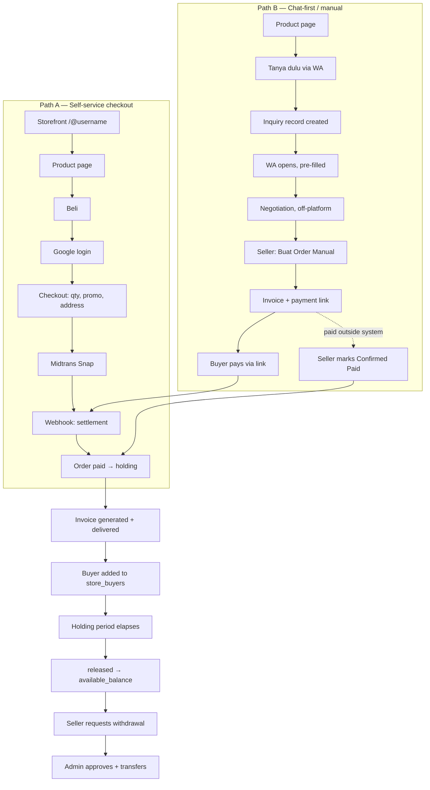
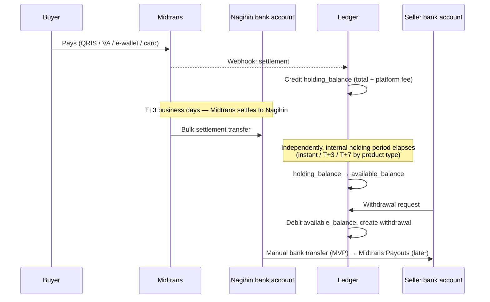

# 00 — Product Analysis

Analysis of [`../user-behavior.md`](../user-behavior.md), [`../database-schema.md`](../database-schema.md)
and [`../summary.md`](../summary.md), read as an engineering brief.

---

## 1. Business goals

### The reframe that defines the product

The brainstorm arrived at Nagihin by elimination, and the last turn matters more than the whole path.
The insight (`summary.md` §6) is that small Indonesian sellers **already sell successfully over WhatsApp**.
They do not need a prettier storefront. What they lose is everything *after* the sale: the buyer's
contact scrolls away in chat history, there is no invoice, and they cannot tell revenue from profit.

So the product is not a link-in-bio tool with commerce bolted on. It is a **record-keeping system with a
storefront as the capture mechanism**. Every design decision downstream follows from that ordering.

### Goals, in priority order

| # | Goal | Success looks like | Engineering consequence |
|---|---|---|---|
| G1 | Every transaction produces a **verified buyer record** | ≥95% of paid orders have a buyer with a real email and (eventually) phone | Google login is mandatory at checkout — non-negotiable, even though it adds friction |
| G2 | Every transaction produces a **real invoice** | Invoice PDF delivered within 60s of payment, retrievable forever | Invoice generation is a durable job, not a request-time render |
| G3 | Sellers can see **profit, not just omzet** | HPP captured on ≥60% of products; gross profit report matches manual calculation | HPP snapshotted per order item — historical reports must not shift when prices change |
| G4 | Escape marketplace fees | Effective take rate 5% (free) / 2–3% (pro) vs 12–17% on marketplaces | Fee is deducted at the ledger, not billed separately |
| G5 | Capture the **chat-first** half of the market | ≥30% of orders originate from Path B (inquiry → manual order) | Manual order creation is a first-class flow, not an admin hack |
| G6 | Organic growth loop | Storefront links spread through IG/TikTok bios and WA broadcasts without paid marketing | `/@username` pages must be fast, SEO-indexable, and shareable with promo codes pre-applied |

### The differentiation claim, stated honestly

`summary.md` §6 contains a sober competitor check: Lynk.id has had storefront + physical/digital
products + QRIS + 3–5% commission since 2020. Plugo raised $9M. **Nagihin is not entering a blue ocean.**

The defensible combination is: *storefront + automatic invoice + verified buyer database + HPP accounting
in one product*. Each competitor covers part of it. That gap is real but **narrow and copyable** — Lynk.id
could close the positioning gap without writing code.

The engineering implication is uncomfortable but important: **the moat is the buyer database's
accumulated value, not the feature list.** A seller with 800 buyer records and two years of profit
history cannot leave. A seller with a pretty storefront can leave any afternoon. Therefore anything that
increases data capture and data completeness (CRM, tags, repeat-purchase analytics, export) outranks
anything that increases storefront prettiness (themes, custom domains, animations) — even though the
latter demos better.

---

## 2. User personas

### Sellers

| | **Instant Seller** | **Cautious Seller** |
|---|---|---|
| Sells | Digital products, ready-stock low-value physical | Custom orders, higher-value physical, services |
| Volume | Small–medium, frequent | Low frequency, higher ticket |
| Prior scarring | None; trusts automation | Has eaten a refund/chargeback elsewhere |
| Wants | Speed, no friction, fast settlement | Control, confirmation steps, delayed settlement |
| System needs | Path A checkout, instant release, minimal config | Manual order creation, manual release, dispute tooling |
| Risk to us | Churns if the system feels slow | Churns if the system feels out of their control |

These two pull in opposite directions on the single most sensitive axis — *when does money become mine*.
The resolution in `user-behavior.md` §9 is the correct one and must be implemented exactly: **tiered
holding periods on by default, `manual` settlement mode may only lengthen the hold, never shorten it
below the platform floor.** A seller-configurable hold that could go to zero would turn a buyer
protection into a seller preference.

### Buyers

| | **Direct Checkout Buyer** | **Chat-First Buyer** |
|---|---|---|
| Behavior | Decided already, buys at listed price | Asks about stock, ongkir, variants; negotiates |
| Prevalence | Minority for physical, majority for digital | The dominant pattern on IG/TikTok/local marketplaces |
| Path | A — self-service checkout | B — WA inquiry → seller creates order |
| System needs | Fast checkout, few fields | The conversation must leave a trace in the system |

The Chat-First Buyer is the reason Path B exists. A plain `wa.me` link would serve them commercially but
would destroy G1 — the buyer never enters the database. Hence the design rule from `user-behavior.md` §3:
**the "Tanya dulu via WA" button creates an `inquiry` record before it opens WhatsApp.**

### A third persona the source docs imply but never name: the Platform Operator

Someone must approve withdrawals, resolve disputes, and reconcile Midtrans settlements daily
(`user-behavior.md` §13). At MVP this is the founder, but it is still a **role with its own screens,
permissions and audit requirements**, not a database console. It is treated as a first-class persona in
[03 — Administration context](./03-bounded-contexts.md#310-administration) and given real RBAC in
[07](./07-auth.md).

---

## 3. Product flow

### The two transaction paths

The two paths converge deliberately at `A7`/`A8`. Everything after payment — invoice, CRM record,
ledger entry, holding, release — is **path-agnostic**. Only order *creation* differs. This is what keeps
Path B from doubling the system's complexity, and it is the single most important structural decision
in the whole flow.

### The money's journey

Money crosses four boundaries, and each is a different kind of risk.

Two settlement clocks run in parallel and are unrelated to each other: Midtrans→Nagihin (T+3 business
days, outside our control) and holding→available (our rules). For physical goods a seller genuinely waits
**~T+6 business days** before withdrawable cash exists. `user-behavior.md` §13 is right that this must be
communicated up front — it is slower than Shopee/Tokopedia, and discovering it at withdrawal time is how
sellers churn angrily.

**Engineering consequence:** the internal release clock must not be allowed to outrun the Midtrans
settlement clock, or the platform can owe sellers withdrawable money it has not physically received.
See [09 §5](./09-payments-ledger.md#5-the-two-clock-problem).

---

## 4. Core features

Derived from the source docs, grouped by the value they protect. Full module breakdown in [01](./01-feature-breakdown.md).

| Feature | Source | Why it exists |
|---|---|---|
| Google OAuth identity, global across stores | `user-behavior.md` §11, schema `users` | One buyer identity across all sellers — the network effect. Also the only way to guarantee a verified contact per order (G1) |
| Storefront `/@username` + social links | schema `stores`, `social_links` | The capture surface and the growth loop |
| Product catalog with `product_type` and HPP | schema `products` | `product_type` drives holding rules and delivery; HPP drives the profit report (G3) |
| Digital delivery via signed URLs | `user-behavior.md` §10 | Replicates the Lynk.id pattern; enables instant release |
| Inquiry capture | `user-behavior.md` §3 | Converts an off-platform conversation into a tracked lead (G5) |
| Manual order creation with price override | `user-behavior.md` §8 | The negotiated price is the real price; the invoice and profit report must reflect it |
| Order state machine with holding | `user-behavior.md` §4–5 | The buyer-protection mechanism and the seller-trust mechanism, in one model |
| Midtrans Snap + webhooks | `user-behavior.md` §15 (Model 1) | Single merchant-of-record; lowest seller onboarding friction |
| Append-only ledger + dual balances | schema `balance_transactions` | Separates `total_seller_liability` from `platform_revenue` (§13) — the thing that stops the operator spending float |
| Automatic invoicing | `summary.md` §7 | G2. The single most-cited pain point in the research |
| Buyer database (mini-CRM), per store | schema `store_buyers` | G1's payoff and the actual moat |
| Gross profit reporting | `summary.md` §8 | G3. Deliberately *not* double-entry accounting — that path was explicitly rejected (`summary.md` §5) |
| Promotions with auto-apply links | `user-behavior.md` §12 | The IG/TikTok growth loop, Saweria-style |
| Withdrawals with admin approval | `user-behavior.md` §5 | Second control layer; also the fraud checkpoint at MVP scale |
| Subscriptions (Free/Pro) | `user-behavior.md` §14 | Schema ready now, billing automation later |
| Audit trail: status history, audit logs, webhook events | schema | Dispute investigation and daily reconciliation both depend on it |

---

## 5. Risks

### Business risks

| Risk | Severity | Assessment |
|---|---|---|
| **Competitive** — Lynk.id/Plugo close the gap | High | Real and unmitigable by features. Mitigation is data lock-in and niche focus, not a feature race. Documented honestly rather than argued away |
| **Regulatory (PJP/OJK)** — holding buyer funds is a supervised activity | High, deferred | `user-behavior.md` §13 flags this correctly. Custodial float is fine at small scale, dangerous at GMV. Mitigation: segregated bank account from day one, and Model 2 migration triggers pre-agreed (§15). **Engineering must keep the ledger model compatible with both** |
| **Unit economics** — 5% may not cover Midtrans MDR + buffer | High | MDR per channel is unknown until the merchant contract exists. If QRIS MDR is 0.7% and credit card is ~2.9%, a flat 5% is fine on QRIS and thin on cards. **Make `platform_fee_rate` per-order and per-channel-aware in code even if the initial policy is flat** |
| **Operator float confusion** — spending seller liability as revenue | Critical | The classic way small platforms die. Mitigated by AD-06 (ledger authority) + separate bank account + daily reconciliation |
| **Chargeback after withdrawal** | Medium | Explicitly out of MVP scope (`user-behavior.md` §6). Accepted risk; holding periods reduce frequency. Revisit with reserve balance once dispute rate data exists |
| **Adoption** — sellers won't change WA habits | Medium | Path B is the mitigation: the product meets them inside WhatsApp instead of demanding they abandon it |

### Technical risks

| Risk | Severity | Mitigation |
|---|---|---|
| **Lost/duplicated webhooks** → wrong balances | Critical | Raw `webhook_events` log + idempotent processing + daily reconciliation against Midtrans settlement reports ([09](./09-payments-ledger.md)) |
| **Balance drift** between cached and ledger totals | Critical | Balances derived from and verified against `balance_transactions` nightly; drift raises an alert, not a silent correction |
| **Race on release/withdraw** — double-spend of available balance | Critical | Withdrawal creation takes a row lock on the store balance inside the same transaction as the ledger insert |
| **Money as floating point** | High | `BIGINT` rupiah integers end-to-end (AD-04). No `float`, no JS `number` for amounts crossing the wire — serialize as string |
| **WA provider ToS termination** (Fonnte/Wablas are grey area) | High | Channel port abstraction (AD-10) + email as the guaranteed fallback. Never let invoice delivery depend solely on WA |
| **Supabase Storage signed-URL leakage** | Medium | Short expiry, download counting server-side, never store the signed URL |
| **Solo bus factor** | High | This documentation set *is* the mitigation. Plus boring, conventional technology choices |
| **Postgres 18 / UUIDv7 availability** | Low | `database-schema.md` already flags it. Generate UUIDv7 in application code — same format, no dependency on the Supabase Postgres version |

---

## 6. Technical challenges

The hard parts, ranked. These deserve disproportionate design and test attention; everything else is
conventional CRUD.

1. **Exactly-once money movement under an at-least-once webhook.** Midtrans retries. The network fails
   mid-transaction. The solution is not "be careful" — it is structural: raw event log, idempotency keys,
   transactional outbox, and a ledger that can be replayed to rebuild balances. [09](./09-payments-ledger.md)

2. **Two independent settlement clocks.** Internal release must never promise withdrawable money before
   Midtrans has actually settled to the Nagihin account. Naive "instant release for digital" violates this
   the very first time it runs. [09 §5](./09-payments-ledger.md#5-the-two-clock-problem)

3. **A state machine with money-side effects on almost every transition.** Every transition must be
   atomic with its ledger entry and its history row. Implemented as guarded transitions on the Order
   aggregate — never as a bare `UPDATE orders SET status = ...`. [08](./08-order-state-machine.md)

4. **Mixed-basket holding rules.** One order, one digital item, one physical item. Releasing the digital
   portion early would require splitting the ledger entry per item; releasing everything early breaks
   buyer protection. Resolution: **max risk tier across items** (AD-09) — simple, safe, explainable.

5. **Snapshot integrity.** Order items snapshot name/price/HPP; orders snapshot the fee rate. Any code
   path that reads a *live* product to compute a *historical* report is a bug. Enforced by making
   reporting queries read only `order_items`.

6. **Multi-tenant data isolation.** Store A must never see store B's buyers — `store_buyers` is
   per-store by design. Every seller-scoped query needs `store_id` in the predicate. Enforced by a
   repository-level store scope rather than trusting each query. [07 §5](./07-auth.md#5-tenant-isolation)

7. **Storefront performance at the growth-loop moment.** A TikTok bio link that goes viral hits one
   `/@username` page hard. Public storefront reads must be cached and must not touch the same Postgres
   connection pool that processes payments.

8. **PDF generation without a heavyweight runtime.** Puppeteer in a worker is memory-hungry on small
   Railway/Render instances. Sized as a dedicated worker concern in [10](./10-background-jobs.md).

---

## 7. What the source documents leave open

Carried forward with a recommendation rather than left dangling.

| Open item | Source | Recommendation | Decide by |
|---|---|---|---|
| WA delivery provider | `summary.md` §7 | Start Fonnte/Wablas behind a `NotificationChannel` port; email always sent in parallel. Migrate to official WABA when WA delivery becomes revenue-critical | Sprint 6 |
| Invoice PDF generator | `summary.md` §7 | Server-side HTML→PDF in a BullMQ worker. The invoice is already a web page; one template serves both view and PDF | Sprint 4 |
| Actual Midtrans MDR per channel | `user-behavior.md` §14 | Blocking on the merchant contract. Keep fee logic per-order and channel-aware regardless | Before public pricing |
| Domain `.id` + social handles for "Nagihin" | `user-behavior.md` header | Check availability before any branding work; `stores.username` namespace design does not depend on it | Before Sprint 1 |
| Model 2 (split payment) settlement timing | `user-behavior.md` §15 | Not now. Ledger design stays compatible; revisit at the GMV/trust triggers already written | On trigger |
| Reserve balance for high-volume sellers | `user-behavior.md` §9 | Deferred as decided. Needs real dispute-rate data first | Post-launch |

---

Next: [01 — Feature Breakdown & Prioritization](./01-feature-breakdown.md)
