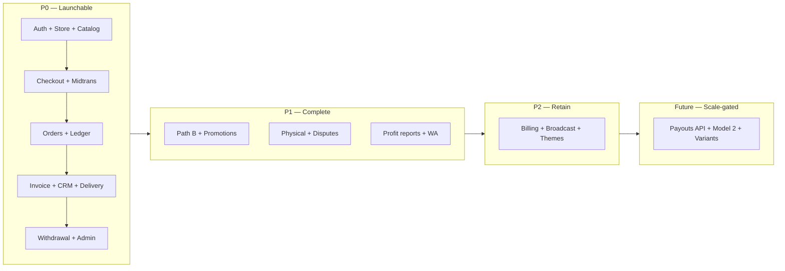

# 01 — Feature Breakdown & Prioritization

---

## 1. Module map

Every feature in the source documents, decomposed into implementable units and assigned to the module
that will own it. Module names match the backend folders in [02 §3](./02-architecture.md#3-folder-structure)
and the bounded contexts in [03](./03-bounded-contexts.md).

### 1.1 Identity

| Unit | Detail | Priority |
|---|---|---|
| Google OAuth login | Authorization-code flow, account auto-provisioned on first login | P0 |
| JWT access token | Short-lived (15 min), stateless, carries `sub`, `role`, `storeId?` | P0 |
| Refresh token rotation | Long-lived (30 d), stored hashed, single-use, reuse detection revokes the family | P0 |
| Session listing & revoke | "Sign out other devices" | P2 |
| Profile completion | Name + phone after first login; phone required before checkout completes | P0 |
| Role model | `buyer` / `seller` / `admin` — one user can hold seller and buyer simultaneously | P0 |
| Account deletion / data export | PDPL-adjacent obligation once real buyer data accumulates | P2 |

### 1.2 Store

| Unit | Detail | Priority |
|---|---|---|
| Store creation | One store per user at MVP; schema already supports many | P0 |
| Username claiming | Unique, reserved-word blocklist, immutable-ish (rate-limited changes) | P0 |
| Profile: display name, bio, avatar, banner | Supabase Storage uploads | P0 |
| Social links CRUD + ordering | The link-aggregator function of `/@username` | P1 |
| Settlement mode setting | `auto` / `manual`, floor-enforced | P0 |
| Bank account (rekening) management | Required before withdrawal; snapshotted at withdrawal time | P0 |
| Storefront theme | `theme` jsonb — colors, layout variant | P2 |
| Custom domain | Pro feature; DNS verification + cert | Future |

### 1.3 Catalog

| Unit | Detail | Priority |
|---|---|---|
| Product CRUD | Name, slug, description, price, HPP, type, stock, images, status | P0 |
| `product_type` handling | `digital` / `physical` / `service` — drives delivery and holding | P0 |
| Image upload | Supabase Storage, multiple images per product | P0 |
| Digital file upload | Private bucket, linked via `digital_files` | P0 |
| Stock tracking | Decrement on paid; null = unlimited | P1 |
| Product status | `active` / `draft` / `archived`; archived stays referenceable by old orders | P0 |
| Variants (size, color) | Not in schema; genuinely needed for physical sellers | Future |
| Categories / collections | Storefront organization once catalogs grow | P2 |

### 1.4 Ordering

| Unit | Detail | Priority |
|---|---|---|
| Checkout (Path A) | Buyer-initiated; multi-item capable from day one | P0 |
| Manual order creation (Path B) | Seller-initiated, price override, buyer by email or manual entry | P1 |
| Inquiry capture | Record created before the WA deep-link opens | P1 |
| Inquiry → order conversion | Links `inquiries.converted_order_id` | P1 |
| Order state machine | All transitions guarded; every transition writes history | P0 |
| Manual "Confirmed Paid" | For Path B payments received outside the gateway | P1 |
| Manual release | Seller-triggered `holding` → `released`, floor-enforced | P0 |
| Order expiry | Unpaid orders auto-cancel after the payment window | P0 |
| Shipping input | `tracking_number`, `courier`, `shipped_at` — starts the physical holding clock | P1 |
| Dispute raising | Buyer- or seller-initiated; freezes holding funds | P1 |
| Refund processing | Full refund at MVP; partial later | P1 |
| Buyer order history | Cross-seller `/akun` view | P0 |

### 1.5 Payments

| Unit | Detail | Priority |
|---|---|---|
| Midtrans Snap token creation | Per order, with expiry aligned to order expiry | P0 |
| Webhook receiver | Signature verification, raw persist, async processing | P0 |
| Webhook processor | Idempotent status mapping → order transitions | P0 |
| Payment status polling fallback | For when a webhook never arrives | P1 |
| Payment method capture | Recorded on the order for later MDR analysis | P0 |
| Refund API call | Midtrans refund for gateway-paid orders | P1 |
| Daily reconciliation | Midtrans settlement report vs internal orders | P1 |
| Midtrans Payouts (Iris) | Replaces manual withdrawal transfers | Future |

### 1.6 Ledger

| Unit | Detail | Priority |
|---|---|---|
| Append-only `balance_transactions` | Every money movement, with running balances | P0 |
| Holding credit on paid | `total − platform_fee` into `holding_balance` | P0 |
| Release to available | Scheduled or manual | P0 |
| Withdrawal debit | Atomic with the withdrawal record | P0 |
| Refund debit | Reverses holding, or flags manual recovery if already released | P1 |
| Balance reconciliation job | Cached balances vs ledger sums | P1 |
| Platform revenue reporting | Derived from released, non-refunded orders | P1 |
| Seller liability report | The operator's most important number | P1 |

### 1.7 Invoicing

| Unit | Detail | Priority |
|---|---|---|
| Invoice number generation | Sequential per store, gapless, human-readable | P0 |
| PDF rendering | HTML template → PDF in a worker | P0 |
| Storage + permanent retrieval | Supabase Storage, buyer-accessible forever | P0 |
| Delivery via email | Guaranteed channel | P0 |
| Delivery via WhatsApp | Best-effort channel | P1 |
| Invoice branding | Store logo, colors — Pro touch | P2 |

### 1.8 Delivery (digital fulfilment)

| Unit | Detail | Priority |
|---|---|---|
| `digital_deliveries` entitlement | Created on paid, per order item | P0 |
| Signed URL generation on demand | Never stored; regenerated per request | P0 |
| Download counting + limits | Server-side enforcement | P0 |
| Re-download from `/akun` | Within `max_downloads` | P0 |
| License key pool | Assign a key per purchase | Future |

### 1.9 CRM

| Unit | Detail | Priority |
|---|---|---|
| `store_buyers` upsert on paid | Totals, first/last purchase | P0 |
| Buyer list with search & sort | The core deliverable of G1 | P0 |
| Buyer detail: order history, notes | | P1 |
| Tags | Manual, then rule-based | P1 |
| CSV export | Pro feature; also the honest data-portability promise | P1 |
| Segments (repeat, lapsed, high-value) | Derived, cached | P2 |
| WA broadcast to a segment | The remarketing payoff — and the biggest ToS risk | P2 |
| Inquiry follow-up list | "Asked but never bought" | P1 |

### 1.10 Promotions

| Unit | Detail | Priority |
|---|---|---|
| Promotion CRUD | Percent/fixed, validity window, min purchase | P1 |
| Scope: all / specific products | `promotion_products` | P1 |
| Usage limits: total + per buyer | Enforced via `promotion_redemptions` | P1 |
| Auto-apply link `?promo=CODE` | The growth loop mechanism | P1 |
| Below-HPP warning | Warn, never block | P1 |
| Redemption ledger | Enables limit enforcement and reporting | P1 |

### 1.11 Reporting (mini accounting)

| Unit | Detail | Priority |
|---|---|---|
| Revenue by period | From orders | P0 |
| Gross profit = revenue − HPP | From `order_items` snapshots only | P1 |
| Per-product performance | Units, revenue, margin | P1 |
| Dashboard summary cards | Today / 7d / 30d | P0 |
| Export to CSV | | P2 |
| Charts | Revenue trend, top products | P1 |

### 1.12 Withdrawal

| Unit | Detail | Priority |
|---|---|---|
| Request withdrawal | Validates available balance, min amount | P0 |
| Bank account snapshot | Frozen at request time | P0 |
| Admin approve / reject | With reason, audited | P0 |
| Mark as paid | Ledger debit finalized | P0 |
| Withdrawal history | Seller-visible | P0 |
| Automated disbursement | Midtrans Payouts | Future |

### 1.13 Billing (subscriptions)

| Unit | Detail | Priority |
|---|---|---|
| Plan model free/pro | `stores.plan` cache, `subscriptions` truth | P1 |
| Fee rate by plan | Snapshotted on each order | P0 |
| Subscribe / upgrade flow | Midtrans payment | P2 |
| Recurring charge | Monthly cycle, retries, dunning | P2 |
| `subscription_invoices` | Billing history | P2 |
| Cancel / downgrade | Grace until period end | P2 |
| Feature gating | Enforced server-side, not just UI | P1 |

### 1.14 Notifications

| Unit | Detail | Priority |
|---|---|---|
| Channel port abstraction | Email + WA behind one interface | P0 |
| Email transport | Resend/Postmark | P0 |
| WA transport | Fonnte/Wablas, later WABA | P1 |
| Templates | Invoice, paid, released, dispute, withdrawal, expiry | P0 |
| Delivery log + retries | `notification_deliveries` | P1 |
| Seller notification prefs | | P2 |
| In-app notification centre | | P2 |

### 1.15 Administration

| Unit | Detail | Priority |
|---|---|---|
| Admin auth + RBAC | Separate role, separate route tree | P0 |
| Withdrawal queue | The daily operational job | P0 |
| Dispute queue | | P1 |
| Reconciliation dashboard | Mismatches surfaced, not buried in logs | P1 |
| Store/user lookup | Support tooling | P1 |
| Platform metrics | GMV, take rate, liability | P1 |
| Audit log viewer | | P1 |
| Feature flags / plan overrides | | P2 |

### 1.16 Storefront (public)

| Unit | Detail | Priority |
|---|---|---|
| `/@username` page | Profile, social links, product grid | P0 |
| Product detail page | Images, description, Beli + Tanya buttons | P0 |
| SEO: metadata, OG images, sitemap | The growth loop depends on shareability | P1 |
| Promo auto-apply from query param | | P1 |
| Store search / discovery | Deliberately not built — sellers bring their own traffic | Future |

---

## 2. Prioritization

### Definitions

| Tier | Meaning |
|---|---|
| **P0** | The product does not exist without it. A seller cannot take money and get a record of it |
| **P1** | Needed for the product to be *good*, and for the differentiation claim to be true. Ship within ~6 weeks of launch |
| **P2** | Retention and polish. Real value, no urgency |
| **Future** | Correct to build eventually, wrong to build now — either scale-gated or economics-gated |

### P0 — Must have

The test applied: *can a real seller run a real transaction end to end and keep the record?*

| Feature | Why it is P0 |
|---|---|
| Google OAuth + JWT + refresh | Every buyer record depends on verified identity (G1). No auth, no product |
| Store + username + storefront page | Without a public URL there is nothing to share and no capture surface |
| Product CRUD incl. digital files | Nothing to sell |
| Path A checkout | The default transaction path |
| Midtrans Snap + webhook processing | Money in. Cannot be faked or deferred |
| Order state machine (core states) | The paid/released distinction is a *product* promise, not a refinement |
| Ledger + dual balances | Wrong balances at launch destroy trust irrecoverably. Retrofitting a ledger onto live money data is one of the worst migrations in software |
| Invoice generation + email delivery | G2, and the most-cited pain point in research |
| `store_buyers` capture | G1's payoff. If this is not correct from transaction #1, the historical data is permanently incomplete |
| Digital delivery + signed URLs | Digital products are the fastest-validating niche (`summary.md` §3) |
| Withdrawal request + admin approval | Money in with no money out is not a product; it is a liability |
| Buyer `/akun` history | Legal and practical: buyers must be able to retrieve what they paid for |
| Admin auth + withdrawal queue | Somebody has to press the button, safely and auditably |
| Basic dashboard revenue summary | The first screen a seller sees must answer "did I make money" |

**Deliberately excluded from P0, with reasons:**

- *Promotions* — a growth accelerator for a product that has no users yet. Sequenced immediately after launch.
- *Manual orders / Path B* — this is 30%+ of the market (G5) and it hurts to defer, but Path A must be correct first, and Path B reuses every post-payment mechanism. Building it second is *cheap*; building both at once doubles the surface where money bugs can hide. First on the P1 list.
- *WhatsApp delivery* — email is a guaranteed channel; WA is a grey-area optimization. Delivering invoices at all is P0; delivering them over WA is not.
- *Physical shipping tracking* — needed for the T+3-from-shipped rule, but digital-first launch sidesteps it entirely.
- *Subscriptions billing* — 5% on free tier funds the business at launch volume. Building recurring billing before there is anyone to bill is pure waste. The *schema* exists now (correct); the *automation* does not.

### P1 — Ship soon after launch

| Feature | Why P1, not P0 |
|---|---|
| Manual orders + inquiries (Path B) | Unlocks the chat-first market segment (G5). Deferred only because it composes onto a proven Path A |
| Promotions + auto-apply links | The organic growth loop. Worthless before there are sellers to loop |
| Physical product flow: shipping, tracking, T+3-from-shipped | Expands the addressable market past digital |
| Disputes + refunds | Rare early; catastrophic to handle badly. Manual admin handling is acceptable for the first weeks, with the audit trail already recording everything |
| Gross profit / HPP reporting | G3 — a core differentiation claim. Needs a few weeks of order data before it says anything |
| WhatsApp notification channel | Meets sellers where they live |
| CRM detail, tags, export | Turns a buyer *list* into a buyer *database* |
| Daily reconciliation dashboard | Manual reconciliation is survivable at 10 orders/day, not at 100 |
| Balance reconciliation job | Same reasoning; the audit data exists from day one so nothing is lost by deferring the automation |
| Feature gating by plan | Needed before Pro can be sold |
| Admin dispute queue + metrics | Operational maturity |

### P2 — Retention and polish

| Feature | Rationale |
|---|---|
| Subscription billing automation | Only once there is demonstrated willingness to pay for Pro |
| WA broadcast / remarketing | The most valuable CRM feature and the highest ToS risk. Do it after the WA relationship is stable |
| Storefront themes | Demos well, converts poorly |
| Buyer segments | Needs data volume to be meaningful |
| Session management, account deletion | Compliance hygiene as user counts grow |
| Categories/collections | Only matters for large catalogs |
| In-app notification centre | Email suffices at this scale |
| Report CSV exports | |
| Invoice branding | |

### Future — correct later, wrong now

| Feature | Gate |
|---|---|
| Model 2 split payment (xenPlatform) | GMV/regulatory trigger from `user-behavior.md` §15 |
| Midtrans Payouts (Iris) automation | ~20–30 active sellers, per `summary.md` §3 |
| Reserve balance for high-volume sellers | Real dispute-rate data |
| Product variants | Physical sellers with real catalogs |
| License key pools | Software sellers |
| Custom domains | Pro tier demand |
| Multi-store per user | Schema already supports it; no demand signal |
| Affiliate system | Lynk.id parity feature, not a differentiator |
| Marketplace discovery | Contradicts the positioning — sellers bring their own traffic |
| Multi-language / multi-currency | Indonesia-only by design |

### Priority summary

---

## 3. Feature → context → sprint traceability

Every P0 feature maps to an owning context and a sprint. Full detail in [12](./12-roadmap-sprints.md).

| Feature | Context | Sprint |
|---|---|---|
| Google OAuth + JWT | Identity | 2 |
| Store + username + settings | Store | 3 |
| Public storefront pages | Storefront (FE) | 3 |
| Product CRUD + digital files | Catalog | 4 |
| Checkout + order creation | Ordering | 5 |
| Midtrans Snap + webhooks | Payments | 5 |
| Ledger + balances | Ledger | 6 |
| Invoice generation + email | Invoicing | 6 |
| `store_buyers` + buyer list | CRM | 6 |
| Digital delivery | Delivery | 5 |
| Withdrawal + admin approval | Withdrawal / Administration | 7 |
| Buyer `/akun` | Ordering (read) | 7 |
| Dashboard summary | Reporting | 8 |

---

Next: [02 — Backend Architecture](./02-architecture.md)
