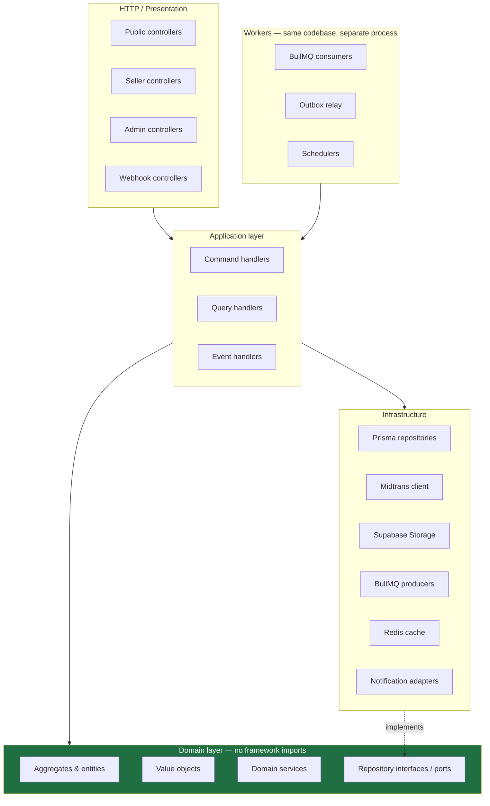
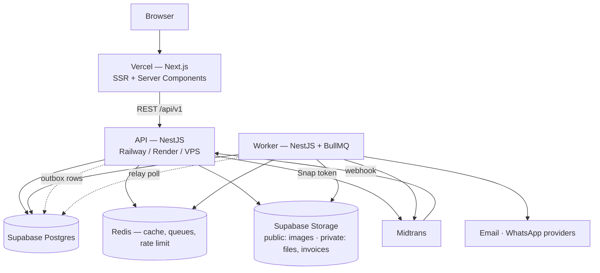

# 02 — Backend Architecture

---

## 1. Architectural style

**Modular monolith** — one deployable NestJS application, internally partitioned into modules with
enforced boundaries.

### Why not microservices

The team is one part-time engineer. Microservices would buy independent scaling and independent
deployment, neither of which is a problem we have, and would charge for it in distributed transactions,
network failure modes, and multi-repo operational overhead. Splitting a ledger across a network boundary
before you have users is how a solo project dies.

### Why not a plain layered app

Because extraction *will* eventually matter — payment webhook processing and invoice PDF rendering have
genuinely different scaling profiles from CRUD. The cost of keeping boundaries clean in a monolith is
low; the cost of introducing them into a tangled one later is enormous.

**The rule that makes extraction possible:** a module may reach another module only through its published
application-layer port or by subscribing to its domain events. **Never** through another module's
repository, and never through a cross-module Prisma join. That single discipline is the difference
between "extract a service in a week" and "rewrite".



The arrow that matters: **infrastructure depends on domain, never the reverse.** The domain layer must
compile with zero imports from `@nestjs/*`, `@prisma/client`, `bullmq`, or `axios`. If a domain file
imports a framework, the dependency rule has been violated — this is the single most valuable thing to
enforce in CI ([13 §2](./13-devops-testing-prod.md#2-testing-strategy)).

---

## 2. Tiered rigor

Applying full DDD ceremony to a `social_links` CRUD module produces six files where one would do, and
teaches the codebase's future readers that the ceremony is noise. Applying it to the ledger is the
difference between correct and insolvent.

So rigor is assigned by **what a bug costs**.

| Tier | Modules | What you get | What you skip |
|---|---|---|---|
| **Tier 1 — Full DDD + CQRS** | `ordering`, `payments`, `ledger` | Rich aggregates enforcing invariants, value objects, domain events, separate command/query handlers, read models bypassing the domain, full unit-test coverage of invariants | Nothing |
| **Tier 2 — Domain-light** | `identity`, `store`, `catalog`, `billing`, `promotions`, `withdrawal` | Entities with behavior where rules exist (username validity, promo applicability, plan gating), repository interfaces, domain events published for cross-context effects | No CQRS split, no factories unless construction is genuinely complex |
| **Tier 3 — Service + repository** | `crm`, `notifications`, `reporting`, `administration`, `storefront-read` | Application service → repository → Prisma. DTOs and validation still enforced | No aggregates, no domain events emitted (they *consume* them), no ceremony |

**Every tier uses the same folder skeleton.** A Tier 3 module simply has thin or empty `domain/`
folders. Upgrading `crm` to Tier 2 later means adding files, never moving them. This is what makes the
tiering a pragmatic choice rather than technical debt.

### CQRS, specifically

CQRS is used where reads and writes genuinely diverge:

- **Ordering** — the write side guards a 9-state machine; the read side is a paginated list with joins to products and buyers. Sharing a model would either bloat the aggregate or cripple the list query.
- **Payments** — writes are webhook-driven and idempotent; reads are reconciliation reports.
- **Ledger** — writes are append-only inserts; reads are aggregations over months of rows.

CQRS is **not** used anywhere else, and **event sourcing is not used at all**. `balance_transactions` is
an append-only log that happens to give us replay for one aggregate — that is the 90% of event
sourcing's value at 10% of its cost. Full event sourcing would be an unforced complexity multiplier.

`@nestjs/cqrs` provides `CommandBus`/`QueryBus`/`EventBus`. Its `EventBus` is **in-process only** — it is
used for synchronous same-transaction concerns. Anything that must survive a crash goes through the
**outbox** instead ([09 §6](./09-payments-ledger.md#6-outbox--event-flow)). Confusing these two is the
most likely architectural mistake in this codebase, so the rule is stated bluntly:

> If losing the event would lose money or a user-visible promise, it goes in the outbox. Otherwise the
> in-process `EventBus` is fine.

---

## 3. Folder structure

### Repository root

```
nagihin/
├── apps/
│   ├── api/                        NestJS HTTP application
│   └── worker/                     BullMQ consumers (imports the same modules)
├── packages/
│   └── contracts/                  Shared DTO/enum types consumed by the web app
├── web/                            Next.js app (see doc 11)
├── prisma/
│   ├── schema.prisma
│   ├── migrations/
│   └── seed/
├── docker/
│   ├── Dockerfile.api
│   ├── Dockerfile.worker
│   └── docker-compose.yml
├── docs/
├── .github/workflows/
├── .env.example
└── package.json                    pnpm workspaces
```

`apps/api` and `apps/worker` are two entry points over one module graph. The worker imports the same
application services; it just registers BullMQ consumers instead of HTTP controllers. This means a job
and an HTTP request execute *identical* domain code — no duplicated business logic, which is the classic
failure mode of a separate worker repo.

### `apps/api/src`

```
src/
├── main.ts
├── app.module.ts
│
├── shared/
│   ├── kernel/                     Framework-free building blocks
│   │   ├── aggregate-root.base.ts
│   │   ├── entity.base.ts
│   │   ├── value-object.base.ts
│   │   ├── domain-event.base.ts
│   │   ├── result.ts               Result<T, E> — expected failures are values, not exceptions
│   │   ├── uuid.ts                 UUIDv7 generation
│   │   └── value-objects/
│   │       ├── money.vo.ts         BIGINT rupiah, no floats
│   │       ├── email.vo.ts
│   │       ├── phone.vo.ts         Indonesian normalization: 08xx ⇄ +628xx
│   │       ├── username.vo.ts      Storefront handle rules + reserved words
│   │       └── slug.vo.ts
│   │
│   ├── domain-errors/              Base error types mapped to HTTP by the exception filter
│   │
│   ├── infrastructure/
│   │   ├── prisma/
│   │   │   ├── prisma.service.ts
│   │   │   ├── prisma.module.ts
│   │   │   └── transaction.manager.ts    Unit of work — one tx across repositories
│   │   ├── redis/
│   │   ├── queue/                  BullMQ registration, queue names, typed payloads
│   │   ├── outbox/
│   │   │   ├── outbox.service.ts   Enqueue within the caller's transaction
│   │   │   ├── outbox.relay.ts     Poller → BullMQ (worker only)
│   │   │   └── outbox.repository.ts
│   │   ├── storage/                Supabase Storage: upload, signed URL
│   │   ├── payment/                Midtrans Snap + Core API client, signature verification
│   │   ├── notification/           Email + WhatsApp adapters behind the port
│   │   ├── pdf/                    HTML → PDF renderer
│   │   ├── idempotency/            Idempotency-Key store + interceptor
│   │   └── cache/                  Typed cache wrapper with namespaced keys
│   │
│   ├── presentation/
│   │   ├── guards/                 JwtAuthGuard, RolesGuard, StoreOwnerGuard, ThrottlerGuard
│   │   ├── decorators/             @CurrentUser, @Roles, @Public, @ApiPaginated
│   │   ├── filters/                DomainExceptionFilter, PrismaExceptionFilter
│   │   ├── interceptors/           Logging, transform, timeout, idempotency
│   │   ├── pipes/                  ZodValidationPipe / global ValidationPipe config
│   │   └── dto/                    PaginationQueryDto, ApiResponseDto, ErrorDto
│   │
│   ├── config/                     Typed config modules, env schema validated at boot
│   └── observability/              Pino logger, request context, health indicators, metrics
│
└── modules/
    ├── identity/
    ├── store/
    ├── catalog/
    ├── ordering/
    ├── payments/
    ├── ledger/
    ├── invoicing/
    ├── delivery/
    ├── crm/
    ├── promotions/
    ├── withdrawal/
    ├── billing/
    ├── reporting/
    ├── notifications/
    ├── storefront/
    └── administration/
```

### Module skeleton — Tier 1 example (`ordering`)

```
modules/ordering/
├── ordering.module.ts
│
├── domain/
│   ├── entities/
│   │   ├── order.aggregate.ts          Root: owns items, guards every transition
│   │   ├── order-item.entity.ts
│   │   └── inquiry.aggregate.ts        Separate root — different lifecycle
│   ├── value-objects/
│   │   ├── order-number.vo.ts
│   │   ├── order-status.vo.ts          Legal-transition table lives here
│   │   ├── order-source.vo.ts
│   │   ├── holding-period.vo.ts        Risk tier → duration
│   │   └── shipping-address.vo.ts
│   ├── events/
│   │   ├── order-created.event.ts
│   │   ├── order-paid.event.ts
│   │   ├── order-released.event.ts
│   │   ├── order-disputed.event.ts
│   │   ├── order-refunded.event.ts
│   │   ├── order-expired.event.ts
│   │   └── inquiry-created.event.ts
│   ├── services/
│   │   ├── holding-period.calculator.ts    Max risk tier across items + Midtrans floor
│   │   └── order-pricing.service.ts        Subtotal, discount, fee, total
│   ├── factories/
│   │   └── order.factory.ts                Checkout vs manual construction paths
│   ├── errors/
│   │   └── ordering.errors.ts
│   └── repositories/
│       ├── order.repository.ts             Interface only
│       └── inquiry.repository.ts
│
├── application/
│   ├── commands/
│   │   ├── create-checkout-order/
│   │   │   ├── create-checkout-order.command.ts
│   │   │   └── create-checkout-order.handler.ts
│   │   ├── create-manual-order/
│   │   ├── mark-order-paid/
│   │   ├── confirm-manual-payment/
│   │   ├── release-order/
│   │   ├── ship-order/
│   │   ├── dispute-order/
│   │   ├── refund-order/
│   │   ├── cancel-order/
│   │   ├── expire-order/
│   │   ├── create-inquiry/
│   │   └── convert-inquiry/
│   ├── queries/
│   │   ├── list-store-orders/
│   │   ├── get-order-detail/
│   │   ├── list-buyer-orders/
│   │   └── list-store-inquiries/
│   ├── event-handlers/
│   │   └── on-payment-settled.handler.ts
│   ├── ports/
│   │   └── ordering.port.ts                What other modules may call
│   └── dto/
│
├── infrastructure/
│   ├── persistence/
│   │   ├── order.prisma.repository.ts
│   │   ├── inquiry.prisma.repository.ts
│   │   ├── order.mapper.ts                 Prisma row ⇄ domain aggregate
│   │   └── order-read.repository.ts        Raw queries for list views — bypasses the domain
│   └── ordering.providers.ts               DI token bindings
│
└── presentation/
    ├── http/
    │   ├── seller-orders.controller.ts
    │   ├── buyer-orders.controller.ts
    │   ├── checkout.controller.ts
    │   └── inquiries.controller.ts
    └── dto/
        ├── requests/
        └── responses/
```

### Module skeleton — Tier 3 example (`crm`)

```
modules/crm/
├── crm.module.ts
├── domain/
│   └── repositories/
│       └── store-buyer.repository.ts
├── application/
│   ├── services/
│   │   └── store-buyer.service.ts
│   ├── event-handlers/
│   │   └── on-order-paid.handler.ts        Upserts store_buyers
│   └── dto/
├── infrastructure/
│   └── persistence/
│       └── store-buyer.prisma.repository.ts
└── presentation/
    └── http/
        └── buyers.controller.ts
```

Same five folders. Less inside them. Nothing to move if it graduates to Tier 2.

### `apps/worker/src`

```
src/
├── main.ts
├── worker.module.ts
└── consumers/
    ├── order/           expire-orders, release-holding, auto-force-release
    ├── payment/         webhook-processing, reconciliation, status-polling
    ├── invoice/         generate-pdf, deliver-invoice
    ├── notification/    send-email, send-whatsapp
    ├── delivery/        provision-digital-delivery
    ├── ledger/          verify-balances
    ├── outbox/          relay
    └── maintenance/     cleanup-expired-deliveries, prune-webhook-events
```

---

## 4. Cross-cutting conventions

### Result over exceptions for expected failures

Domain operations return `Result<T, DomainError>`. Exceptions are reserved for genuinely unexpected
conditions. The reason is not style: an `Order.release()` that returns `Err(HoldingPeriodNotElapsed)`
forces the caller to handle it, and it makes the state machine unit-testable without try/catch scaffolding.
Handlers convert `Err` into typed HTTP problems in one place — the exception filter.

### Transactions

`TransactionManager` exposes the Prisma transaction client through an AsyncLocalStorage context, so
repositories inside a `runInTransaction()` callback automatically enlist. Command handlers open exactly
one transaction spanning: aggregate persist + ledger insert + status-history insert + outbox insert.

**Non-negotiable rule:** no HTTP call to Midtrans, no storage upload, no queue publish inside a database
transaction. External calls go before (and are made idempotent) or after (via the outbox).

### Money

`Money` value object over `bigint` rupiah. No `number` arithmetic, no `Decimal`. Serialized as a JSON
string across the API boundary to survive JavaScript's 2^53 limit — irrelevant at current amounts, free
to do now, painful to retrofit.

### IDs

UUIDv7 generated in application code (`uuid` v11 `v7()`), never by the database. This keeps `database-schema.md`'s
time-ordered index property without depending on Postgres 18 availability on Supabase, and lets aggregates
be fully constructed in memory before persistence — which pure DDD requires and database-generated IDs quietly break.

### Validation

`class-validator` + `class-transformer` on request DTOs via the global `ValidationPipe`
(`whitelist: true`, `forbidNonWhitelisted: true`). Validation is a presentation concern: it rejects
malformed input. It is **not** where business rules live — "discount must not exceed subtotal" belongs
in the domain, not in a decorator.

### API surface conventions

- Versioned under `/api/v1`.
- Envelope: `{ data, meta? }` on success; RFC 7807-shaped `{ type, title, status, detail, errors? }` on failure.
- Cursor pagination for high-volume lists (orders, buyers, ledger); offset for small ones.
- Swagger generated from decorators, served at `/docs`, gated behind basic auth in production.

---

## 5. Prisma vs TypeORM

### Comparison

| Criterion | Prisma | TypeORM | Verdict |
|---|---|---|---|
| **Performance** | Rust query engine; efficient batching; but no native relation JOINs by default (multiple queries per nested read, though `relationJoins` preview improves this). Raw SQL via `$queryRaw` when needed | Can emit tuned single-query JOINs; QueryBuilder gives fine control | **TypeORM, marginally.** Irrelevant at our volume, and our heaviest queries (reports, reconciliation) will be hand-written SQL either way |
| **Developer experience** | Excellent. One schema file, generated types that are always in sync, readable errors, Prisma Studio for inspection | Decorator-driven, split across entity files, weaker inference, historically inconsistent docs | **Prisma, decisively** |
| **Type safety** | End-to-end generated types; a schema change breaks compilation at every affected call site | Partial — QueryBuilder results are frequently `any` | **Prisma, decisively** |
| **DDD support** | Generated models are anemic data structures with no behavior | Entities *can* carry behavior; Active Record mode available | **TypeORM on paper — but see below** |
| **Migrations** | `migrate dev` generates from schema diff; `migrate deploy` is deterministic; drift detection built in | Generation is unreliable for complex changes; hand-editing is common; the ecosystem widely warns against `synchronize` | **Prisma, decisively** |
| **Relations** | Explicit, readable, type-safe nested reads | Flexible, lazy/eager options, more foot-guns | **Prisma** |
| **Complex queries** | `$queryRaw` with tagged-template parameterization and typed generics | Full QueryBuilder | **TypeORM, marginally** |
| **Maintainability** | Schema file is the single readable source of truth | Truth is scattered across entity decorators | **Prisma** |
| **Learning curve** | Low | Moderate; the DataMapper/ActiveRecord duality confuses newcomers | **Prisma** |
| **Scalability** | Connection pooling needs care with serverless (PgBouncer/Supabase pooler); handles our scale comfortably | Similar profile | **Tie** |
| **Ecosystem trajectory** | Actively developed, large community, first-class NestJS docs | Maintained but historically uneven release cadence | **Prisma** |

### The DDD objection, answered

TypeORM's apparent advantage is that an entity can be both a domain object and a persistence mapping.
**In Clean Architecture that is not an advantage — it is the violation we are specifically avoiding.**
A TypeORM entity carries `@Column`, `@ManyToOne`, and a live database connection into what is supposed
to be a framework-free domain layer. The moment `Order` extends `BaseEntity`, the domain depends on the
ORM, and unit-testing an invariant means booting a database.

The correct DDD arrangement is the same for both ORMs:

```
domain/entities/order.aggregate.ts        Pure TypeScript. Zero imports from any ORM
        ↕ mapper
infrastructure/persistence/order.mapper.ts        Prisma row ⇄ aggregate
infrastructure/persistence/order.prisma.repository.ts     Implements the domain interface
```

With this shape, the ORM never touches the domain, so "which ORM has better DDD support" reduces to
"which ORM is better at being a data-access layer" — and Prisma wins that comfortably.

The real cost of the mapper is boilerplate: two conversion functions per aggregate. That is roughly
40 lines for `Order`, our most complex aggregate. Cheap, and it is the same code that later makes
swapping persistence possible.

### Decision: **Prisma**

Three reasons, in order of weight:

1. **Migrations.** This project touches production money data. A migration tool that produces
   deterministic, reviewable, reversible SQL and detects schema drift is worth more than any query-shape
   optimization. TypeORM's migration generation is the most common source of production incidents in
   its own issue tracker.
2. **Solo-maintainer velocity.** Generated types mean a schema change surfaces as compile errors rather
   than runtime surprises. With one part-time engineer and no code reviewer, the compiler *is* the
   reviewer.
3. **Its weakness does not apply to us.** Prisma is worst at complex hand-tuned queries in a codebase
   that treats the ORM as the query layer. We are not that codebase — reports and reconciliation use
   `$queryRaw` deliberately, inside read repositories, isolated from the domain.

**Where Prisma will hurt, and the pre-agreed answer:**

| Pain | Answer |
|---|---|
| Nested reads issue multiple queries | Enable `relationJoins`; for list endpoints use `$queryRaw` read repositories, which we want anyway |
| No native aggregate-with-children upsert | Repository writes children explicitly inside the unit of work — appropriate for a DDD aggregate boundary |
| Generated models are anemic | By design here. Mappers convert |
| Connection limits on Supabase | Use the Supabase transaction pooler for the API, a direct connection for migrations and the worker |
| No native `BIGINT` ergonomics in JS | `Money` VO wraps `bigint`; DTOs serialize as strings |

---

## 6. Runtime topology



**Why the worker is a separate process from day one:** PDF rendering holds hundreds of megabytes and
can wedge an event loop. Sharing a process with payment webhook handling means a slow PDF can delay a
settlement callback. Splitting later means re-testing every job under a new failure model. The
incremental cost now is one Dockerfile and one Railway service.

### Environments

| Env | Where | Database | Midtrans |
|---|---|---|---|
| Local | Docker Compose | Postgres + Redis in containers | Sandbox |
| Staging | Railway/Render + Vercel preview | Separate Supabase project | Sandbox |
| Production | Railway/Render + Vercel | Supabase production, PITR enabled | Production |

Staging must use a *separate Supabase project*, not a schema in the production one. Sharing a database
across environments is how test data ends up in a real ledger.

---

Next: [03 — Bounded Contexts](./03-bounded-contexts.md)
