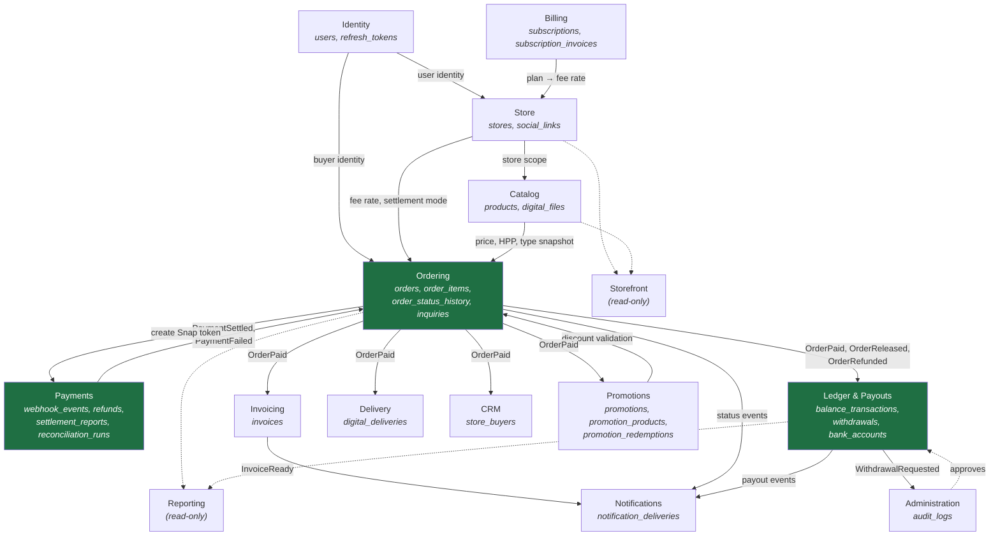

# 03 — Bounded Contexts

A bounded context here means: **a module that owns a set of tables, enforces the rules over them, and
exposes a deliberately narrow surface to everything else.** No other module may write those tables, and
no other module may read them except through a published port or a domain event.

---

## 1. Context map

Green = Tier 1, full DDD ([02 §2](./02-architecture.md#2-tiered-rigor)). Solid arrows are events or port
calls; dotted arrows are read-only projections.

**Ordering is the hub.** Almost every downstream effect in the system is a reaction to an order changing
state. That is a deliberate consequence of the convergent-paths design ([00 §3](./00-product-analysis.md#3-product-flow)):
Path A and Path B differ only in creation, so everything after payment can subscribe to one event stream.

---

## 2. Table ownership

Exactly one owner per table. This table is the enforcement reference — if a query in module X writes a
table owned by module Y, that is a boundary violation regardless of how convenient it was.

| Table | Owner | Source |
|---|---|---|
| `users` | Identity | schema |
| `refresh_tokens` | Identity | amendment |
| `stores` | Store | schema |
| `social_links` | Store | schema |
| `products` | Catalog | schema |
| `digital_files` | Catalog | schema |
| `orders` | Ordering | schema |
| `order_items` | Ordering | schema |
| `order_status_history` | Ordering | schema |
| `inquiries` | Ordering | schema |
| `webhook_events` | Payments | schema |
| `refunds` | Payments | amendment |
| `settlement_reports` | Payments | amendment |
| `reconciliation_runs` | Payments | amendment |
| `balance_transactions` | Ledger & Payouts | schema |
| `withdrawals` | Ledger & Payouts | schema |
| `bank_accounts` | Ledger & Payouts | amendment |
| `invoices` | Invoicing | schema |
| `digital_deliveries` | Delivery | schema |
| `store_buyers` | CRM | schema |
| `promotions` | Promotions | schema |
| `promotion_products` | Promotions | schema |
| `promotion_redemptions` | Promotions | schema |
| `subscriptions` | Billing | schema |
| `subscription_invoices` | Billing | schema |
| `notification_deliveries` | Notifications | amendment |
| `audit_logs` | Administration | schema |
| `outbox_events` | shared infrastructure (not a context) | amendment |
| `idempotency_keys` | shared infrastructure (not a context) | amendment |

Reporting and Storefront own no tables. They are **read contexts** — they query across owners through
dedicated read repositories with hand-written SQL. This is the one sanctioned exception to the ownership
rule, and it is safe precisely because it is read-only: a read context can never corrupt an invariant.

Amendments are specified in [06 §2](./06-database-roadmap.md#2-schema-amendments).

---

## 3. Context responsibilities

### 3.1 Identity

**Owns:** `users`, `refresh_tokens`

**Responsible for:** who someone is, and proving it.

- Google OAuth authorization-code exchange and account provisioning
- Access token issuance, refresh token rotation with reuse detection
- Profile data: name, email, avatar, phone
- Role assignment (`buyer` / `seller` / `admin`)

**Not responsible for:** what a user may do with a *store* — that is Store's authorization concern.
Identity answers "who are you"; Store answers "is this yours". Conflating them produces the classic bug
where an authenticated user can operate on someone else's store.

**Key rule:** identity is **global across stores**, per `database-schema.md`'s first design principle.
One `users` row serves as buyer at store A and seller of store B simultaneously. This is what creates
the checkout network effect in `user-behavior.md` §11, and it means Identity must never be scoped by
store — a mistake that would be extremely expensive to undo.

**Publishes:** `UserRegistered`, `UserProfileCompleted`

---

### 3.2 Store

**Owns:** `stores`, `social_links`

**Responsible for:** the seller's tenant — its identity, its public presentation, its policy settings.

- Store creation and username claiming (uniqueness, reserved words, rate-limited changes)
- Profile: display name, bio, avatar, banner, theme
- **Settlement mode** (`auto` / `manual`) — with the floor rule enforced here, not at the call site
- Plan cache (`plan` column), kept in sync from Billing
- Ownership authorization: "does user U own store S"

**Why settlement mode lives here and not in Ordering:** it is store *policy*, and it must be enforceable
in one place. `user-behavior.md` §9 is explicit that manual mode may only *lengthen* the hold. If that
rule lived in the release handler, every future release path would have to remember it. Store exposes
`getSettlementPolicy(storeId)` returning both the mode and the platform floor; Ordering asks and obeys.

**Publishes:** `StoreCreated`, `SettlementModeChanged`, `StorePlanChanged`

---

### 3.3 Catalog

**Owns:** `products`, `digital_files`

**Responsible for:** what is for sale.

- Product CRUD, slug uniqueness per store, status lifecycle (`active`/`draft`/`archived`)
- `product_type` — the field that drives holding tier and fulfilment path
- HPP capture (the input to the profit report)
- Stock, where tracked
- Product images (public bucket) and digital files (private bucket)

**Not responsible for:** prices *on orders*. Catalog holds the current price; Ordering snapshots it.
The moment an order exists, Catalog has no further authority over that order's numbers. This is
`database-schema.md`'s "snapshot, not live reference" principle, expressed as a context boundary.

**Never hard-deletes.** Archiving only — old `order_items` reference products by ID, and a deleted
product would orphan a paid order's provenance.

**Publishes:** `ProductCreated`, `ProductArchived`, `DigitalFileAttached`

---

### 3.4 Ordering

**Owns:** `orders`, `order_items`, `order_status_history`, `inquiries`

**Responsible for:** the transaction lifecycle — the heart of the system.

- Order creation via both paths (checkout / manual), through a factory that shares all post-creation logic
- Line item snapshots: name, type, price, HPP, quantity
- Pricing composition: subtotal → discount → total → platform fee
- **The state machine** — every transition guarded, every transition recorded ([08](./08-order-state-machine.md))
- Holding period computation (max risk tier across items, floored by the Midtrans settlement clock)
- Inquiry capture and conversion
- Shipping data entry for physical orders
- Dispute initiation

**Not responsible for:** money movement. Ordering decides *that* an order is paid and *when* it releases;
Ledger decides what that does to balances. Keeping "state" and "money" in separate contexts means a state
bug cannot silently corrupt a balance — the ledger reacts to events and can be independently replayed.

**Aggregate boundary:** `Order` is a single aggregate root containing its items. `Inquiry` is a separate
root — it has an independent lifecycle, may exist without an order forever, and is often the only artifact
of a conversation that never converted. Modelling it inside `Order` would force moneyless rows into the
money table. This is [AD-08](./README.md#decision-log).

**Publishes:** `OrderCreated`, `OrderPaid`, `OrderShipped`, `OrderReleased`, `OrderDisputed`,
`OrderRefunded`, `OrderCancelled`, `OrderExpired`, `InquiryCreated`, `InquiryConverted`

**Consumes:** `PaymentSettled`, `PaymentFailed`, `PaymentExpired` from Payments

---

### 3.5 Payments

**Owns:** `webhook_events`, `refunds`, `settlement_reports`, `reconciliation_runs`

**Responsible for:** every interaction with Midtrans, and nothing else.

- Snap transaction token creation
- Webhook receipt: signature verification, raw persistence, idempotent processing
- Mapping Midtrans transaction statuses to domain events
- Refund API calls
- Daily settlement reconciliation: Midtrans's report vs our orders
- Payment status polling when a webhook never arrives

**This is an anti-corruption layer.** Midtrans's vocabulary — `settlement`, `capture`, `pending`, `deny`,
`fraud_status`, `signature_key` — stops at this boundary. Ordering receives `PaymentSettled`, never a
Midtrans payload. That is what makes a future switch to Xendit (Model 2, `user-behavior.md` §15) a
change inside one module instead of a search-and-replace across the codebase.

**Never** writes to `orders`. It publishes an event; Ordering decides what the state machine permits.
A webhook arriving for an already-refunded order must not resurrect it, and only the aggregate knows that.

**Publishes:** `PaymentSettled`, `PaymentPending`, `PaymentFailed`, `PaymentExpired`, `RefundCompleted`,
`ReconciliationMismatchDetected`

---

### 3.6 Ledger & Payouts

**Owns:** `balance_transactions`, `withdrawals`, `bank_accounts`

**Responsible for:** every rupiah the platform holds on behalf of a seller.

- Append-only ledger entries with running balance snapshots
- Maintaining `stores.holding_balance` / `available_balance` as a **cache of the ledger**, never as
  independent truth
- `holding` → `available` transfer on release
- Withdrawal requests: balance validation, atomic debit, bank account snapshot
- Payout destination management (`bank_accounts`)
- Reconciliation of cached balances against ledger sums
- Deriving `total_seller_liability` and `platform_revenue`

**Why `bank_accounts` lives here rather than in Store:** it exists only to receive a payout, and the
withdrawal invariant is "sufficient available balance **and** a valid verified destination". Splitting
those two halves across contexts would mean the invariant is enforced nowhere. The settings *screen*
lives in the seller dashboard; screen location does not determine ownership.

**Absolute rules:**
- Balances are **only** mutated by inserting a `balance_transactions` row in the same transaction. There
  is no code path that does `UPDATE stores SET available_balance = ...` alone. Enforced by keeping the
  balance-writing method private to a single ledger service.
- Rows are never updated or deleted. A correction is a compensating entry.
- Withdrawal creation takes `SELECT ... FOR UPDATE` on the store row — concurrent requests must not both
  see the same available balance.

**Publishes:** `BalanceCredited`, `BalanceReleased`, `WithdrawalRequested`, `WithdrawalPaid`,
`WithdrawalRejected`, `BalanceDriftDetected`

---

### 3.7 Invoicing

**Owns:** `invoices`

**Responsible for:** producing the document that gave the product its name.

- Gapless, sequential invoice numbering per store
- Rendering the invoice from order data (HTML template → PDF)
- Storing the PDF and serving it permanently
- Recording delivery channel and timestamp

**Numbering matters more than it looks.** Invoice numbers are a legal/accounting artifact — gaps invite
questions. Generated inside a transaction with a per-store counter row, not from a global sequence and
never from `COUNT(*) + 1`.

Rendering is **asynchronous** ([10](./10-background-jobs.md)) and idempotent by order ID: retrying the
job must overwrite the same file, never mint a second invoice number.

**Publishes:** `InvoiceGenerated`, `InvoiceDelivered`

**Consumes:** `OrderPaid`

---

### 3.8 Delivery

**Owns:** `digital_deliveries`

**Responsible for:** getting digital goods to the buyer, and not to anyone else.

- Creating an entitlement per digital order item on payment
- Generating signed URLs **on demand** — never persisted (`database-schema.md` is explicit)
- Enforcing download counts and expiry server-side
- Re-download from `/akun` within the remaining allowance

**Entitlement vs link:** `expires_at` bounds the *signed URL window*, not the buyer's right to the file.
A buyer who returns after expiry gets a freshly signed URL as long as `download_count < max_downloads`.
Reading it the other way would break `user-behavior.md` §11's promise of re-downloadable purchases —
this is [amendment #7](./06-database-roadmap.md#2-schema-amendments).

**Consumes:** `OrderPaid`

---

### 3.9 CRM

**Owns:** `store_buyers`

**Responsible for:** the buyer database — the product's actual moat ([00 §1](./00-product-analysis.md#1-business-goals)).

- Upsert on every paid order: totals, first/last purchase timestamps
- Buyer list, search, sort, detail
- Tags and private notes
- CSV export
- Segments (later)

**The isolation rule is a product promise, not a technicality.** `database-schema.md`'s first principle
says seller A must not learn that their buyer also shops at store B. Therefore every CRM query is scoped
by `store_id` at the repository level, and the CRM API never returns a global `users` row — only the
per-store projection. A join that leaks cross-store purchase data is a privacy incident, not a bug.

**Consumes:** `OrderPaid`, `OrderRefunded` (totals must decrease on refund)

---

### 3.10 Promotions

**Owns:** `promotions`, `promotion_products`, `promotion_redemptions`

**Responsible for:** discounts and the growth loop they power.

- Promotion CRUD, scope resolution, validity windows
- Validation: active, in window, min purchase met, usage limits not exceeded
- Discount computation (percent or fixed)
- Redemption recording — the enforcement mechanism for per-buyer and total limits
- Below-HPP warning (advisory, never blocking, per `user-behavior.md` §12)

**Validation and redemption are separate operations.** Validation happens at checkout render (may I show
this discount?); redemption happens at payment (this discount was actually used). Recording redemption at
validation time would let abandoned carts burn a limited promo — a subtle bug that only appears under load.

**Publishes:** `PromotionRedeemed`

**Consumes:** `OrderPaid` (record redemption), `OrderRefunded` (release the redemption slot)

---

### 3.11 Billing

**Owns:** `subscriptions`, `subscription_invoices`

**Responsible for:** the Free/Pro relationship between the platform and the seller.

- Subscription lifecycle: trialing → active → past_due → cancelled
- Monthly recurring charges and dunning (P2)
- Keeping `stores.plan` in sync as a read cache
- Resolving the platform fee rate for a store at a point in time
- Feature gating

**Distinct from Ledger** because the money flows the opposite direction — Ledger is money the platform
*owes sellers*; Billing is money *sellers owe the platform*. They share nothing but a `store_id` and must
never share a balance.

**Fee rate resolution is Billing's, but the snapshot is Ordering's.** Billing answers "what rate applies
to store S today"; Ordering copies that number onto the order permanently. A plan change must never
retroactively alter an existing order's economics.

**Publishes:** `SubscriptionActivated`, `SubscriptionCancelled`, `SubscriptionPastDue`

---

### 3.12 Notifications

**Owns:** `notification_deliveries`

**Responsible for:** reaching a human, over whichever channel currently works.

- Channel port abstraction: `EmailChannel`, `WhatsAppChannel` behind one interface
- Template rendering per event type
- Delivery attempt logging, retry, fallback
- Provider swapping without touching any caller

**Why the port abstraction is architectural rather than speculative:** WA provider choice is an unresolved
cost/ToS bet ([00 §7](./00-product-analysis.md#7-what-the-source-documents-leave-open)). Fonnte and
Wablas can be terminated for ToS reasons with no notice. If invoice delivery calls a Fonnte SDK directly,
that termination is an outage. Behind a port, it is a config change. This is [AD-10](./README.md#decision-log).

**Email is the guaranteed channel; WhatsApp is best-effort.** No user-visible promise may depend solely
on WA delivery.

**Consumes:** most events in the system. Notifications is a pure downstream consumer — nothing depends on it.

---

### 3.13 Administration

**Owns:** `audit_logs`

**Responsible for:** the platform operator's work and the record of it.

- Admin authentication and elevated RBAC
- Withdrawal approval queue (the daily operational task)
- Dispute resolution queue
- Reconciliation mismatch review
- Store/user support lookup
- Platform metrics: GMV, take rate, **total seller liability**
- Audit log write API used by every other context, and the viewer

**Administration writes `audit_logs`, but every context calls it** through the `AuditLogPort`. This is the
one intentional cross-context write path, because a single audit table with a uniform shape is worth more
than per-context audit purity — and `database-schema.md` already specifies exactly this shape.

**Separation from Store:** an admin acting on a store is not a store owner. The permission model must
distinguish "owns" from "administers", or the first support action will be indistinguishable from a
compromised seller account in the audit trail.

---

### 3.14 Reporting *(read-only)*

**Owns:** nothing.

Queries across Ordering, Ledger and Catalog to produce:
- Revenue by period
- Gross profit = revenue − HPP, computed **exclusively from `order_items` snapshots**
- Per-product performance
- Dashboard summary cards

**Deliberately not double-entry accounting.** `summary.md` §5 records the explicit rejection of a
custom-COA accounting product as too heavy and aimed at the wrong user. Reporting stays at
`revenue − HPP = gross profit`. Any pull toward journals, ledgers-of-accounts, or tax compliance should
be resisted — that is a different product competing with Accurate and Jurnal.

Uses `$queryRaw` read repositories. May read any table; may write none.

---

### 3.15 Storefront *(read-only)*

**Owns:** nothing.

Serves the public, unauthenticated surface: `/@username`, product pages, promo-applied links.

Separated from Store and Catalog because its **non-functional requirements are different**: aggressively
cached, unauthenticated, SEO-critical, and the most likely thing to receive a traffic spike when a TikTok
bio link goes viral ([00 §6](./00-product-analysis.md#6-technical-challenges)). Giving it its own read
path means public traffic can be cached and rate-limited independently of the dashboard, and never
competes with webhook processing for the same connection pool.

---

## 4. Integration patterns

| From → To | Pattern | Why |
|---|---|---|
| Payments → Ordering | Domain event via outbox | Webhook processing must not be coupled to state-machine availability |
| Ordering → Ledger | Domain event via outbox | Money movement must survive a crash between the two writes |
| Ordering → Invoicing / Delivery / CRM / Promotions | Domain event via outbox | Fan-out; each consumer retries independently |
| Ordering → Catalog | Synchronous port call | Snapshotting needs the price *now*, transactionally |
| Ordering → Promotions | Synchronous port call | Discount validation is part of price computation |
| Ordering → Store | Synchronous port call | Fee rate and settlement policy are inputs to creation |
| Ordering → Payments | Synchronous port call | Snap token is needed in the checkout response |
| Anything → Administration (audit) | Synchronous port call | Audit must be in the same transaction as the action |
| Anything → Notifications | Domain event | Notification failure must never fail a business operation |
| Reporting / Storefront → anything | Direct read | Read-only contexts cannot violate invariants |

**Rule of thumb:** synchronous when the caller needs the answer to continue correctly; asynchronous when
the caller only needs the effect to eventually happen. When in doubt, asynchronous — a slow WhatsApp
provider should never be able to fail a checkout.

---

## 5. Extraction readiness

If Payments or the worker ever needs to become a separate service, the work is:

1. Its port interfaces already exist → become an HTTP/gRPC client.
2. Its events already flow through the outbox → become a message broker topic.
3. Its tables are exclusively its own → move with the service, no shared-table untangling.
4. The anti-corruption layer already isolates Midtrans → nothing else knows the vendor.

What would *break* extraction, and is therefore forbidden today:

- A Prisma query joining tables across two contexts (outside a read context)
- A module importing another module's repository or Prisma model
- A shared transaction spanning two contexts' writes — except the sanctioned
  aggregate + ledger + history + outbox unit of work inside a single command

---

Next: [04 — Entity Design](./04-entity-design.md)
