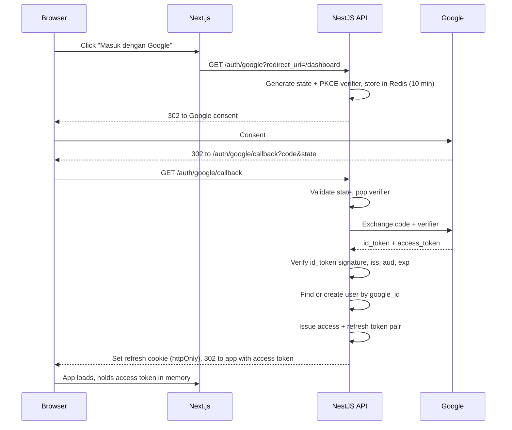
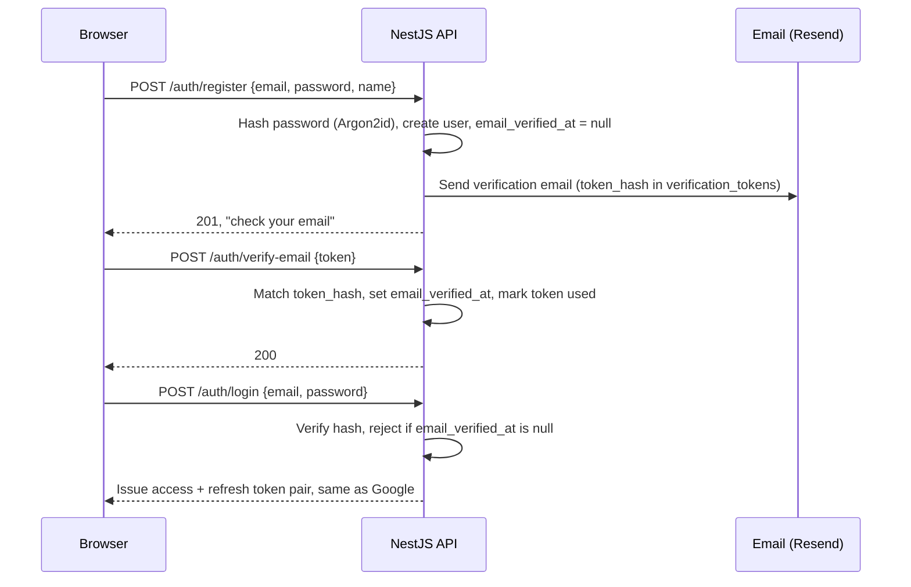
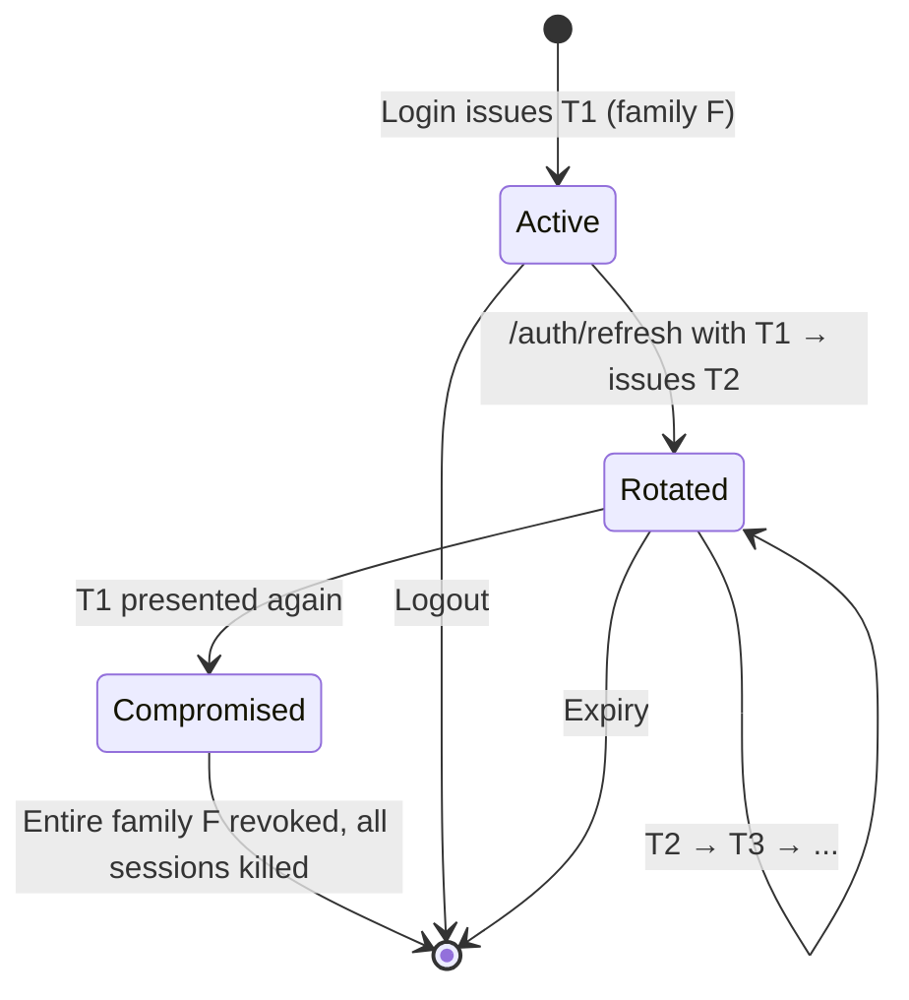

# 07 — Authentication & Authorization

Google was originally the **only** login method, per the decision recorded in `summary.md` §8 (WA OTP was
considered and dropped). That held while it kept signup frictionless and avoided all password-storage
obligations, but it made the product fully dependent on Google availability and unusable for any
Indonesian seller without a Google account — a real conversion risk the original design flagged as
"worth revisiting if signup conversion disappoints."

**Amendment ([AD-13](./README.md#decision-log)):** email + password is now a first-class second login
method, alongside Google. A `users` row may have a `google_id`, a `password_hash`, or both — never
neither. The two methods can be linked together, but only through an explicit authenticated action
(§1b), never implicitly during login or registration. Everything downstream of `UserRegistered` remains
provider-agnostic, which is what makes this addition cheap: nothing in Store, Catalog, Ordering, or the
ledger changes.

---

## 1. Google OAuth flow

Authorization Code flow with PKCE. The token exchange happens **server-side**, so the Google client
secret never reaches the browser.



### Verification steps that are not optional

- `id_token` signature checked against Google's JWKS (cached, rotated)
- `iss` is `accounts.google.com` or `https://accounts.google.com`
- `aud` equals our client ID
- `exp` in the future, `email_verified` is true
- `state` matched and single-use — the CSRF defense
- PKCE verifier matched

### Account provisioning

First login creates a `users` row from the Google profile: `google_id`, `email`, `name`, `avatar_url`.
`phone` is null and is collected later.

**Matching is by `google_id`, not email.** Emails can change on a Google account; the subject identifier
cannot. If an incoming `google_id` is new but the email already exists, that is a conflict, not a merge:
link only after an explicit, logged confirmation. Silent email-based merging is a well-known account
takeover vector.

### Profile completion

`phone` is required before a checkout can complete — invoice delivery over WhatsApp depends on it, and
the phone number is a substantial part of a buyer record's value to the seller ([00 §1](./00-product-analysis.md#1-business-goals)).

It is deliberately **not** required at login. Demanding a phone number before someone has seen the
product costs signups. The gate sits at checkout, where intent already exists.

---

## 1a. Email & password registration and login



### Registration

- Password hashed with **Argon2id**, never logged, never stored or transmitted in plaintext beyond the
  request body
- Minimum length 8 characters. No forced complexity rules (uppercase/symbol requirements) — length is
  the property that actually resists brute force; composition rules mostly push users toward predictable
  substitutions
- `POST /auth/register` never reveals whether an email is already registered as a *Google* account —
  the existing `google_id`-first-then-conflict model already handles that; a password-registration
  attempt against an existing Google-only email is rejected with "sign in with Google instead," logged
  the same way as any other collision

### Email verification

- Required before login succeeds. A registered-but-unverified user exists in `users` but every
  `/auth/login` attempt is rejected until `email_verified_at` is set — this preserves the same
  "every transaction = one verified contact" guarantee Google's `email_verified` claim already gives us
  ([00 §1](./00-product-analysis.md#1-business-goals))
- Verification tokens: random, hashed (SHA-256) at rest in `verification_tokens`, single-use, 24h expiry
- Google-provisioned or Google-linked accounts are considered verified immediately; Google has already
  done this work

### Forgot / reset password

- `POST /auth/forgot-password` always responds `200`, whether or not the email is registered or has a
  password set — this is the standard defense against account enumeration
- Reset tokens: same hashing/single-use scheme as verification tokens, 1h expiry
- `POST /auth/reset-password` sets the new hash and **revokes every refresh token family for that user**,
  killing all existing sessions — a password reset is exactly the moment an attacker might also be
  holding a valid session

---

## 1b. Account linking

Linking (adding Google to a password account, or adding a password to a Google-only account) happens
**only from an authenticated settings action** — `POST /auth/google/link` or `POST /auth/set-password`,
both requiring `JwtAuthGuard`. It never happens implicitly during login or registration, even when the
email addresses match exactly.

This is the same rule §1 already states for Google `google_id` collisions — "silent email-based merging
is a well-known account takeover vector" — applied symmetrically to the new provider combination. In
concrete terms:

- Google callback finds an email that already belongs to a password-only account with no `google_id`:
  **do not** log the caller in and **do not** create a duplicate account. Respond with an error directing
  them to sign in with their password and connect Google from settings
- `POST /auth/register` targets an email that already belongs to a Google-only account: reject with the
  same "sign in with Google instead" message; adding a password to that account happens later, from
  settings, once authenticated
- `DELETE /auth/google/unlink` is only permitted when `password_hash` is already set — a user must always
  retain at least one way back into their account, enforced by the same
  `CHECK (google_id IS NOT NULL OR password_hash IS NOT NULL)` constraint the database carries
  ([06 §2](./06-database-roadmap.md#2-schema-amendments))

The linking UI itself ships with `/dashboard/pengaturan` in Sprint 3; the backend endpoints land in
Sprint 2 alongside everything else in this document.

---

## 2. Tokens

| | Access token | Refresh token |
|---|---|---|
| Format | JWT, RS256 | Opaque random 256-bit |
| Lifetime | 15 minutes | 30 days |
| Storage (browser) | Memory only | `httpOnly`, `Secure`, `SameSite=Lax` cookie |
| Storage (server) | None — stateless | SHA-256 hash in `refresh_tokens` |
| Revocable | No (short life is the mitigation) | Yes, immediately |
| Sent as | `Authorization: Bearer` | Cookie, only to `/auth/refresh` |

### Access token claims

```json
{
  "sub": "01924f8e-...",
  "email": "seller@example.com",
  "role": "seller",
  "storeId": "01924f90-...",
  "iat": 1753689600,
  "exp": 1753690500,
  "iss": "nagihin.id",
  "aud": "nagihin-api"
}
```

`storeId` is embedded to avoid a database lookup on every seller request, and it is **still verified**
against the resource being accessed by `StoreOwnerGuard`. A claim is a hint, never an authorization
decision — a stale token from before an ownership change must not grant access.

**RS256 rather than HS256** so the public key can be shared for verification (e.g. by an edge function or
a future extracted service) without distributing a signing secret.

### Why access tokens are not in localStorage

Any XSS on the dashboard reads localStorage. Memory-only storage means a token dies with the tab, and the
refresh cookie is unreadable from JavaScript. The cost is re-authentication on a hard refresh, solved by
a silent refresh call on app boot.

### Refresh rotation with reuse detection

Every refresh issues a new refresh token and revokes the old one. Tokens form a **family** identified by
`family_id`.



Presenting an already-rotated token means either a stolen token is being replayed, or the legitimate
client raced. Both are handled the same way: **revoke the family and force re-login.** Being occasionally
annoying beats leaving a stolen session live, and in practice the race is rare because refresh requests
are serialized client-side.

---

## 3. Protecting routes

Guards compose in a fixed order: authenticate, then authorize role, then authorize resource ownership.

| Guard | Responsibility |
|---|---|
| `JwtAuthGuard` | Verify signature and expiry, attach `CurrentUser`. Global default; opt out with `@Public()` |
| `RolesGuard` | Enforce `@Roles('admin')` |
| `StoreOwnerGuard` | The resolved store must be owned by the caller |
| `OrderAccessGuard` | Caller is the order's buyer, the store owner, or an admin |
| `WebhookSignatureGuard` | Midtrans SHA-512 signature — replaces JWT entirely on webhook routes |
| `ThrottlerGuard` | Rate limits per [05 §17](./05-api-roadmap.md#17-conventions) |

`JwtAuthGuard` is registered globally with an explicit `@Public()` opt-out rather than being applied
per-controller. Default-deny means a forgotten decorator produces a `401`, not an open endpoint — the
failure mode points the right way.

**Store scoping is never taken from the request body.** A seller endpoint resolves `storeId` from the
authenticated user, never from a client-supplied field. Accepting `storeId` from the body is how
multi-tenant systems leak: the guard passes, the query uses the attacker's value.

---

## 4. RBAC

Roles are deliberately coarse. At MVP there is one admin and every seller has identical permissions over
their own store; a permission matrix with granular grants would be elaborate machinery guarding a
one-person operation.

| Role | Granted by | Scope |
|---|---|---|
| `buyer` | Default on registration | Own orders, own deliveries, own profile |
| `seller` | Owning a store | Everything within that store |
| `admin` | Manual database assignment | Platform-wide operations |

### Permission matrix

| Capability | Buyer | Seller (own store) | Admin |
|---|---|---|---|
| View public storefront | ✅ | ✅ | ✅ |
| Create order (checkout) | ✅ | ✅ | ✅ |
| View own orders | ✅ | ✅ | ✅ |
| Download own purchases | ✅ | ✅ | ✅ |
| Raise dispute on own order | ✅ | — | ✅ |
| Create/edit products | ❌ | ✅ | ❌ |
| View store orders | ❌ | ✅ | ✅ (support) |
| Create manual order | ❌ | ✅ | ❌ |
| Release holding funds | ❌ | ✅ (floor-enforced) | ✅ (override) |
| View store buyers (CRM) | ❌ | ✅ | ✅ (support) |
| Request withdrawal | ❌ | ✅ | ❌ |
| Approve withdrawal | ❌ | ❌ | ✅ |
| Resolve dispute | ❌ | ❌ | ✅ |
| View platform metrics | ❌ | ❌ | ✅ |
| View audit logs | ❌ | ❌ | ✅ |
| Reprocess webhook | ❌ | ❌ | ✅ |
| Override store plan | ❌ | ❌ | ✅ |

**Admins cannot request withdrawals and sellers cannot approve them.** The separation is the entire
control: one party asks for money, a different party releases it. Collapsing them — even for
convenience during testing — removes the only check on payout fraud at this scale.

Admin actions on a store are `admin`-attributed in `audit_logs`, never `seller`-attributed, so support
activity is always distinguishable from account compromise.

### Future: granular permissions

When staff are hired, `admin` splits into `support` (read + dispute), `finance` (withdrawal approval),
and `superadmin`. The `role` column becomes a join to a `permissions` table. Not before — the migration
is small and premature abstraction here buys nothing.

---

## 5. Tenant isolation

Store A must never see store B's data. Beyond correctness, the CRM promise in `database-schema.md`'s
first design principle — a seller must not learn where else their buyer shops — makes this a privacy
commitment, not just an access rule.

Defense in depth, three layers:

1. **Guard layer** — `StoreOwnerGuard` verifies ownership before the handler runs.
2. **Repository layer** — seller-scoped repositories take `storeId` as a mandatory first parameter and
   inject it into every `where` clause. A query that omits it does not compile.
3. **Test layer** — an integration test suite that, for every seller endpoint, authenticates as store A
   and requests store B's resource, asserting `403`/`404`. This runs in CI on every PR. It is the only
   layer that catches the case where someone adds a new endpoint and forgets the first two.

Row Level Security is **not** used. It is powerful with Supabase's client-side access pattern, but our
API is the only database client and it connects as a single role; RLS would add a second, invisible
authorization system that disagrees with the first one at the worst possible moment.

---

## 6. Frontend integration

| Concern | Approach |
|---|---|
| Access token storage | React memory (Zustand), never persisted |
| Refresh | `httpOnly` cookie; silent refresh on boot and on `401` |
| Server Components | Read the refresh cookie server-side, exchange for a short-lived access token per render |
| Route protection | Next.js middleware checks cookie presence for `/dashboard/*` and `/akun/*`; the API is still the real authority |
| Logout | `POST /auth/logout`, clear memory, clear cookie |
| Concurrent 401s | Single-flight refresh — queue failed requests, refresh once, replay |

Middleware only checks for cookie *presence*, not validity. Verifying a token at the edge on every
navigation is latency spent to prevent a flash of a loading state; the API rejects invalid tokens
regardless. Cheap check at the edge, real check at the API.

---

## 7. Security checklist

- [ ] Google client secret server-side only, never in `NEXT_PUBLIC_*`
- [ ] `state` parameter single-use, Redis-backed, 10-minute TTL
- [ ] PKCE verifier per authorization request
- [ ] `id_token` fully verified (signature, `iss`, `aud`, `exp`, `email_verified`)
- [ ] JWT signing keys in secrets management, rotatable without invalidating live sessions (key ID in header)
- [ ] Refresh tokens stored hashed, never plaintext
- [ ] Reuse detection revokes the family
- [ ] Refresh cookie `httpOnly` + `Secure` + `SameSite=Lax`
- [ ] Access token lifetime ≤ 15 minutes
- [ ] Rate limit on `/auth/*` — 10 req/min per IP, tightened to ~5 req/min on `/auth/login`,
      `/auth/register`, and `/auth/forgot-password`
- [ ] Account matched by `google_id`, never by email
- [ ] Email collision requires explicit confirmation, and is logged
- [ ] Passwords hashed with Argon2id; never logged, never stored or returned in plaintext
- [ ] Minimum password length 8; no forced composition rules
- [ ] Email/password login rejected until `email_verified_at` is set
- [ ] Verification and password-reset tokens hashed at rest, single-use, short expiry (24h / 1h)
- [ ] Password reset revokes every refresh token family for the user
- [ ] `/auth/forgot-password` never reveals whether an account exists
- [ ] Google ⇄ password linking only from an authenticated settings action, never implicit during
      login or registration
- [ ] Unlinking Google requires `password_hash` already set on the account
- [ ] `JwtAuthGuard` global with `@Public()` opt-out
- [ ] `storeId` resolved from the token, never from the request body
- [ ] Cross-tenant test suite in CI
- [ ] Admin role assigned manually, never self-service
- [ ] Every admin action written to `audit_logs` with `actor_type = 'admin'`
- [ ] Webhook routes bypass JWT but require signature verification
- [ ] CORS restricted to known frontend origins
- [ ] Helmet security headers enabled
- [ ] No token, password, or full card data ever written to logs

---

Next: [08 — Order State Machine](./08-order-state-machine.md)
