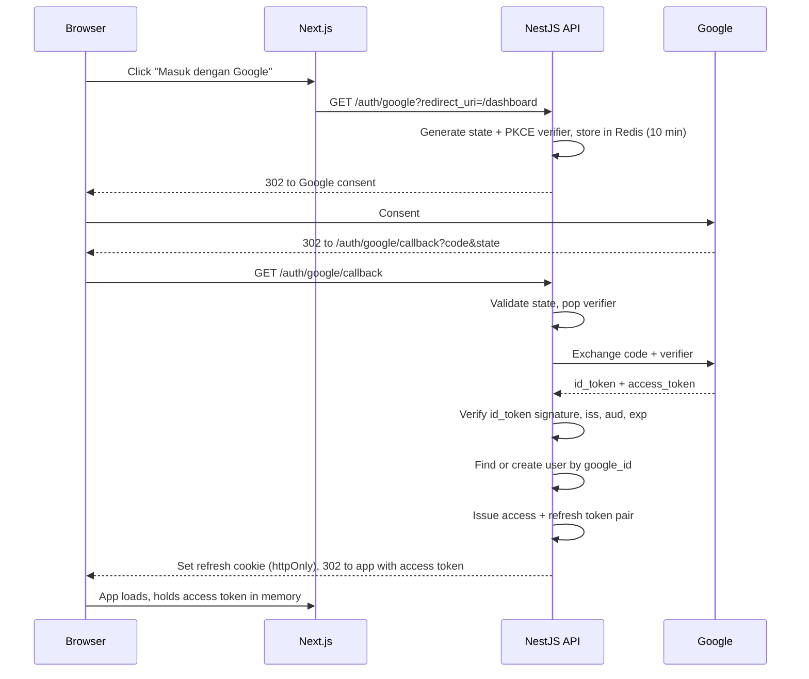
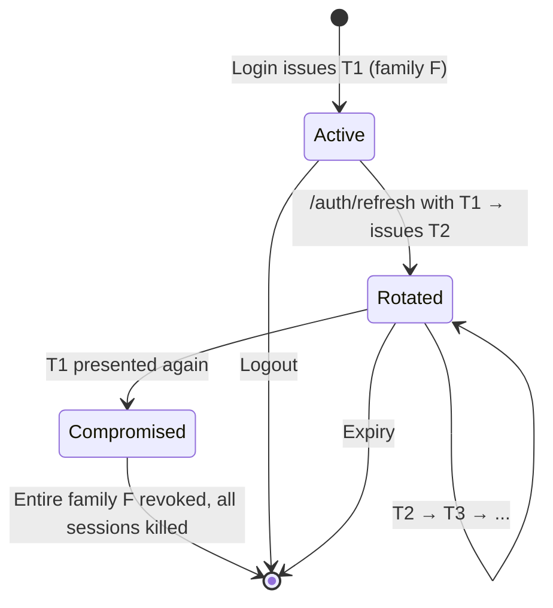

# 07 — Authentication & Authorization

Google is the **only** login method, per the decision recorded in `summary.md` §8 (WA OTP was considered
and dropped). No passwords, no magic links, no OTP.

Two consequences worth stating up front. First, there is no password reset, no credential stuffing
surface, and no password storage obligation — a large amount of security work simply does not exist.
Second, we are fully dependent on Google availability, and any Indonesian seller without a Google
account cannot use the product. That second point is a real product risk and is worth revisiting if
signup conversion disappoints; the architecture keeps it cheap to add a provider because everything
downstream of `UserRegistered` is provider-agnostic.

---

## 1. Google OAuth flow

Authorization Code flow with PKCE. The token exchange happens **server-side**, so the Google client
secret never reaches the browser.



### Verification steps that are not optional

- `id_token` signature checked against Google's JWKS (cached, rotated)
- `iss` is `accounts.google.com` or `https://accounts.google.com`
- `aud` equals our client ID
- `exp` in the future, `email_verified` is true
- `state` matched and single-use — the CSRF defense
- PKCE verifier matched

### Account provisioning

First login creates a `users` row from the Google profile: `google_id`, `email`, `name`, `avatar_url`.
`phone` is null and is collected later.

**Matching is by `google_id`, not email.** Emails can change on a Google account; the subject identifier
cannot. If an incoming `google_id` is new but the email already exists, that is a conflict, not a merge:
link only after an explicit, logged confirmation. Silent email-based merging is a well-known account
takeover vector.

### Profile completion

`phone` is required before a checkout can complete — invoice delivery over WhatsApp depends on it, and
the phone number is a substantial part of a buyer record's value to the seller ([00 §1](./00-product-analysis.md#1-business-goals)).

It is deliberately **not** required at login. Demanding a phone number before someone has seen the
product costs signups. The gate sits at checkout, where intent already exists.

---

## 2. Tokens

| | Access token | Refresh token |
|---|---|---|
| Format | JWT, RS256 | Opaque random 256-bit |
| Lifetime | 15 minutes | 30 days |
| Storage (browser) | Memory only | `httpOnly`, `Secure`, `SameSite=Lax` cookie |
| Storage (server) | None — stateless | SHA-256 hash in `refresh_tokens` |
| Revocable | No (short life is the mitigation) | Yes, immediately |
| Sent as | `Authorization: Bearer` | Cookie, only to `/auth/refresh` |

### Access token claims

```json
{
  "sub": "01924f8e-...",
  "email": "seller@example.com",
  "role": "seller",
  "storeId": "01924f90-...",
  "iat": 1753689600,
  "exp": 1753690500,
  "iss": "nagihin.id",
  "aud": "nagihin-api"
}
```

`storeId` is embedded to avoid a database lookup on every seller request, and it is **still verified**
against the resource being accessed by `StoreOwnerGuard`. A claim is a hint, never an authorization
decision — a stale token from before an ownership change must not grant access.

**RS256 rather than HS256** so the public key can be shared for verification (e.g. by an edge function or
a future extracted service) without distributing a signing secret.

### Why access tokens are not in localStorage

Any XSS on the dashboard reads localStorage. Memory-only storage means a token dies with the tab, and the
refresh cookie is unreadable from JavaScript. The cost is re-authentication on a hard refresh, solved by
a silent refresh call on app boot.

### Refresh rotation with reuse detection

Every refresh issues a new refresh token and revokes the old one. Tokens form a **family** identified by
`family_id`.



Presenting an already-rotated token means either a stolen token is being replayed, or the legitimate
client raced. Both are handled the same way: **revoke the family and force re-login.** Being occasionally
annoying beats leaving a stolen session live, and in practice the race is rare because refresh requests
are serialized client-side.

---

## 3. Protecting routes

Guards compose in a fixed order: authenticate, then authorize role, then authorize resource ownership.

| Guard | Responsibility |
|---|---|
| `JwtAuthGuard` | Verify signature and expiry, attach `CurrentUser`. Global default; opt out with `@Public()` |
| `RolesGuard` | Enforce `@Roles('admin')` |
| `StoreOwnerGuard` | The resolved store must be owned by the caller |
| `OrderAccessGuard` | Caller is the order's buyer, the store owner, or an admin |
| `WebhookSignatureGuard` | Midtrans SHA-512 signature — replaces JWT entirely on webhook routes |
| `ThrottlerGuard` | Rate limits per [05 §17](./05-api-roadmap.md#17-conventions) |

`JwtAuthGuard` is registered globally with an explicit `@Public()` opt-out rather than being applied
per-controller. Default-deny means a forgotten decorator produces a `401`, not an open endpoint — the
failure mode points the right way.

**Store scoping is never taken from the request body.** A seller endpoint resolves `storeId` from the
authenticated user, never from a client-supplied field. Accepting `storeId` from the body is how
multi-tenant systems leak: the guard passes, the query uses the attacker's value.

---

## 4. RBAC

Roles are deliberately coarse. At MVP there is one admin and every seller has identical permissions over
their own store; a permission matrix with granular grants would be elaborate machinery guarding a
one-person operation.

| Role | Granted by | Scope |
|---|---|---|
| `buyer` | Default on registration | Own orders, own deliveries, own profile |
| `seller` | Owning a store | Everything within that store |
| `admin` | Manual database assignment | Platform-wide operations |

### Permission matrix

| Capability | Buyer | Seller (own store) | Admin |
|---|---|---|---|
| View public storefront | ✅ | ✅ | ✅ |
| Create order (checkout) | ✅ | ✅ | ✅ |
| View own orders | ✅ | ✅ | ✅ |
| Download own purchases | ✅ | ✅ | ✅ |
| Raise dispute on own order | ✅ | — | ✅ |
| Create/edit products | ❌ | ✅ | ❌ |
| View store orders | ❌ | ✅ | ✅ (support) |
| Create manual order | ❌ | ✅ | ❌ |
| Release holding funds | ❌ | ✅ (floor-enforced) | ✅ (override) |
| View store buyers (CRM) | ❌ | ✅ | ✅ (support) |
| Request withdrawal | ❌ | ✅ | ❌ |
| Approve withdrawal | ❌ | ❌ | ✅ |
| Resolve dispute | ❌ | ❌ | ✅ |
| View platform metrics | ❌ | ❌ | ✅ |
| View audit logs | ❌ | ❌ | ✅ |
| Reprocess webhook | ❌ | ❌ | ✅ |
| Override store plan | ❌ | ❌ | ✅ |

**Admins cannot request withdrawals and sellers cannot approve them.** The separation is the entire
control: one party asks for money, a different party releases it. Collapsing them — even for
convenience during testing — removes the only check on payout fraud at this scale.

Admin actions on a store are `admin`-attributed in `audit_logs`, never `seller`-attributed, so support
activity is always distinguishable from account compromise.

### Future: granular permissions

When staff are hired, `admin` splits into `support` (read + dispute), `finance` (withdrawal approval),
and `superadmin`. The `role` column becomes a join to a `permissions` table. Not before — the migration
is small and premature abstraction here buys nothing.

---

## 5. Tenant isolation

Store A must never see store B's data. Beyond correctness, the CRM promise in `database-schema.md`'s
first design principle — a seller must not learn where else their buyer shops — makes this a privacy
commitment, not just an access rule.

Defense in depth, three layers:

1. **Guard layer** — `StoreOwnerGuard` verifies ownership before the handler runs.
2. **Repository layer** — seller-scoped repositories take `storeId` as a mandatory first parameter and
   inject it into every `where` clause. A query that omits it does not compile.
3. **Test layer** — an integration test suite that, for every seller endpoint, authenticates as store A
   and requests store B's resource, asserting `403`/`404`. This runs in CI on every PR. It is the only
   layer that catches the case where someone adds a new endpoint and forgets the first two.

Row Level Security is **not** used. It is powerful with Supabase's client-side access pattern, but our
API is the only database client and it connects as a single role; RLS would add a second, invisible
authorization system that disagrees with the first one at the worst possible moment.

---

## 6. Frontend integration

| Concern | Approach |
|---|---|
| Access token storage | React memory (Zustand), never persisted |
| Refresh | `httpOnly` cookie; silent refresh on boot and on `401` |
| Server Components | Read the refresh cookie server-side, exchange for a short-lived access token per render |
| Route protection | Next.js middleware checks cookie presence for `/dashboard/*` and `/akun/*`; the API is still the real authority |
| Logout | `POST /auth/logout`, clear memory, clear cookie |
| Concurrent 401s | Single-flight refresh — queue failed requests, refresh once, replay |

Middleware only checks for cookie *presence*, not validity. Verifying a token at the edge on every
navigation is latency spent to prevent a flash of a loading state; the API rejects invalid tokens
regardless. Cheap check at the edge, real check at the API.

---

## 7. Security checklist

- [ ] Google client secret server-side only, never in `NEXT_PUBLIC_*`
- [ ] `state` parameter single-use, Redis-backed, 10-minute TTL
- [ ] PKCE verifier per authorization request
- [ ] `id_token` fully verified (signature, `iss`, `aud`, `exp`, `email_verified`)
- [ ] JWT signing keys in secrets management, rotatable without invalidating live sessions (key ID in header)
- [ ] Refresh tokens stored hashed, never plaintext
- [ ] Reuse detection revokes the family
- [ ] Refresh cookie `httpOnly` + `Secure` + `SameSite=Lax`
- [ ] Access token lifetime ≤ 15 minutes
- [ ] Rate limit on `/auth/*` — 10 req/min per IP
- [ ] Account matched by `google_id`, never by email
- [ ] Email collision requires explicit confirmation, and is logged
- [ ] `JwtAuthGuard` global with `@Public()` opt-out
- [ ] `storeId` resolved from the token, never from the request body
- [ ] Cross-tenant test suite in CI
- [ ] Admin role assigned manually, never self-service
- [ ] Every admin action written to `audit_logs` with `actor_type = 'admin'`
- [ ] Webhook routes bypass JWT but require signature verification
- [ ] CORS restricted to known frontend origins
- [ ] Helmet security headers enabled
- [ ] No token, password, or full card data ever written to logs

---

Next: [08 — Order State Machine](./08-order-state-machine.md)
