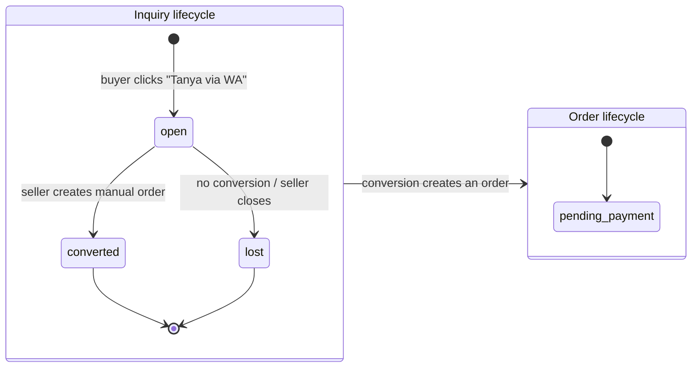
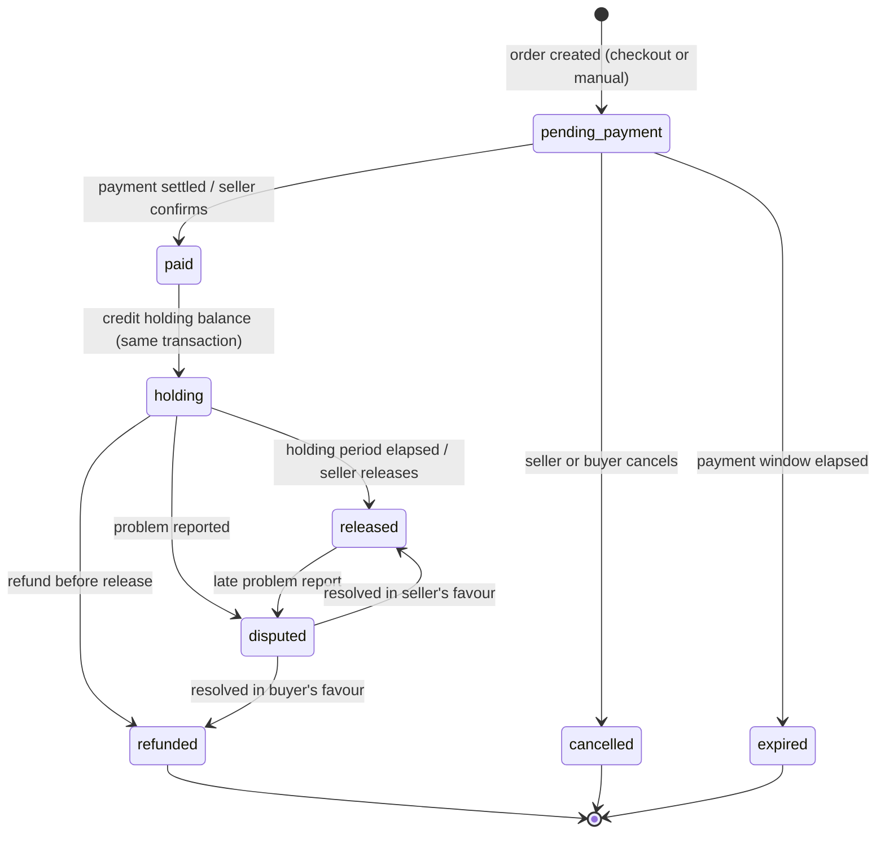

# 08 — Order State Machine

The state machine from `user-behavior.md` §4, specified precisely enough to implement and test.

---

## 1. Scope: `inquiry` is not an order

`user-behavior.md` §4 lists `inquiry` as the first state. `database-schema.md` models inquiries as a
separate table. **The schema is correct and this document follows it** ([AD-08](./README.md#decision-log)).

An inquiry has no money, no line items, and no commitment. Most inquiries never become orders. Folding
them into `orders` would mean every revenue query, ledger join, and CRM aggregation carries a
`WHERE status != 'inquiry'` clause forever, and eventually one of them would forget.

The two lifecycles run in parallel and meet at conversion:



---

## 2. States

| State | Meaning | Money position | Terminal |
|---|---|---|---|
| `pending_payment` | Order exists, awaiting payment | None | No |
| `paid` | Payment received (gateway or seller-confirmed) | Transitional — immediately becomes `holding` | No |
| `holding` | Funds credited to the seller's **holding** balance, not yet withdrawable | In `holding_balance` | No |
| `released` | Holding period elapsed; funds moved to **available** | In `available_balance` | No¹ |
| `disputed` | Buyer or seller raised a problem | Frozen where it sits | No |
| `refunded` | Money returned to the buyer | Debited from the seller | **Yes** |
| `cancelled` | Terminated before payment | None | **Yes** |
| `expired` | Payment window elapsed unpaid | None | **Yes** |

¹ `released` is not strictly terminal — a dispute can still be raised after release, which is exactly the
scenario `user-behavior.md` §6 flags as only partially solvable. The order can move `released → disputed`,
but funds have already mixed into the seller's general balance, so recovery becomes a manual matter
(`refunds.requires_manual_recovery`, [06 §2.8](./06-database-roadmap.md#28-refunds--new-table)).

### Why `paid` and `holding` are separate states

`paid` is momentary — the system passes through it and lands on `holding` in the same transaction. It
would be tempting to collapse them.

They stay separate because they answer different questions. `paid` records *the buyer's obligation is
discharged*; `holding` records *the platform owes the seller, conditionally*. When a dispute is
investigated six weeks later, `order_status_history` must show both facts with their own timestamps.
Collapsing them loses the distinction between "when did money arrive" and "when did the seller's claim
on it begin" — and those differ for manually-confirmed Path B payments.

---

## 3. Transitions



### Transition table

| # | From | To | Trigger | Actor | Guards | Effects |
|---|---|---|---|---|---|---|
| 1 | — | `pending_payment` | Checkout or manual order created | buyer / seller | Products active, stock available, promo valid | Snapshot items, compute totals + fee, create Snap token, `OrderCreated` |
| 2 | `pending_payment` | `paid` | `PaymentSettled` webhook | system | Webhook not already processed; amount matches | Set `paid_at`, `payment_method`, `midtrans_transaction_id`, `OrderPaid` |
| 3 | `pending_payment` | `paid` | Seller confirms manual payment | seller | Order source is `manual` | Same as above with `payment_method = 'manual'` |
| 4 | `paid` | `holding` | Automatic, same transaction | system | — | Compute `holding_until`, credit `holding_balance`, `BalanceCredited` |
| 5 | `pending_payment` | `cancelled` | Explicit cancel | seller / buyer | Not paid | Restore stock, `OrderCancelled` |
| 6 | `pending_payment` | `expired` | Expiry job or `PaymentExpired` webhook | system | `created_at + window < now()` | Restore stock, `OrderExpired` |
| 7 | `holding` | `released` | Release job | system | Settlement mode is `auto`; `holding_until <= now()`; Midtrans settled | Move holding → available, `OrderReleased` |
| 8 | `holding` | `released` | Seller clicks Release | seller | `holding_until <= now()` — **the floor applies even in manual mode** | Same |
| 9 | `holding` | `released` | Auto-force-release | system | Manual mode and `paid_at + 30d < now()` | Same, flagged as forced |
| 10 | `holding` | `disputed` | Problem reported | buyer / seller / admin | Not already disputed | Freeze funds, `OrderDisputed` |
| 11 | `released` | `disputed` | Late problem report | buyer / admin | Within the dispute window | Flag; funds already mixed |
| 12 | `holding` | `refunded` | Refund issued | seller / admin | Funds still in holding | Debit holding, Midtrans refund, `OrderRefunded` |
| 13 | `disputed` | `released` | Resolved for seller | admin / seller | Dispute open | Unfreeze, move to available |
| 14 | `disputed` | `refunded` | Resolved for buyer | admin / seller | Dispute open | Refund; if already released, set `requires_manual_recovery` |

### Everything not listed is illegal

`OrderTransitionPolicy` holds this table as data. Any transition absent from it returns
`Err(IllegalTransition)`. Notably forbidden:

- `expired → paid` — a late webhook for an expired order must not resurrect it. It is recorded as an
  anomaly and routed to admin review, because money may genuinely have been taken.
- `refunded → anything` — terminal.
- `released → holding` — money does not travel backwards. A correction is a compensating ledger entry.
- `pending_payment → released` — skipping payment.
- `cancelled → paid` — same reasoning as expired.

---

## 4. Holding period rules

From `user-behavior.md` §5 and §9.

| Product type | Risk tier | Holding period | Rationale |
|---|---|---|---|
| `digital` | Low | T+0 — immediate | Delivered at purchase; dispute risk minimal |
| `physical` | Medium | T+3 from `paid`, or T+3 from `shipped_at` when tracking is entered | Buyer needs time to receive and inspect |
| `service` | High | T+7 | Custom work, higher expectation mismatch |

### Mixed baskets: max risk tier wins

An order with one digital and one physical item is held T+3 in full ([AD-09](./README.md#decision-log)).

Per-item release would require splitting each ledger entry by line and tracking partial release state
per item — a large increase in ledger complexity for a case that is rare and whose downside (a seller
waits three days for the digital portion) is small. Simple, safe, explainable to a seller in one sentence.

### The platform floor is not negotiable

```
effective_holding_until = max(
    platform_floor(max_risk_tier, paid_at, shipped_at),
    seller_requested_hold        -- manual mode may extend
)
```

`user-behavior.md` §9 is explicit: manual mode may **lengthen** a hold, never shorten it. A seller holding
their own money longer is their prerogative; a seller releasing before the buyer's complaint window closes
is the actual abuse vector. The floor is computed in `SettlementPolicyResolver` ([04 §2](./04-entity-design.md#2-store--tier-2))
and the `holding → released` transition re-checks it — including for the manual path — so a UI bug cannot
produce an early release.

### Auto-force-release safety net

Manual mode plus a seller who forgets equals funds stuck indefinitely. After **30 days** from `paid_at`,
the system releases regardless. Operational hygiene, not fraud prevention — the seller is notified and
the ledger note records that it was forced.

---

## 5. The Midtrans settlement clock

Internal release must never outrun Midtrans's settlement to the Nagihin bank account, or the platform
promises withdrawable money it does not physically hold ([00 §3](./00-product-analysis.md#3-product-flow)).

Digital products are the sharp edge: T+0 internal release against Midtrans's T+3 settlement means a
seller could request a withdrawal of money that has not arrived.

**Rule:** `holding_until = max(product_tier_period, midtrans_settlement_estimate)`.

| Product type | Internal tier | Effective earliest release |
|---|---|---|
| `digital` | T+0 | **T+3 business days** (Midtrans-bound) |
| `physical` | T+3 | **T+3–6 business days** (whichever is later) |
| `service` | T+7 | T+7 |

For a single-operator platform this is the conservative choice: the alternative is fronting cash from
operating capital, which is precisely the float confusion `user-behavior.md` §13 warns against.

**This must be communicated in the seller UI**, not discovered at withdrawal time. The balance screen
shows `holding_until` per order and the reason ("dana masuk T+3 setelah settlement Midtrans"). Silent
delays are how sellers conclude a platform is holding their money arbitrarily.

Once a Midtrans settlement report confirms a transaction earlier than estimated, the estimate can be
replaced by the actual settlement date — a refinement worth doing after reconciliation is running
([10](./10-background-jobs.md)).

---

## 6. Implementation

### Transitions are aggregate methods

```
order.markPaid(paidAt, method, transactionId) : Result<void, DomainError>
order.release(releasedAt, actor)              : Result<void, DomainError>
order.dispute(reason, actor)                  : Result<void, DomainError>
```

Each method:
1. Consults `OrderTransitionPolicy` — is this legal from the current state, for this actor?
2. Checks state-specific guards (holding elapsed, funds still in holding, …)
3. Mutates state
4. Appends an `OrderStatusHistory` entry with actor and reason
5. Records a domain event on the aggregate

There is no public status setter and no repository method that writes `status` directly. Bypassing the
machine requires deleting code, not merely forgetting to call something.

### One transaction per transition

```
runInTransaction(async () => {
  const order = await orderRepo.findById(id);       // row-locked
  const result = order.markPaid(...);               // may fail — Result, not exception
  if (result.isErr()) return result;
  await orderRepo.save(order);                      // order + status history
  await ledger.creditHolding(order);                // balance_transactions + stores cache
  await outbox.enqueue(order.pullEvents());         // published after commit
});
```

The order write, the ledger write, the history write, and the outbox write commit together or not at
all. This is the single most important transactional boundary in the system: it is what makes "paid but
never credited" impossible.

**No external call goes inside this transaction.** Midtrans calls, storage uploads, and queue publishes
happen before (idempotently) or after (via the outbox).

### Concurrency

`findById` for a write uses `SELECT ... FOR UPDATE`. Two simultaneous webhooks for the same order
serialize; the second finds the state already advanced and its transition returns
`Err(IllegalTransition)`, which the webhook processor treats as *already handled* rather than an error.

---

## 7. Test matrix

Every row is a test. This machine is where a bug costs real money, so the coverage target here is 100%
of transitions, both legal and illegal.

| Test | Expectation |
|---|---|
| Checkout creates `pending_payment` with correct totals and fee | ✅ |
| Settled webhook → `paid` → `holding` with correct `holding_until` | ✅ |
| Duplicate settled webhook | Second is ignored, balance credited once |
| Digital-only order | `holding_until` respects the Midtrans floor, not T+0 |
| Mixed digital + physical | Takes the physical (higher) tier |
| Physical order with shipping entered | `holding_until` recomputed from `shipped_at` |
| Manual release before floor | `Err(HoldingPeriodNotElapsed)` |
| Manual release after floor | Moves holding → available |
| Manual mode + 30 days elapsed | Force-released, flagged |
| Auto mode + period elapsed | Released by the job |
| Dispute during holding | Funds frozen; release job skips it |
| Dispute after release | Recorded; `requires_manual_recovery` set on refund |
| Refund during holding | Holding debited, balance non-negative |
| Expiry job on unpaid order | `expired`, stock restored |
| Late webhook on expired order | Rejected, anomaly recorded, admin alerted |
| Any transition from `refunded` | `Err(IllegalTransition)` |
| `released → holding` | `Err(IllegalTransition)` |
| Concurrent release + withdrawal | Serialized; no double-spend |
| Every transition writes exactly one history row | ✅ |
| Every money transition writes exactly one ledger row | ✅ |

---

Next: [09 — Payments & Ledger](./09-payments-ledger.md)
