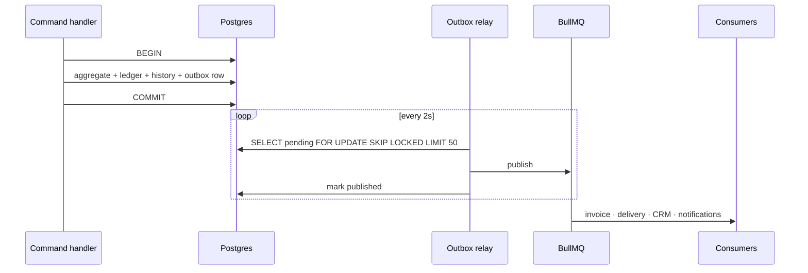
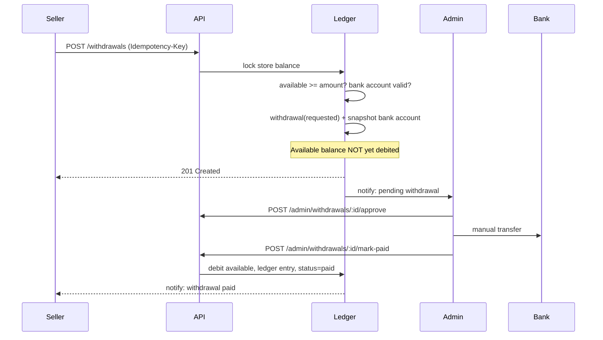
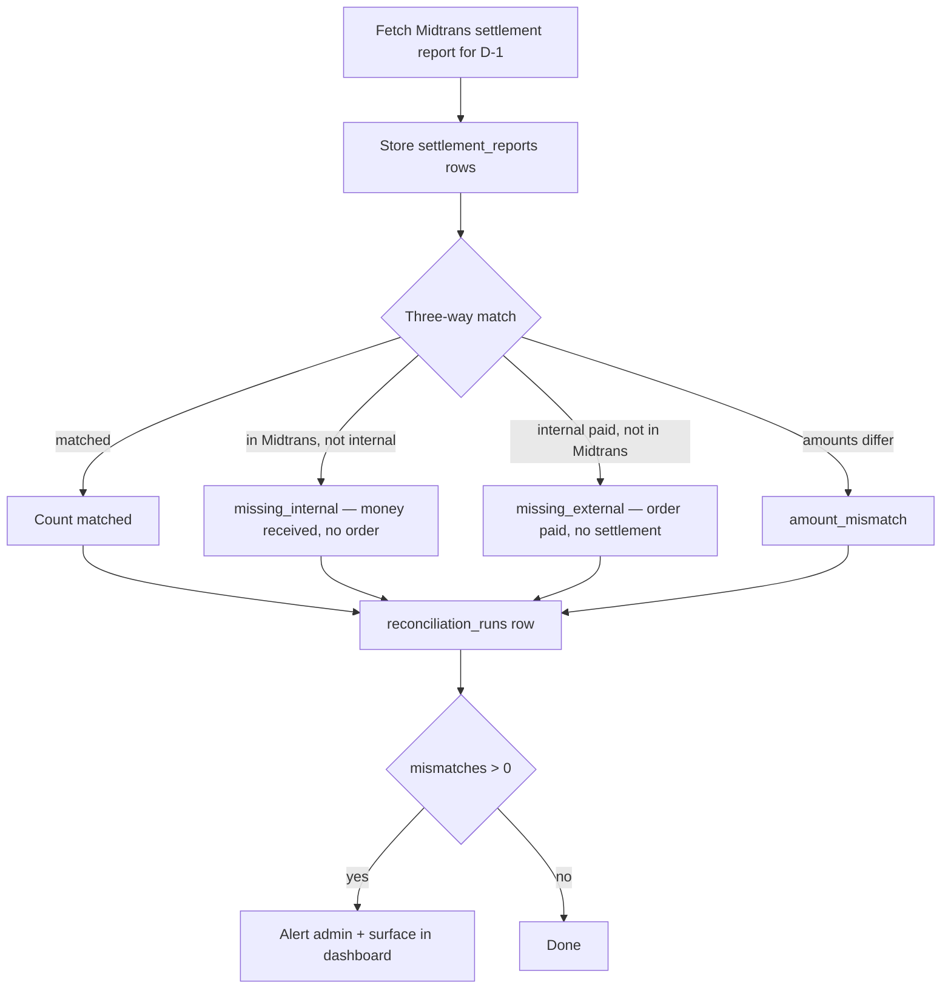

# 09 — Payments & Ledger

Nagihin is the **merchant of record** (Model 1, `user-behavior.md` §15). All buyer money lands in one
Midtrans account and one Nagihin bank account before any of it reaches a seller. That choice buys full
control over holding periods and near-zero seller onboarding friction; it charges for that in custodial
risk, regulatory exposure, and the obligation to know — to the rupiah — how much of the bank balance
is not ours.

This document is the design for that obligation.

---

## 1. Midtrans integration

### What we use

| Product | Purpose | When |
|---|---|---|
| **Snap** | Hosted checkout: QRIS, VA, e-wallet, card | MVP |
| **Core API** — status, refund | Polling fallback, refunds | MVP |
| **Settlement report** | Daily reconciliation | P1 |
| **Payouts (Iris)** | Automated seller disbursement | Future — replaces manual transfers |

### Snap token creation

Created synchronously during checkout so the response can carry it to the browser.

```
POST /snap/v1/transactions
{
  transaction_details: { order_id: <order_number>, gross_amount: <total> },
  customer_details:    { first_name, email, phone },
  item_details:        [ ...line items..., { id: 'platform_fee', ... } ],
  expiry:              { duration: 24, unit: 'hours' },
  callbacks:           { finish: '<app>/checkout/<orderNumber>/status' }
}
```

Three details that matter:

- **`order_id` is our `order_number`, not our UUID.** Midtrans requires uniqueness per merchant and shows
  this value in their dashboard, where a human-readable number makes support tractable.
- **`item_details` must sum exactly to `gross_amount`** or Midtrans rejects the transaction. Discounts go
  in as a negative line item.
- **Snap expiry mirrors our order expiry.** Divergent windows produce the worst case: Midtrans accepts a
  payment for an order we already expired.

### Anti-corruption boundary

Midtrans vocabulary — `settlement`, `capture`, `deny`, `fraud_status`, `signature_key` — stops inside the
Payments module. Nothing downstream ever sees a Midtrans payload; it sees `PaymentSettled`. This is what
keeps a future migration to Model 2 / Xendit a change inside one module
([03 §3.5](./03-bounded-contexts.md#35-payments)).

---

## 2. Webhook flow

```mermaid
sequenceDiagram
    participant M as Midtrans
    participant C as Webhook controller
    participant DB as Postgres
    participant Q as BullMQ
    participant W as Worker
    participant O as Ordering
    participant L as Ledger

    M->>C: POST /payments/midtrans/webhook
    C->>C: Verify SHA-512 signature
    alt invalid
        C-->>M: 401
    end
    C->>DB: INSERT webhook_events (status='received', raw payload)
    C->>Q: enqueue process-webhook(eventId)
    C-->>M: 200 OK (fast — under 100ms)

    W->>Q: consume
    W->>DB: Load event; already processed for this txn+status?
    alt duplicate
        W->>DB: mark 'ignored'
    else new
        W->>O: PaymentSettled → MarkOrderPaid
        O->>DB: order → paid → holding + status history
        O->>L: credit holding_balance
        L->>DB: balance_transactions + stores cache
        O->>DB: outbox: OrderPaid
        W->>DB: mark 'processed'
    end
```

### Rules

1. **Verify the signature before anything else.** SHA-512 of
   `order_id + status_code + gross_amount + server_key`, compared in constant time. An unverified payload
   is not evidence of anything.
2. **Persist raw before interpreting.** A payload we cannot parse is still the only record that Midtrans
   told us something. `webhook_events.payload` is written verbatim.
3. **Return `200` as soon as it is persisted.** Midtrans treats slow or failing responses as delivery
   failures and retries with backoff. Doing ledger work inline turns one slow query into a retry storm
   against an already-struggling system.
4. **Never return `500` for a processing bug.** The row is saved; the bug is fixed; the event is
   reprocessed from the admin UI. Retries cannot fix a code defect, they only amplify it.
5. **Verify the amount.** `gross_amount` must equal the order total. A mismatch is never auto-accepted —
   it is a `reconciliation_mismatch` and an admin alert.

### Status mapping

| Midtrans `transaction_status` | `fraud_status` | Domain event |
|---|---|---|
| `capture` | `accept` | `PaymentSettled` |
| `capture` | `challenge` | `PaymentPending` — awaits manual review |
| `settlement` | — | `PaymentSettled` |
| `pending` | — | `PaymentPending` |
| `deny` | — | `PaymentFailed` |
| `cancel` | — | `PaymentFailed` |
| `expire` | — | `PaymentExpired` |
| `refund` / `partial_refund` | — | `RefundCompleted` |

`capture` + `challenge` is the trap: it looks successful and is not. Treating it as settled credits a
seller for money that may still be reversed. It maps to `PaymentPending` and waits for a subsequent
notification.

---

## 3. Idempotency

Three independent layers, because each protects a different failure.

### Layer 1 — webhook deduplication

Before processing, look up `(source, payload->>'transaction_id', transaction_status)` in `webhook_events`
with `status = 'processed'`. Found → mark the new row `ignored` and stop.

`database-schema.md` deliberately declines a unique constraint here, and that is right: duplicates must
be *recorded* and then ignored. A database rejection would lose the evidence that Midtrans retried.

### Layer 2 — HTTP idempotency keys

`POST /checkout` and `POST /withdrawals` require an `Idempotency-Key`. The key plus a hash of the body
is stored in `idempotency_keys`; a replay within 24 hours returns the stored response.

| Situation | Result |
|---|---|
| Same key, same body | Original response returned; nothing happens twice |
| Same key, different body | `409 Conflict` |
| New key | Processed normally |

This is what protects against a double-clicked "Bayar" button and a mobile client retrying on a flaky
connection.

### Layer 3 — domain guards

Even if both layers fail, `order.markPaid()` on an order already `holding` returns
`Err(IllegalTransition)`. The state machine is the last line, and it is the one that cannot be bypassed
by an infrastructure mistake.

**Three layers is not paranoia.** Layer 1 fails if two webhook deliveries race before either commits.
Layer 2 does not apply to webhooks. Layer 3 catches everything but produces a worse error message. Each
covers the others' blind spot, and duplicate payment credit is the single most expensive bug this system
can have.

---

## 4. Ledger design

### Principles

1. **Append-only.** No update, no delete. Corrections are compensating entries.
2. **The ledger is truth; `stores.*_balance` is a cache** derived from it and verifiable against it.
3. **Every row carries the resulting balances** (`holding_balance_after`, `available_balance_after`), so
   any single row can be verified in isolation and drift can be pinpointed to the exact entry where it
   began.
4. **Every money movement has exactly one entry.** Not zero, not two.
5. **Written only inside the transaction that caused it.**

### Entry types

| Type | Trigger | Holding | Available |
|---|---|---|---|
| `order_paid_holding` | Order `paid` | `+ (total − fee)` | — |
| `order_released` | Order `released` | `− (total − fee)` | `+ (total − fee)` |
| `withdrawal_paid` | Withdrawal marked paid | — | `− amount` |
| `refund_debit` | Refund before release | `− (total − fee)` | — |
| `refund_debit` | Refund after release | — | `− (total − fee)` |
| `promo_adjustment` | Manual correction | ± | ± |

### Worked example — Rp100.000 digital product, free tier (5%)

| Event | Type | Amount | Holding after | Available after |
|---|---|---|---|---|
| Buyer pays Rp100.000 | `order_paid_holding` | +95.000 | 95.000 | 0 |
| T+3, released | `order_released` | −95.000 / +95.000 | 0 | 95.000 |
| Withdrawal of Rp95.000 paid | `withdrawal_paid` | −95.000 | 0 | 0 |

Platform revenue of Rp5.000 is **never inserted into this ledger** — it is derived from
`SUM(orders.platform_fee_amount) WHERE released_at IS NOT NULL AND status <> 'refunded'`, exactly as
`database-schema.md` specifies. Seller balances answer "what do we owe"; the derived query answers "what
did we earn". Mixing them in one table is how a platform starts spending float.

### The three numbers the operator must know

| Number | Source | Meaning |
|---|---|---|
| `total_seller_liability` | `SUM(holding_balance + available_balance)` across stores | **Money in our bank account that is not ours** |
| `platform_revenue` | Derived from released orders | Actually earned |
| Bank balance | Reality | Must be ≥ liability at all times |

`user-behavior.md` §13 requires these to be separated in *accounting*, not merely in the UI. The admin
dashboard surfaces all three on one screen, because the moment they are on different screens someone
starts treating the bank balance as spendable.

### Concurrency

Every ledger write loads `StoreBalance` with `SELECT ... FOR UPDATE`. Withdrawal creation and release
processing therefore serialize per store. Without the lock, "read available balance, then debit" is a
textbook double-spend under two concurrent requests.

---

## 5. The two-clock problem

Two settlement clocks run independently and are unrelated:

| Clock | Controlled by | Duration |
|---|---|---|
| Midtrans → Nagihin bank | Midtrans | T+3 business days |
| `holding` → `available` | Us | T+0 / T+3 / T+7 by product type |

If the internal clock is faster, the platform owes a seller withdrawable money it has not received.
Digital products at T+0 hit this immediately.

**Resolution:** `holding_until = max(product_tier_period, midtrans_settlement_estimate)`, detailed in
[08 §5](./08-order-state-machine.md#5-the-midtrans-settlement-clock).

The alternative — fronting from operating capital — is viable for a funded company and reckless for a
solo operator. `user-behavior.md` §13 already commits to honest expectation-setting with sellers; the
system must make that expectation visible per order rather than leaving sellers to infer it.

---

## 6. Outbox & event flow

### The problem

```
BEGIN;
  UPDATE orders SET status = 'holding';
  INSERT INTO balance_transactions ...;
COMMIT;
await queue.add('generate-invoice', ...);   // ← Redis down. Invoice never generated.
```

The database commits, the queue publish fails, and the invoice is never created — with nothing to
indicate anything went wrong. Retrying the whole operation would double-credit the balance.

### The solution

```
BEGIN;
  UPDATE orders SET status = 'holding';
  INSERT INTO balance_transactions ...;
  INSERT INTO outbox_events (event_type, payload, status='pending');
COMMIT;
```

A relay in the worker polls `outbox_events WHERE status='pending' AND available_at <= now()`, publishes
to BullMQ, and marks `published`. If publishing fails, the row stays pending and is retried with
exponential backoff. The event cannot be lost, because it committed with the state change that caused it.



`FOR UPDATE SKIP LOCKED` lets multiple relay instances run without stepping on each other, should the
worker ever scale beyond one process.

### What goes in the outbox versus the in-process bus

| Outbox (durable) | In-process `EventBus` |
|---|---|
| `OrderPaid`, `OrderReleased`, `OrderRefunded` | Cache invalidation |
| `PaymentSettled` | Search index updates |
| `WithdrawalRequested`, `WithdrawalPaid` | Non-critical metrics |
| `InvoiceGenerated` | |
| Anything producing a notification | |

**The test:** if losing this event would lose money or break a user-visible promise, it goes in the
outbox. Otherwise the in-process bus is fine. Getting this backwards is the most likely architectural
mistake in this codebase.

### Consumer idempotency

Consumers must tolerate redelivery — the relay guarantees at-least-once, not exactly-once. Invoice
generation is keyed on `order_id` (unique); CRM upsert recomputes totals rather than incrementing;
delivery provisioning is keyed on `order_item_id`.

---

## 7. Withdrawal flow



### Why the debit happens at `mark-paid`, not at request

Debiting at request time would mean a rejected withdrawal needs a compensating credit — two ledger
entries for something that never happened, and a window where the seller's displayed balance is wrong for
a reason they cannot see.

Instead the requested amount is **reserved logically**: available balance for new requests is
`available_balance − SUM(pending withdrawals)`. One entry, on the transfer that actually occurred.

Both reads happen under the same row lock, so a seller cannot open two tabs and request the same money
twice.

### Validation at request time

- Amount ≥ minimum (Rp50.000 — below this, transfer fees dominate)
- Amount ≤ available minus pending
- A verified default bank account exists
- No unresolved dispute on orders contributing to the balance
- Rate-limited: one pending withdrawal per store at a time (MVP simplification, removable later)

### Failure handling

| Failure | Handling |
|---|---|
| Transfer fails at the bank | Admin marks `rejected` with a reason; no ledger entry; balance untouched |
| Wrong account number | The snapshot proves what was submitted; recovery is a manual banking matter |
| Admin marks paid but the transfer did not happen | Reconciliation against bank statements catches it; corrected with a compensating entry |
| Seller requests during a dispute | Blocked at validation |

---

## 8. Refunds

| Scenario | Funds are | Action |
|---|---|---|
| Before release | In `holding` | Debit holding, call Midtrans refund, order → `refunded` |
| After release, not withdrawn | In `available` | Debit available (may go to zero, never negative), order → `refunded` |
| After withdrawal | In the seller's bank | Cannot recover. Order → `refunded`, `requires_manual_recovery = true`, admin notified |

The third row is `user-behavior.md` §6's acknowledged gap. The system records it accurately rather than
pretending to solve it — which is the honest engineering response to a business problem that needs a
policy (reserve balance, ToS terms), not code.

**Refunds are always initiated through our API, never directly in the Midtrans dashboard.** A dashboard
refund produces a webhook for an order whose ledger has not been adjusted, and reconciliation surfaces it
as a mismatch days later. This belongs in the operator runbook.

---

## 9. Reconciliation

Mandatory from MVP (`user-behavior.md` §13). Runs daily at 02:00 WIB.



| Outcome | Likely cause | Response |
|---|---|---|
| `missing_internal` | Webhook never arrived or failed processing | Replay from `webhook_events`; if absent, poll Midtrans and create the transition |
| `missing_external` | Manually-confirmed Path B payment, **or** a fraudulent confirmation | Expected for `payment_method = 'manual'`; investigate otherwise |
| `amount_mismatch` | Partial refund, MDR deduction, or a tampering attempt | Manual review, always |

A separate weekly job verifies **cached balances against ledger sums** for every store and raises
`BalanceDriftDetected` on any difference. Drift is never auto-corrected — a silent correction hides the
bug that caused it. It is alerted, investigated, and fixed with an explicit compensating entry.

---

## 10. Failure handling summary

| Failure | Detection | Recovery |
|---|---|---|
| Webhook never delivered | Reconciliation `missing_internal`; status-polling job | Poll Core API, apply the transition |
| Webhook processing throws | `webhook_events.status = 'failed'` | Admin reprocess endpoint |
| Duplicate webhook | Dedup check | Marked `ignored` |
| Redis down when publishing | Outbox rows stay `pending` | Relay retries when Redis recovers |
| Worker crashes mid-job | BullMQ retry with backoff | Idempotent consumers make replay safe |
| Snap token creation fails | Checkout returns an error | Order stays `pending_payment`; token re-issuable |
| Midtrans refund API fails | `refunds.status = 'failed'` | Retry job; then manual |
| Bank transfer fails | Admin observes | Withdrawal rejected, balance untouched |
| Balance drift | Weekly verification | Alert, investigate, compensating entry |
| Payment for an expired order | Reconciliation mismatch | Admin decides: honour or refund |

### Retry policy

| Operation | Attempts | Backoff |
|---|---|---|
| Webhook processing | 5 | Exponential, 1s → 16s |
| Outbox relay | Unlimited | Exponential, capped at 5 min |
| Invoice generation | 3 | Exponential, 10s → 40s |
| Email | 5 | Exponential, 30s → 8 min |
| WhatsApp | 3 | Exponential, 1m → 4m |
| Midtrans status poll | 10 | Fixed 5 min |
| Refund API | 3 | Exponential, 1m → 4m |

Anything exhausting its retries lands in a dead-letter queue with an admin alert. A silently discarded
money-related job is worse than a loud failure.

---

Next: [10 — Background Jobs](./10-background-jobs.md)
