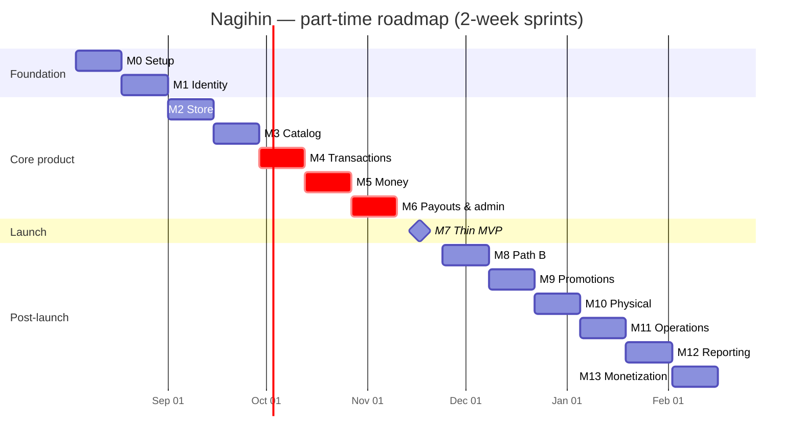

# 12 — Roadmap & Sprints

**Capacity assumption:** one part-time engineer, ~20–25 hours per two-week sprint (~10–12h/week).
Every estimate below is against that capacity. Adjust proportionally for a different pace.

---

## 1. Milestones

| M | Milestone | Sprints | Complexity | Outcome |
|---|---|---|---|---|
| **M0** | Foundation | 1 | Low | Repo, Docker, CI, config, health checks, Prisma bootstrap |
| **M1** | Identity | 2 | Medium | Google OAuth + email/password, account linking, JWT + rotation, guards, profile |
| **M2** | Store & storefront | 3 | Medium | Store CRUD, username, public `/@username`, social links |
| **M3** | Catalog | 4 | Medium | Products, images, digital files, storefront product pages |
| **M4** | Transaction core | 5 | **High** | Checkout, orders, Midtrans, webhooks, outbox, digital delivery |
| **M5** | Money | 6 | **High** | Ledger, balances, invoices, CRM capture |
| **M6** | Payouts & admin | 7 | High | Withdrawals, admin dashboard, buyer `/akun`, audit |
| **M7** | **Thin MVP launch** | 8 | Medium | Reports, polish, production hardening, first sellers |
| **M8** | Path B | 9 | Medium | Inquiries, manual orders, WA channel |
| **M9** | Promotions | 10 | Medium | Promotions, auto-apply links, redemptions |
| **M10** | Physical & disputes | 11 | High | Shipping, tracking, disputes, refunds |
| **M11** | Operations | 12 | Medium | Reconciliation, balance verification, notification log |
| **M12** | Reporting depth | 13 | Medium | Gross profit, product performance, CRM export |
| **M13** | Monetization | 14 | Medium | Subscriptions, Pro gating, recurring billing |

---

## 2. Sprint backlog

### Sprint 1 — Foundation
**Goal:** an empty but production-shaped system that deploys.

- [x] pnpm monorepo: `apps/api`, `apps/worker`, `packages/contracts`, `web`
- [x] NestJS bootstrap: config module with env schema validation at boot, Pino logging, global pipes/filters/interceptors
- [x] Prisma init, migration 001. **Amendment:** Postgres is self-hosted via Docker Compose (and later the VPS) rather than Supabase-hosted; Supabase is scoped to object storage only ([13 §3](./13-devops-testing-prod.md#3-production-checklist) amended accordingly). `DATABASE_URL`/`DIRECT_DATABASE_URL` are still kept distinct so a pooler can be dropped in later without a code change
- [x] Shared kernel: `Result`, base entity/aggregate/VO, UUIDv7, `Money`
- [x] Docker Compose: Postgres, Redis, API, worker
- [x] Swagger at `/docs`, health at `/health` and `/health/ready`
- [x] Next.js bootstrap: Tailwind, shadcn init, theme provider, dark mode
- [x] GitHub Actions: lint, typecheck, test, build (integration/e2e jobs deferred — no Postgres-backed module or staging environment to test yet)
- [ ] Deploy skeleton to Railway/Render + Vercel — **deferred.** No hosting accounts yet; the production target is a self-hosted VPS with its own domain rather than Railway/Render/Vercel. `Dockerfile.api`/`Dockerfile.worker` are already VPS-portable; the actual deploy pipeline (and Vercel or a VPS-hosted `web`) is revisited once the VPS is ready

**Deliverable:** `docker compose up` runs the whole stack; verified locally — Postgres/Redis healthy,
`/health` and `/health/ready` return green, migration 001 applies cleanly. No deployed environment yet.

---

### Sprint 2 — Identity
**Goal:** a user can sign in and stay signed in, by Google or by email/password.

- [x] Migration 002: `users` (+ `role`, `password_hash`, `email_verified_at`, nullable `google_id`), `refresh_tokens`, `verification_tokens` ([AD-13](./README.md#decision-log))
- [x] `User` aggregate, `Email`/`UserRole`/`PasswordHash` VOs, `UserRepository` + mapper. **Amendment:** `Phone` stays a plain nullable string on the aggregate rather than a VO — it isn't validated or used yet; wrap it when the WhatsApp channel (Sprint 9) needs a real format check
- [x] Google OAuth: authorize redirect, state in Redis, PKCE, callback, `id_token` verification
- [x] Email/password: register, Argon2id hashing, login, email verification, forgot/reset password ([07 §1a](./07-auth.md#1a-email--password-registration-and-login))
- [x] Minimal `EmailSender` (Resend) for verification + reset emails only — full `NotificationChannel` port stays Sprint 6
- [x] Account linking: `POST /auth/google/link`, `POST /auth/set-password`, `DELETE /auth/google/unlink` — explicit-authenticated-action only, never implicit ([07 §1b](./07-auth.md#1b-account-linking))
- [x] Token issuance: RS256 access (15m), opaque refresh (30d, hashed)
- [x] Rotation with family reuse detection
- [x] `JwtAuthGuard` global + `@Public()`, `RolesGuard`, `@CurrentUser()`
- [x] `/auth/*` and `/users/me` endpoints, stricter rate limit on login/register/forgot-password
- [x] Frontend: `/masuk` (password form + Google button), `/daftar`, `/lupa-password`, `/reset-password`, `/callback`, `/lengkapi-profil`, token store, silent refresh, single-flight
- [x] Middleware protecting `/dashboard/*` and `/akun/*` — implemented as `web/src/proxy.ts` (Next.js renamed `middleware.ts` to `proxy.ts`)
- [x] Tests: OAuth flow, password register/verify/login, forgot/reset, linking rules (both directions + retain-one-method invariant), rotation, reuse detection, guards

**Deliverable:** sign in with Google or with email/password, verify email, reset a forgotten password,
refresh across a reload, sign out. Connecting a Google account from settings ships with Sprint 3's
`/dashboard/pengaturan`.

**Status: done.** Verified 2026-07-29 — 95/95 unit tests pass, lint and typecheck clean, integration
suite (`identity.int-spec.ts`) covers register→verify→login, forgot/reset (incl. session revocation),
refresh rotation + reuse detection, and Google login collision/new-user cases. `test:integration`
wasn't run live (requires Docker, not running locally) but was read in full and is not stubbed.

---

### Sprint 3 — Store & public storefront
**Goal:** a seller has a shareable link.

- [x] Migration 003: `stores` (+ `invoice_counter`), `social_links`
- [x] `Store` aggregate, `Username` VO + reserved blocklist, `SettlementPolicy` VO
- [x] Store creation, profile update, username availability + change
- [x] Settlement mode setting with floor enforcement
- [x] Social links CRUD + reorder
- [x] Storefront read context + Redis cache with event invalidation
- [x] Supabase Storage: avatar and banner upload
- [x] Frontend: dashboard shell + sidebar, `/dashboard/toko`, `/dashboard/pengaturan`
- [x] Frontend: public `/@username` (SSR), `StorefrontHeader`, social links
- [x] Seed: reserved usernames, plans, bank codes

**Deliverable:** create a store, claim `@username`, view the live public page.

**Status: done.** Verified 2026-07-30 — 33 API unit suites (225 tests) and 3 integration suites
(23 tests, real Postgres + Redis) pass; web typecheck, lint, and `next build` are clean. Live
smoke test against running `api`/`web` dev servers: register → verify → login → create store →
username availability (reserved + free) → social link add → public `/storefront/:username` (cached
in Redis, case-insensitive, 404s for unknown) → SSR `/@username` page (display name present in
initial HTML, correct `<title>`) → `/username` (no `@`) also resolves → unknown username renders
the not-found page.

Decisions and drift from the docs, recorded here rather than silently:
- Reserved usernames are a frozen code constant (`shared/kernel/value-objects/reserved-usernames.ts`),
  not a table; plan fee rates come from env (`PLAN_FEE_RATE_FREE`/`_PRO`); bank codes are deferred to
  Sprint 7. `prisma/seed/base.ts` stays an empty no-op — see [06 §5](./06-database-roadmap.md).
- `Username` VO lives in `shared/kernel/value-objects/`, not inside the store module, so the
  storefront module can validate/normalize a handle without importing another module's domain layer.
  This makes Sprint 2's module-local `Email` VO the inconsistent one, not `Username`.
- `stores.owner_id` is `@unique` — one store per user is a database invariant, not just an
  application check. Not stated explicitly in the docs; consistent with "satu seller = satu toko."
- `stores.owner_id → users` FK is `ON DELETE RESTRICT` (a store carries balances); `social_links →
  stores` cascades (purely presentational) — matches [06 §4](./06-database-roadmap.md#4-constraints).
- Username changes are throttled *and* governed by two Redis-backed policies with no schema
  column: a 30-day per-store change cooldown, and a 90-day reservation on a released handle so a
  stranger cannot immediately claim a seller's old link. Both configurable via
  `USERNAME_CHANGE_COOLDOWN_DAYS` / `USERNAME_RESERVATION_DAYS`.
- `POST /stores/me/avatar` and `POST /stores/me/banner` (multipart upload, magic-byte validated,
  2MB/5MB limits) are new endpoints not listed in [05 §3](./05-api-roadmap.md); they upload and
  persist the URL in one step rather than a bare-URL-then-PATCH flow.
- Storage has three adapters behind one `StorageUploader` port: Supabase (used when
  `SUPABASE_URL`/`SUPABASE_SERVICE_ROLE_KEY` are set), a filesystem adapter writing into
  `web/public/uploads` (used in development when Supabase is unconfigured, so uploads are actually
  testable locally), and a null adapter that throws a clear 503 in production when unconfigured.
- No outbox exists yet (Sprint 5), so storefront cache invalidation is an in-process
  `DomainEventPublisher` (`shared/infrastructure/events/`) that Store publishes to after each
  commit and the storefront module subscribes to. This works only within a single API process —
  the 60s Redis TTL is the real staleness guarantee once there is a second replica or the worker
  starts touching stores. Redis pub/sub is the documented upgrade path.
- The global rate limiter was a single `default` bucket shared by every route, including
  `/users/me`, capped at `AUTH_THROTTLE_LIMIT` (5/min) — a Sprint 2 bug this sprint was the first to
  actually trigger. Fixed by renaming that global bucket's source to `GENERAL_THROTTLE_LIMIT`
  (300/min, matching [05 §17](./05-api-roadmap.md)) and keeping the existing per-route
  `@Throttle` overrides for login/register/forgot-password at the original 5/min.
- `/users/me` and `/users` PATCH responses now include a `store: { id, username, displayName,
  avatarUrl, plan } | null` summary ([05 §2](./05-api-roadmap.md)) — a breaking change to
  `web/src/features/auth/api/auth.api.ts`'s `UserResponse`, updated in the same change.
- `SettlementPolicy`'s `effectiveHoldUntil`/`forcedReleaseAt` are fully implemented and unit-tested
  but not called from any production code path yet — `ProductRiskTier` doesn't exist until Sprint 4
  and the release job doesn't exist until Sprint 6. The risk tier is a local `'low'|'medium'|'high'`
  string union in the VO file rather than an import from a module that doesn't exist yet.
- `StoreOwnerGuard` lives in `modules/store/presentation/guards/`, not `shared/presentation/guards/`
  as [02's folder tree](./02-architecture.md) suggests, because it depends on `STORE_REPOSITORY` and
  a shared-layer file importing a module's token would invert the dependency direction.
- The JWT `storeId` claim is populated on login/refresh but is treated purely as a UI hint — every
  tier-`S` request re-resolves ownership from the database via `StoreOwnerGuard`, per
  [07 §2](./07-auth.md). A user who creates a store keeps working immediately (the guard doesn't
  need the claim); the frontend gets the claim into a fresh token via the existing single-flight
  `refreshAccessToken()` after `POST /stores` succeeds.

---

### Sprint 4 — Catalog
**Goal:** there is something to sell.

- [x] Migration 004: `products`, `digital_files`
- [x] `Product` aggregate, `ProductType`/`ProductStatus`/`Slug`/`StockLevel` VOs, `ProductRiskTierResolver`
- [x] Product CRUD, publish/archive, slug uniqueness per store
- [x] Image upload (public bucket), delete — reorder deferred, see drift below
- [x] Digital file upload (private bucket), validation that digital products have files before publishing
- [x] Public product endpoints + cache
- [x] Frontend: `/dashboard/produk` list, create/edit form, `ImageUploader`, `FileUploader`, `MoneyInput`
- [x] Frontend: public product page with Beli + Tanya buttons (both inert until Sprint 5's checkout — see drift below)
- [x] Tests: product rules, slug collisions, storage integration

**Deliverable:** publish a digital product and see it on the public storefront.

**Status: done.** Verified 2026-07-30 — 43 API unit suites (347 tests) and 4 integration suites
(42 tests, real Postgres + Redis) pass; web typecheck, lint, and `next build` are clean. Live
smoke test against running `api`/`web` servers: register → verify → login → create store →
create product (draft) → publish rejected without a digital file (422) → upload digital file →
publish succeeds → product visible on `GET /storefront/:username` and busts the cache → archive
removes it again. Separately: create a physical product → publish → SSR `/@username` shows it in
the grid → SSR `/@username/produk/:slug` renders name/price/description in the initial HTML
(verified via `view-source`, not devtools) → unknown slug renders the not-found page.

Decisions and drift from the docs, recorded here rather than silently:
- Full sprint scope was estimated at 34-38h against the ~20-25h part-time budget; the following
  items were cut to fit and are the acknowledged gap against the checklist above:
  - **Image reorder** (`PUT /products/:id/images/order`) was not built — upload order is display
    order for now. The checklist above is marked done on upload+delete; reorder is the one
    sub-item still open.
  - **`GET /storefront/:username/products`** (a separate paginated public endpoint) was not
    built. `GET /storefront/:username` embeds up to 24 active products directly instead, so the
    SSR storefront page is one round trip — the more important property for AD-11 SEO/performance.
    `CacheService` has no prefix-delete for per-page keys yet, which this also sidesteps.
  - A dedicated Redis cache layer for individual product-detail pages was not built. The public
    product endpoint is still cached indirectly — the storefront-level 60s cache plus the web
    app's `revalidate: 60` ISR are the only caches. `GET /storefront/:username/products/:slug`
    still exists and is invalidated on product events.
  - Dashboard product list UI has a status filter only (draft/active/archived tabs); free-text
    search and a type filter are not exposed in the UI. The API (`GET /products`) already accepts
    `search` and `productType` query params, so this is a UI-only gap.
  - `PATCH /products/:id/stock` (P1) and `StockReservationService` were not built.
    `PATCH /products/:id` already accepts `stock`, so stock edits work; `StockReservationService`'s
    only real caller is Sprint 5's `MarkOrderPaid`, which doesn't exist yet.
  - No `DataTable`, no `table`/`alert-dialog` shadcn primitives, no `@tanstack/react-table` — the
    product list is a card list (`social-links-editor.tsx` precedent) plus the existing `dialog`
    for archive confirmation. `DataTable` is deferred to Sprint 5, which needs cursor pagination
    and row selection for orders — building it against an 8-field product list would have guessed
    that contract.
  - `MarginWarning` (below-HPP advisory) was not built — `.docs/11-frontend.md` lists it, but it
    is actually a Sprint 10 (Promotions) deliverable per the sprint backlog, not Sprint 4.
- `digital_files` gains three undocumented columns beyond `.docs/brief/database-schema.md`:
  `file_name`, `size_bytes` (`Int`, not `BigInt`, so it never needs bigint-safe JSON handling),
  `content_type`. Needed for a usable files list in the dashboard and for `Content-Disposition`
  when Sprint 5/6 issues signed download URLs.
- `products.images` is a jsonb array of `{ id, path, url }` objects, not the bare "Array URL" the
  database-schema doc describes. The seller API exposes only `{ id, url }`; `path` (the private
  storage key) never leaves the API. The `id` is what `DELETE /products/:id/images/:imageId`
  addresses by, since neither URL nor path is a stable, adapter-independent key.
- `Slug` VO lives in `shared/kernel/value-objects/slug.vo.ts` (matching `Username`'s precedent
  from Sprint 3) rather than inside the catalog module, so the storefront module can normalize a
  slug without importing catalog's domain layer.
- `ProductRiskTier` moved to `shared/kernel/value-objects/product-risk-tier.ts`. `SettlementPolicy`
  in the store module previously declared a local `'low'|'medium'|'high'` union with a comment
  noting it was a placeholder until catalog existed (Sprint 3 note) — that placeholder is now
  gone and both modules share the same kernel type.
- `StoreOwnerGuard` is now exported from `StoreModule` (it was provided but not exported) so
  catalog's controllers can apply it — a gap in Sprint 3's module that only mattered once a second
  module needed the guard.
- `products.store_id` is `ON DELETE RESTRICT` (`.docs/06-database-roadmap.md §4` left this
  relationship unspecified). Matches the doc's stated rule ("financial restricts, presentational
  cascades") and the fact that `order_items → products` will also be `RESTRICT` in Sprint 5 — a
  cascading delete from `stores` would have hit that wall anyway once orders exist.
- `POST /products/:id/publish` is legal from both `draft` and `archived` — the only path back to
  `active` for an archived product, since there is no separate "unarchive" endpoint.
- Public product endpoints (`GET /storefront/:username/products/:slug`) live in
  `modules/storefront`, not a `PublicProductsController` inside `modules/catalog` as
  `.docs/04-entity-design.md §3` names it — matches `.docs/03-bounded-contexts.md §3.15`, which
  assigns the public read surface to storefront specifically because its caching and rate-limit
  needs differ from the seller-facing catalog API, and the cache/invalidator machinery already
  lives there from Sprint 3.
- Offset pagination (`{ data, meta: { page, limit, total, hasMore } }`) is now a real thing:
  `shared/presentation/dto/paginated.dto.ts`'s `Paginated<T>` marker class, detected by
  `TransformInterceptor` and unwrapped into the envelope. `web`'s `apiClient` gained
  `getPaginated<T>` since the existing `doFetch` discarded the `meta` field entirely.
- Product images render through a raw ``, not `next/image`, on both the dashboard and the
  storefront. `next.config.ts`'s `images.remotePatterns` only allows the production Supabase host,
  and the dev-mode filesystem `StorageUploader` adapter serves images from
  `http://localhost:3000/uploads/...` — an http URL that `next/image` won't optimize anyway.
  `ProductImages` (the catalog VO) accordingly accepts both `http` and `https` URLs, unlike
  `StoreProfile`'s avatar/banner fields, which are https-only.
- `web/public/uploads/` was untracked but not gitignored since Sprint 3 (avatars/banners already
  wrote there in dev); added to `.gitignore` now that product images make it a certainty rather
  than an edge case.

---

### Sprint 5 — Transaction core ⚠️ highest risk
**Goal:** a buyer can pay, and the system knows.

- [x] Migrations 005, 006, 009, 011: orders, items, status history, webhook events, digital deliveries,
  outbox, idempotency — migration 009 pulled forward from Sprint 6, see drift below
- [x] `Order` aggregate with the full state machine and transition policy
- [x] `OrderFactory.fromCheckout`, `OrderPricingService`, `HoldingPeriodCalculator`
- [x] Checkout quote + create with `Idempotency-Key`
- [x] Midtrans Snap client, token creation, sandbox wiring — plus a dev stub gateway, see drift below
- [x] Webhook controller: signature verification, raw persist, fast `200`, enqueue
- [x] Webhook processor: dedup, status mapping, `MarkOrderPaid`
- [x] Outbox table, service, and relay in the worker
- [x] BullMQ setup, queues, `expire-orders` job
- [x] Digital delivery provisioning + signed URL issuance + download counting
- [x] Frontend: checkout page, Snap integration, status page with polling
- [x] Tests: state machine, webhook idempotency, outbox durability — not the full exhaustive matrix,
  see drift below

**Deliverable:** end-to-end sandbox purchase of a digital product, with the file downloadable.

> **This sprint carries the most risk in the project.** If anything slips, it is this one. Everything
> downstream depends on the order model being right, so under-delivering here is far cheaper than
> rushing it.

**Status: done.** Verified 2026-08-03 — 53 API unit suites (476 tests, including all 19 actor/transition
combinations that are legal and all 8 explicitly-forbidden state-machine transitions) pass, plus the new
`ordering.int-spec.ts` integration suite (6 tests, real Postgres + Redis, `STORAGE_UPLOADER` overridden
with an in-memory fake so the suite has no external Supabase dependency): checkout creates
`pending_payment` with the correct total and a snapshotted `platform_fee_rate`; a signed-and-verified
webhook settles the order to `paid` → `holding` with the correct `holding_until` and exactly the expected
number of status-history rows; `OrderPaid` lands in and is claimable from the outbox; a duplicate webhook
delivery is marked `ignored` with no extra transition; a late webhook on an already-`expired` order is
rejected; digital delivery provisioning is idempotent on redelivery; a download issues a signed URL and
increments the counter; `Idempotency-Key` replay and conflict semantics both hold; a buyer cannot read
another buyer's order. The three other existing integration suites (`identity`, `store`, `storefront` —
28 tests) still pass after adding the new tables to their cleanup chains. `catalog.int-spec.ts` was
already failing 5/14 tests before this sprint's changes, independent of anything here — the `.env` in
this environment points `SUPABASE_URL`/`SUPABASE_SERVICE_ROLE_KEY` at a real Supabase project whose
`nagihin-private`/`nagihin-public` buckets return "Bucket not found"; confirmed by running
`catalog.int-spec.ts` unmodified and seeing the identical failure on `DigitalFileService.upload`. Not a
regression from this sprint and not fixed here — it needs the buckets provisioned or the environment
pointed at the filesystem adapter, either of which is outside a single sprint's scope.
`pnpm run lint`, `pnpm run typecheck`, and `pnpm run build` are clean for both `apps/api` and `web`. Live
smoke test: booted both `node dist/main.js` (HTTP API) and `node dist/worker.main.js` (worker) against
the local Docker Postgres/Redis with no Midtrans keys configured — both connect cleanly, every
checkout/payments/delivery route maps, and the worker logs confirm the outbox relay, `expire-orders`, and
job consumers registered with the stub Snap gateway active.

A real bug only surfaced under the integration suite: BullMQ (v6) rejects a `:` character in a custom
job or job-scheduler id, and both `webhook-${event.id}` (was `webhook:${event.id}`) in
`WebhookIngestionService` and the two `REPEATABLE_JOB_IDS` values used `:` as a separator. Fixed to `-`
throughout `shared/infrastructure/queue/`; the unit suite alone would never have caught this since it
never exercises a real `Queue.add()` call.

Decisions and drift from the docs, recorded here rather than silently:
- **The worker is a second entrypoint into `@nagihin/api`, not the separate `apps/worker` package the
  docs describe.** `apps/api/src/worker.main.ts` boots `WorkerModule` via
  `NestFactory.createApplicationContext`; `apps/worker` is deleted, and `docker/Dockerfile.worker` now
  builds `@nagihin/api` and runs `dist/worker.main.js`. Still a separate process/container — the
  event-loop-isolation rationale in `.docs/02-architecture.md` §6 is exactly why a slow PDF render must
  never delay a webhook — it just no longer duplicates config/Prisma/Redis wiring to get it. BullMQ
  `@Processor` classes live in per-module `*-jobs.module.ts` files (`OrderingJobsModule`,
  `PaymentsJobsModule`, `DeliveryJobsModule`, `OutboxRelayModule`) imported only by `WorkerModule`, so
  importing the plain feature module into the HTTP API (for its controllers) never also starts a
  competing job consumer there.
- **Migration 009 (`digital_deliveries`) is pulled forward from Sprint 6 into this sprint's migration
  005/006/009/011 sequence**, matching the scope decision to ship "the file downloadable" as stated in
  the deliverable rather than deferring digital delivery per the risk register's stated fallback.
- **Midtrans is wired through a `PaymentGateway` port** (`ordering/application/ports/payment-gateway.port.ts`,
  owned by the consumer — same dependency-inversion direction as identity's `STORE_LOOKUP`) with two
  adapters: `MidtransSnapGateway` (real Snap API via plain `fetch`, no SDK) and `StubSnapGateway`,
  selected by `AppConfigService.isMidtransConfigured`. `MIDTRANS_SERVER_KEY`/`MIDTRANS_CLIENT_KEY` blank
  (as they are in this environment) selects the stub, whose tokens are prefixed `stub-` so the frontend
  can skip loading the real Snap.js SDK. A dev-only `POST /payments/dev/simulate-webhook` (404s outside
  development or once real keys are set) builds a signature the same way ingestion verifies it — both
  read `config.midtransServerKey`, blank in stub mode — so it exercises the real signature-verification
  code path rather than bypassing it.
- **No ledger and no stock decrement this sprint, as scoped.** `markPaid` moves `paid → holding` and
  computes `holding_until` via `HoldingPeriodCalculator` (which reuses `SettlementPolicy.effectiveHoldUntil`
  from the store module, a pure cross-module VO import — no `balance_transactions` row and no
  `stores.holding_balance` write; that consumer arrives with Sprint 6, reading `OrderPaid` off the
  outbox. Checkout validates stock but does not decrement it (Sprint 11, `StockReservationService` still
  doesn't exist).
- **`webhook_events` gained `transaction_id`/`transaction_status` as real nullable columns**, extracted
  at ingestion, instead of an expression index on the jsonb payload — the Layer-1 dedup lookup
  (`.docs/09-payments-ledger.md` §3) is a plain indexed query rather than a `payload->>'...'` expression.
- **Partial and expression indexes from `.docs/06-database-roadmap.md` §3 are plain Prisma `@@index`
  entries without the `WHERE` predicate** (e.g. `orders(status, holding_until)` has no
  `WHERE status = 'holding'`) — Prisma cannot express partial indexes, and hand-appended raw-SQL
  partial indexes would show as drift on every future `prisma migrate dev`. A sizing optimization, not
  a plan change, worth revisiting once order volume actually warrants it.
- **`OrderNumber` format is `ORD-{yyMMdd}-{6-char base32-ish}`, globally unique**, not per-store —
  unspecified in every doc, but Midtrans requires `order_id` uniqueness per merchant account (all stores
  share one Midtrans account under Model 1 merchant-of-record), so a per-store counter would collide.
- **`GET /checkout/:orderNumber/status`, not `:orderId`** as `.docs/05-api-roadmap.md` §6.1 lists — it's
  keyed by what the Snap `callbacks.finish` URL and the `/checkout/[orderNumber]` route already carry,
  and it serves both the checkout and status pages instead of adding a second `orderId`-keyed endpoint.
  `GET /payments/orders/:orderId` (P1, payment status) was skipped as redundant with it.
- **`/me/orders` is offset paginated, not cursor paginated** as `.docs/05-api-roadmap.md` §17 specifies
  for orders — reuses the existing `Paginated`/`PaginationQueryDto` machinery rather than inventing a
  second pagination contract for one buyer-facing, inherently low-volume endpoint. Cursor pagination
  stays the plan for the seller-facing `/orders` list, deferred this sprint along with `DataTable` and
  `Timeline` — no seller order pages shipped, so nothing needs cursor pagination or row selection yet.
- **`digital_deliveries` gained `@@unique([orderItemId, filePath])`** — a product can carry up to 5
  digital files, so the real grain is one row per file, and this unique key is what makes
  `provision-digital-delivery` idempotent on redelivery.
- Full state-machine and pricing coverage is real (14/14 legal transitions, all explicitly-forbidden
  ones, holding-period floor incl. mixed-basket max-tier and Midtrans-floor cases, fee rounding, discount
  clamping, signature verification, status mapping, idempotency replay/conflict) but is not the doc's
  full row-by-row test matrix in `.docs/08-order-state-machine.md` §7 — `resolveDispute`/refund-recovery
  paths are unit-tested on the aggregate but have no application-service callers or integration coverage
  yet, since nothing in this sprint invokes them (dispute/refund flows are Sprint 11).

---

### Sprint 6 — Money
**Goal:** money is tracked correctly and a record exists.

- [x] Migrations 007, 008, 010, and 017 pulled forward: ledger (+ `bank_accounts`/`withdrawals` as
  schema-only), invoices, `store_buyers`, `notification_deliveries` — 009 already shipped in Sprint 5
- [x] `StoreBalance` aggregate with `FOR UPDATE` locking
- [x] `balance_transactions` append-only writes with balance snapshots
- [x] `credit-holding-balance` and `release-to-available` jobs
- [x] `release-holding-balance` scheduler with floor re-check and dispute skip
- [x] Invoice number generator (per-store counter), HTML template, PDF worker, storage upload
- [x] Email channel + `NotificationChannel` port + `notification_deliveries` groundwork
- [x] `store_buyers` upsert on `OrderPaid`, recompute-not-increment
- [x] Frontend: `/dashboard/keuangan` (balance + holding countdown), `/dashboard/pembeli`, `/dashboard/invoice`
- [x] Tests: ledger invariants, balance concurrency, invoice idempotency, CRM replay safety

**Deliverable:** a paid order credits holding, releases on schedule, generates an emailed invoice, and
creates a buyer record.

**Status: done.** Verified live 2026-08-03 against real Postgres + Redis (Docker was available this
sprint, unlike Sprint 5) — 59 API unit suites (894 tests, including the new `StoreBalance` aggregate
invariants, `BalanceTransactionType` effect table, `InvoiceNumber` format, `Invoice.fromOrder` snapshotting
incl. immunity to the source object mutating after construction, `outbox-routing.spec.ts`'s fan-out guard,
and `cursor.spec.ts`) pass, plus all 9 integration suites run for real: `ledger.int-spec.ts` (3/3 — cached
balance matches `SUM(holding_delta)`/`SUM(available_delta)` and the snapshot chain is gapless; a redelivered
credit produces exactly one row; 10 orders credited and 5 released concurrently via `Promise.all` on one
store produce the exact expected final balance and row count — the test the `FOR UPDATE` lock on `stores`
exists for), `invoicing.int-spec.ts` (2/2 — 3 repeated `generate-invoice` calls for one order yield one
invoice, one number, `stores.invoice_counter === 1`; numbers are gapless per store and never collide across
two stores' first invoices), `crm.int-spec.ts` (2/2 — a redelivered `OrderPaid` does not inflate
`total_orders`/`total_spent`; seller-entered `notes`/`tags` survive a replay; cross-store isolation holds),
`notifications.int-spec.ts` (3/3 — dispatch writes a `pending` row before anything sends; a successful
channel marks it `sent`; a failing channel marks it `failed` with `attempts` incremented), and
`ordering.int-spec.ts`'s new `release-holding-balance` block (2/2 — `releaseBatch` releases a due `holding`
order, skips a `disputed` one, is idempotent on a second run, and the resulting `OrderReleased` lands
claimable in the outbox; a direct `execute()` call before the holding floor correctly returns
`HoldingPeriodNotElapsedError`). Across the full `test:integration` run: 8/9 suites and 59/60 tests pass;
the one failure (`ordering.int-spec.ts`'s pre-existing "creates a pending_payment order" test) is this
environment's `.env` carrying real-looking `MIDTRANS_SERVER_KEY`/`MIDTRANS_CLIENT_KEY` values that Midtrans
rejects with 401, selecting the real `MidtransSnapGateway` over Sprint 5's `StubSnapGateway` — confirmed
unrelated to any Sprint 6 code by its failure message and by every other test in the same suite (incl. the
2 new release tests) passing. `catalog.int-spec.ts`, flagged pre-existing 5/14 red in Sprint 5 for a
missing-Supabase-bucket reason, now passes cleanly in this environment.
All 4 new migrations (007/008/010/017, applied as `20260803000000`–`20260803000300` since 009 already
occupies the 006→011 gap from Sprint 5) applied with zero manual intervention against both the dev and
integration-test Postgres databases. `pnpm run lint`, `pnpm run typecheck`, and `pnpm run build` are clean
for `apps/api` and `web`; `next build` prerenders all three new routes (`/dashboard/keuangan`,
`/dashboard/pembeli`, `/dashboard/invoice`) alongside the existing ones.

Three real defects surfaced only by running live against Postgres rather than by typecheck/lint alone —
recorded because each is the kind of bug a smaller sprint would have shipped: (1) `InvoicingModule` didn't
import `OutboxModule`, so `InvoiceService` (which injects `OutboxService` to publish `invoice_generated`)
failed to resolve outside a test double; (2) `NotificationsModule` imported `QueueModule` in the source but
never added it to the module's own `imports` array, silently relying on `PaymentsModule` loading the
(global) queue registration first elsewhere in the tree — fixed to import it directly rather than depend on
sibling-module load order; (3) the three int-spec test fixtures generating fake order numbers as
`` `ORD-TEST-${id.slice(0,8)}` `` violated `OrderNumber`'s real format (`ORD-{6 digits}-{6 alphanumeric}`)
and, since a UUIDv7's leading bytes encode a millisecond timestamp, collided under the ledger concurrency
test's tight-loop order creation — fixed by using `OrderNumber.generate()` in all three files instead of a
hand-rolled string.

Decisions and drift from the docs, recorded here rather than silently:
- **`balance_transactions` gained `holding_delta`/`available_delta` columns beyond the documented single
  signed `amount`.** `.docs/09 §4`'s own worked example writes the `order_released` row as
  "−95.000 / +95.000" — one row, two movements — which a single signed column cannot express. `amount`
  stays the unambiguous display magnitude; the two deltas are what make `BalanceReconciler` a plain
  `SUM(...) GROUP BY store_id` instead of a `CASE` over `type` that would re-encode domain logic in a read
  query. Direction lives on `BalanceTransactionType` (`holdingDirection`/`availableDirection`), not on a
  signed `Money` — `Money` cannot be negative by design, which turned out to be an asset:
  `holding.subtract(amount).isErr()` **is** the insufficient-balance invariant.
- **Two hand-written partial unique indexes ship in migration 007**, matching Sprint 5's precedent that
  Prisma cannot express partial predicates: `balance_transactions (order_id, type) WHERE order_id IS NOT
  NULL AND type IN ('order_paid_holding','order_released')` (the DB half of the credit/release replay
  guard) and `bank_accounts (store_id) WHERE is_default`. Unlike Sprint 5's partial indexes (access-path
  sizing only), these two guard an actual double-credit — a deliberate exception, recorded as drift on
  every future `prisma migrate dev`.
- **`bank_accounts`/`withdrawals` ship as schema-only this sprint** — both tables exist (migration 007)
  because `balance_transactions.withdrawal_id` is a `RESTRICT` FK onto `withdrawals`, but no repository,
  service, or controller exists for either until Sprint 7.
- **`invoices.invoice_number` is unique per store (`@@unique([storeId, invoiceNumber])`), not globally**,
  as `.docs/brief/database-schema.md` states — a global unique is unsatisfiable alongside `.docs/04 §7`'s
  "per-store sequential" (two stores' first invoice would collide). `store_id` was added to the table for
  this and so `GET /invoices` never joins `orders`. Format is `INV-{5-digit zero-padded counter}`
  (`INV-00001`, growing past 5 digits naturally) — unspecified in any doc, chosen and recorded here,
  mirroring Sprint 5's `OrderNumber` drift note. `invoices` also gained `rendered_at` (lets
  `GET /invoices/:id/pdf` return a precise "sedang dibuat" 422 instead of an ambiguous 404 during the async
  render window) and `snapshot` (jsonb; freezes `Invoice.fromOrder`'s full view model, defensively
  `structuredClone`'d on construction, so a later product rename or store profile edit never alters an
  issued invoice).
- **Invoice generation is a two-phase design**, exactly as planned: phase A (`InvoiceService.generateForOrder`,
  transactional) allocates the number under `stores.invoice_counter`'s row lock via `UPDATE ... RETURNING`
  and inserts the row with `rendered_at = null`; phase B (`renderAndUpload`, deliberately outside any
  transaction) renders the PDF and uploads it. The split exists because `TransactionManager.runInTransaction`
  passes no options today (Prisma's 5s default), and holding the `stores` lock across a multi-second
  Puppeteer render would block the ledger for no reason. `TransactionManager.runInTransaction` gained an
  optional `{ timeout, maxWait }` passthrough as a result — unused this sprint, an escape hatch for later.
- **The shared HTML template lives in `packages/contracts`** (`invoice-view-model.ts`, `render-invoice-html.ts`,
  `format.ts`), which shipped its first real content this sprint. Getting `@nagihin/contracts` a real build
  (`tsc`, `main`/`types` pointing at `dist/`) rather than importing raw `src/index.ts` was done and verified
  *first*, before any invoice code — raw-TS importing from a sibling package would have shifted `apps/api`'s
  computed `rootDir` and silently changed `dist/main.js` to `dist/apps/api/src/main.js`, breaking both
  Dockerfiles. Confirmed clean both ways (`pnpm --filter @nagihin/api run build` still emits `dist/main.js`).
- **PDF rendering uses Puppeteer (`puppeteer-core`, not `puppeteer`) behind a `PdfRenderer` port**, with
  `NullPdfRenderer` selected whenever `PUPPETEER_EXECUTABLE_PATH` is blank — the same "blank config selects
  the null adapter" pattern as `StorageModule` and the Midtrans stub gateway. This is what keeps local dev
  and `invoicing.int-spec.ts` free of a Chromium dependency. `docker/Dockerfile.worker` installs
  `chromium nss freetype harfbuzz ca-certificates ttf-freefont font-noto` and sets
  `PUPPETEER_EXECUTABLE_PATH=/usr/bin/chromium-browser`; `docker/Dockerfile.api` gets no Chromium.
  `docker-compose.yml`'s `worker` service needed an explicit `PUPPETEER_EXECUTABLE_PATH` override, since
  Compose's `env_file: ../.env` would otherwise clobber the Dockerfile's `ENV` with `.env`'s blank
  local-dev value — Compose environment/env_file always wins over a Dockerfile default.
- **`Invoice.pdfUrl` holds a storage path, not a resolvable URL**, despite the name (kept to match the
  documented `pdf_url` column) — same precedent as `digital_deliveries`: a signed URL is generated fresh
  per request (`GET /invoices/:id/pdf`, `GET /me/orders/:id/invoice`) rather than persisted, so it can
  never be served after its 1-hour expiry.
- **A real BullMQ architectural constraint surfaced while wiring the new queues**: `@nestjs/bullmq`
  creates one `Worker` per `@Processor`-decorated class, so two processor classes on the same queue name
  would compete for jobs from Redis *regardless of job name* — a job could silently be pulled by the wrong
  processor. This would have broken the `ledger` queue (`credit-holding-balance` + `release-to-available`),
  the `order` queue (`expire-orders` + the new `release-holding-balance`), and the `invoice` queue
  (`generate-invoice` + `deliver-invoice`) had each job type gotten its own processor class as first drafted.
  Fixed by consolidating each multi-job-type queue into one processor class that switches on `job.name`:
  `LedgerQueueProcessor`, the renamed `OrderQueueProcessor` (was `ExpireOrdersProcessor`), and
  `InvoiceQueueProcessor`. Single-job-type queues (`delivery`, `payment`, `crm`, `notification`, `outbox`)
  were unaffected and keep one processor class each.
- **The outbox relay's routing table became one-to-many.** `OUTBOX_ROUTES` now maps an event name to an
  array of routes with per-route retry policy (`attempts`/`backoff`), and the relay's `queueFor` switched
  from a hard-coded `switch` to a `ReadonlyMap` built once in the constructor. `ordering.order_paid` now
  fans out to 4 consumers (delivery, ledger credit, invoice generation, CRM upsert) and
  `ordering.order_released` to 1 (ledger release). The relay's per-event `try` still wraps the whole
  fan-out loop, so a partial failure re-queues the *whole* event on retry; the job id became
  `` `outbox-${event.id}-${route.jobName}` `` (deterministic per route) so BullMQ dedupes the routes that
  already succeeded. A new `outbox-routing.spec.ts` asserts every route's queue is one the relay actually
  injects and every `jobName` is a known constant — catching a wiring mistake at test time instead of a
  production 3am throw.
- **`ReleaseOrderService` is new** (`modules/ordering/application/services/release-order.service.ts`);
  `Order.release()` already existed from Sprint 5 with the floor re-check built in and simply had no
  caller. It serves both `POST /orders/:id/release` (seller actor, ownership-checked via
  `Order.belongsToStore`, information-hiding a mismatch as `OrderNotFoundError` rather than 403) and the
  new `release-holding-balance` scheduler (system actor, batched, one transaction per order matching
  `ExpireOrderService.expireBatch`'s precedent). `OrderRepository.findReleasableIds` joins `stores` on
  `settlement_mode = 'auto'` — manual-mode orders wait for the seller's own click or Sprint 7's
  `auto-force-release`. Dispute-skip is structural (`status = 'holding'` excludes `disputed`, and
  `OrderTransitionPolicy` never allows `system` to transition `disputed → released`), not a query-level
  special case.
- **Ledger reads order money by importing `OrderReadService` (an application service), not
  `ORDER_REPOSITORY`** — `.docs/03 §5` forbids a module importing another module's repository.
  `OrderReadService` gained a plain `findById(orderId)` pass-through for this; `LedgerService` re-derives
  `net = order.total - order.fee.amount` at both credit and release time rather than trusting the
  outbox payload, since `OrderPaid`/`OrderReleased` carry no money amounts. A status guard
  (`paid|holding|released` for credit, `released` for release) protects against a redelivery racing a
  future refund.
- **Cursor pagination is new shared infrastructure** (`shared/kernel/cursor.ts`,
  `shared/presentation/dto/cursor-{paginated,query}.dto.ts`), mirroring the existing offset `Paginated`
  precedent exactly so `TransformInterceptor` gained one more `instanceof` branch. The cursor carries a
  generic `{ k: sortValue, i: id }` pair rather than a hardcoded `(created_at, id)`, since `/buyers` sorts
  by `total_spent`/`total_orders`/`last_purchase_at`. Used by `/balance/transactions`, `/invoices`, and
  `/buyers`; `/orders/pending-release` stayed offset-paginated (a store-scoped holding-order queue is
  smaller even than the buyer order list that set the offset precedent in Sprint 5) — a scope
  simplification against `.docs/05 §17`'s stated cursor list, recorded here rather than silently.
- **`StorageUploader` gained `download()`** across the port and all three adapters (Supabase, filesystem,
  null) — needed so `deliver-invoice` and `SendEmailProcessor` can attach the PDF bytes to the email
  without persisting them anywhere.
- **The Resend integration was extracted into `shared/infrastructure/email/resend-mailer.ts`**, a generic
  `send({ to, subject, html, attachments? })` behind an `EmailModule`. Both identity's `EMAIL_SENDER` port
  (verification/reset emails, untouched otherwise) and the new `EmailChannel` delegate to it — one Resend
  client, one dry-run-when-no-API-key path, instead of two.
- **`SendEmailProcessor` is a one-line BullMQ wrapper around `SendEmailService`**, a plain application
  service holding the actual send/render/attach/mark-status logic. Splitting it this way was what let
  `notifications.int-spec.ts` call the logic directly with a real `deliveryId` instead of needing to
  construct a fake BullMQ `Job` object — a small refactor made specifically for testability.
- **`NotificationDelivery` is a plain `Entity`, not an aggregate**, mirroring `WebhookEvent`'s "persisted
  before interpretation" precedent from Sprint 5 exactly: `NotificationDispatcher.dispatch()` writes the
  row (status `pending` or `skipped`) *before* anything is sent, so a crash between "decided to send" and
  "actually sent" still leaves a record. An attachment is passed to `dispatch()` as a storage reference
  (`bucket`/`path`/`filename`), folded into the persisted `payload` JSON as plain keys — never as raw
  bytes, which don't belong in a jsonb column — and `SendEmailService` downloads the bytes at send time.
- **Only two notification templates ship this sprint**: `invoice_ready` (the deliverable's emailed
  invoice, PDF attached) and `order_released` (seller: "dana kamu sudah cair" — the other user-visible
  money moment this sprint creates). `order_paid_buyer`/`order_paid_seller` from `.docs/10 §3`'s full
  template table are deferred; the port, dispatcher, table, queue, and channel are the "groundwork" the
  checklist asked for. Retry job and admin viewer stay Sprint 12 as planned.
- **`notification_deliveries` (migration 017) was pulled forward from its nominal Sprint 12 slot** — the
  same move Sprint 5 made pulling `digital_deliveries` (migration 009) forward from Sprint 6. Row-first
  dispatch needs the table to exist now, not a stub.
- **The `stores.holding_balance`/`available_balance`/`invoice_counter` fence is an architecture test, not
  just a convention.** `.docs/03 §3.6` already assigns Ledger responsibility for the two balance columns
  on a Store-owned row; `StoreMapper.toPersistenceUpdate` already omitted them from Sprint 3. This sprint
  made it enforced: `architecture.spec.ts` gained a second describe block scanning every
  `infrastructure/persistence/` file for those three field names in write position and asserting the file
  is on a 3-file allowlist (`store.mapper.ts`'s zero-init create, `store-balance.prisma.repository.ts`,
  `invoice-number.prisma.allocator.ts`), plus a third block asserting `BalanceTransaction.record(` — the
  factory "private to `StoreBalance`" per `.docs/04 §6`, which TypeScript itself cannot express — appears
  only in the aggregate and its mapper.
- **`HoldingCountdown`'s per-order release reason is a static explanation, not a derived discriminated
  union.** `.docs/11-frontend.md`'s component spec wants "T+3 setelah settlement Midtrans" computed per
  order from its item risk tiers and the store's settlement mode; this sprint ships the release date plus
  a general always-shown explanation instead. A cut, recorded rather than silently shipped.
- **`InvoicePreview` opens a freshly-signed PDF URL in a new tab rather than rendering the shared HTML
  template in an iframe.** The invoice snapshot (the full `InvoiceViewModel` needed to render client-side)
  is not exposed over the seller-facing API this sprint — `InvoiceResponseDto` carries only
  id/orderId/invoiceNumber/status fields. A scope simplification against `.docs/11`'s `InvoicePreview`
  spec; the PDF itself (byte-identical to what the template produces) is one click away either way.
- **`DataTable` ships without server-side column sorting.** `@tanstack/react-table` + the `table` primitive
  landed as planned (cursor pagination, required loading/empty/error props, CSS-only responsive card
  fallback below `md`), but clickable sortable column headers were cut; `/dashboard/pembeli`'s sort is a
  `<Select>` dropdown (recent / total spent / total orders) instead. Pagination state is an in-memory
  cursor stack (`useCursorPagination`), not URL-synced as `.docs/11` specifies — both cuts, recorded rather
  than silently shipped; Sprint 7's admin lists are the first thing that will need row selection, at which
  point the sortable-header and URL-sync gaps are worth closing together.
- **`GET /invoices/:id/pdf` and the seller `GET /invoices/:id` both check `invoice.storeId === storeId`
  in the application service** (`InvoiceReadService.getForStore`/`getSignedPdfUrlForStore`), not just via
  `StoreOwnerGuard` — the guard only resolves the caller's own store, not whether a specific invoice id
  belongs to it. Same information-hiding precedent as `ReleaseOrderService`: a mismatch is `InvoiceNotFoundError`
  (404), not a 403 that would confirm the id exists.

---

### Sprint 7 — Payouts & admin
**Goal:** money can leave, safely.

- [ ] Migration 012: `audit_logs`
- [ ] Bank account CRUD with a single default
- [ ] Withdrawal request: locked balance check, pending-reservation logic, snapshot
- [ ] Admin: approve / reject / mark-paid, with the ledger debit on mark-paid
- [ ] `AuditLogPort` + writes from every mutating context
- [ ] Admin auth, role assignment, admin route tree
- [ ] Buyer `/akun`: order history, order detail, downloads
- [ ] Frontend: `/dashboard/keuangan/penarikan`, `/rekening`, `/admin`, `/admin/penarikan`
- [ ] Tests: withdrawal concurrency, admin RBAC, cross-tenant isolation suite

**Deliverable:** a seller requests a withdrawal, an admin approves and marks it paid, and the ledger
balances.

---

### Sprint 8 — Thin MVP launch
**Goal:** a real seller, a real transaction, real money.

- [ ] Dashboard summary cards + revenue report
- [ ] Every empty, loading, and error state across the app
- [ ] Mobile responsiveness pass on the whole dashboard
- [ ] Production Midtrans account, live keys, production webhook URL
- [ ] Production checklist ([13 §3](./13-devops-testing-prod.md#3-production-checklist))
- [ ] Sentry, uptime monitoring, alert routing
- [ ] Terms of service + privacy policy pages
- [ ] Backup verification: restore drill from PITR
- [ ] Seller onboarding guide
- [ ] Load-test the storefront path
- [ ] **Pilot with 1–3 friendly sellers**

**Deliverable:** live product, first real transaction, first real withdrawal.

---

### Sprint 9 — Path B
- [ ] Migration 013: `inquiries` + `orders.inquiry_id`
- [ ] `Inquiry` aggregate, creation from the storefront, WA deep link with pre-filled message
- [ ] Manual order creation with price override and buyer-by-email
- [ ] Manual payment confirmation
- [ ] Inquiry → order conversion, mark lost
- [ ] WhatsApp channel implementation (Fonnte/Wablas) behind the port
- [ ] Frontend: `/dashboard/pesanan/manual`, `/dashboard/pesanan/pertanyaan`, live Tanya button

**Deliverable:** the chat-first flow works end to end and lands buyers in the database.

### Sprint 10 — Promotions
- [ ] Migration 014: promotions, scope, redemptions
- [ ] `Promotion` aggregate, validator, discount calculator with subtotal clamp
- [ ] Usage limits (total + per buyer), redemption on paid, release on refund
- [ ] Auto-apply `?promo=` links + share-link generator
- [ ] Below-HPP margin warning (advisory)
- [ ] Frontend: `/dashboard/promosi`, storefront promo preview

### Sprint 11 — Physical & disputes
- [ ] Migrations 015, 016: shipping fields, `refunds`
- [ ] Shipping input, `recompute-holding-until` from `shipped_at`
- [ ] Stock decrement on paid, restore on cancel/expire
- [ ] Dispute raise (buyer + seller), funds freeze, release-job skip
- [ ] Refund flow across all three fund positions, incl. `requires_manual_recovery`
- [ ] Admin dispute queue and resolution
- [ ] Frontend: shipping form, dispute dialog, `/admin/sengketa`

### Sprint 12 — Operations
- [ ] Migrations 017, 018: notification deliveries, settlement reports, reconciliation runs
- [ ] Daily settlement fetch + three-way reconciliation + mismatch alerts
- [ ] Weekly balance verification + drift alerts
- [ ] Notification delivery log + retry job
- [ ] Admin: reconciliation dashboard, webhook inspection + reprocess, audit viewer
- [ ] Dead-letter queue monitoring and alerting

### Sprint 13 — Reporting depth
- [ ] Gross profit from HPP snapshots (with the "never join products" test)
- [ ] Per-product performance, charts, date ranges
- [ ] CRM: buyer detail, tags, notes, CSV export
- [ ] Inquiry follow-up analytics
- [ ] Frontend: `/dashboard/laporan`, `/dashboard/pembeli/[id]`

### Sprint 14 — Monetization
- [ ] Migration 019: subscriptions, subscription invoices
- [ ] `Subscription` aggregate, plan resolution, `PlanFeatureResolver`
- [ ] Server-side feature gating on every Pro feature
- [ ] Subscribe flow via Midtrans, recurring charge job, dunning
- [ ] Fee rate differentiation (5% free / 2.5% pro)
- [ ] Frontend: `/harga`, `/dashboard/pengaturan/langganan`

---

## 3. Developer task list

### Backend

**Foundation**
- [x] pnpm workspace, `apps/api`, `packages/contracts` — `apps/worker` merged into `apps/api` as a
  second entrypoint (`src/worker.main.ts`) in Sprint 5; see that sprint's drift notes
- [x] Typed config module with boot-time env validation
- [x] Pino logger with request correlation IDs
- [x] Global `ValidationPipe`, `DomainExceptionFilter`, `PrismaExceptionFilter`
- [x] `Result<T,E>`, base entity/aggregate/VO/domain-event classes
- [x] `Money` value object. `Email`/`Phone`/`Username`/`Slug` deferred to the modules that need them (Sprint 2+)
- [x] `TransactionManager` with AsyncLocalStorage (wired, unused until the first repository lands)
- [x] `PrismaService` with pooler/direct connection split — moot since Sprint 5's worker merge: both
  entrypoints now share one `PrismaService` on `DATABASE_URL`
- [x] Redis module — typed cache wrapper deferred until a consumer needs it
- [x] BullMQ registration, queue names, typed payloads
- [x] Outbox service, table, and relay
- [x] Idempotency store + interceptor
- [x] Supabase Storage service (upload, signed URL) — plus a filesystem dev adapter and a null
  adapter behind the same `StorageUploader` port
- [x] Health indicators: Postgres, Redis, Storage
- [x] Typed cache wrapper (`shared/infrastructure/cache/`) and in-process domain event publisher
  (`shared/infrastructure/events/`) — Sprint 3, ahead of the Sprint 5 outbox

**Identity**
- [x] `User` aggregate + `RefreshToken` entity + `VerificationToken` repository + mapper
- [x] Google OAuth service with PKCE and state
- [x] Password service: Argon2id hashing, register, login, email verification, forgot/reset
- [x] Minimal `EmailSender` (Resend) for verification + reset emails
- [x] `AccountLinkingService`: link/unlink Google, set password, retain-one-method invariant
- [x] JWT service (RS256, key rotation via `kid`)
- [x] Rotation service with family reuse detection
- [x] `JwtAuthGuard`, `RolesGuard`, `@CurrentUser`, `@Public`, `@Roles`
- [x] Auth + user controllers

**Store / Catalog**
- [x] `Store` aggregate, `SettlementPolicy` VO, username service with blocklist
- [x] `Product` aggregate, `ProductRiskTierResolver`
- [x] Storefront read repository + cache invalidation on events

**Ordering**
- [x] `Order` aggregate with all guarded transitions (`markPaid`/`cancel`/`expire`/`release`/`dispute`/
  `refund` — `release`/`dispute`/`refund` are unit-tested but have no application-service caller yet;
  dispute/refund flows land in Sprint 11)
- [x] `OrderTransitionPolicy` as a data table
- [x] `HoldingPeriodCalculator` (max risk tier + Midtrans floor)
- [x] `OrderPricingService`
- [x] `OrderFactory` (checkout only — manual creation is Sprint 9)
- [ ] `Inquiry` aggregate — Sprint 9
- [x] Application services for the transitions this sprint calls: `CheckoutService`, `MarkOrderPaidService`,
  `CancelOrderService`, `ExpireOrderService` (not one handler per transition — see the module's
  `application/services/` convention, matching the rest of the codebase's style, not a CQRS command bus)
- [x] `OrderReadRepository` with raw SQL (buyer-facing list only; the seller-facing list is deferred with
  `/dashboard/pesanan`)

**Payments**
- [x] Midtrans Snap client (Core API / refunds deferred to when refunds ship, Sprint 11)
- [x] `SignatureVerifier` (constant-time compare)
- [x] Webhook controller + ingestion service
- [x] `PaymentStatusMapper` incl. `capture`+`challenge`
- [x] Webhook processor with dedup
- [ ] Refund service — Sprint 11
- [ ] Reconciliation service (three-way match) — Sprint 12

**Ledger**
- [x] `StoreBalance` aggregate with row locking (`StoreBalancePrismaRepository.findForUpdate`,
  `SELECT ... FOR UPDATE` on `stores`)
- [x] Ledger service; private balance mutation (`LedgerService.creditHoldingForOrder`/
  `releaseToAvailableForOrder` — the only application service that may call
  `StoreBalanceRepository.save`, enforced by `architecture.spec.ts`)
- [ ] Withdrawal service with pending-reservation logic — Sprint 7
- [ ] Bank account service — Sprint 7 (table is schema-only this sprint)
- [x] `BalanceReconciler` (recompute from ledger sums, report drift — no caller yet; Sprint 12's
  `verify-store-balances` job is its first consumer)
- [ ] Platform revenue + seller liability calculators — stubbed, no caller until Sprint 7's admin
  finance screen

**Supporting**
- [x] Invoice number generator, renderer, delivery service (`InvoiceService`, `InvoiceDeliveryService`,
  Puppeteer/`NullPdfRenderer` behind a `PdfRenderer` port)
- [x] Digital delivery service, signed URL issuer, download policy
- [x] `StoreBuyer` service with recompute-on-event (`StoreBuyerService.upsertFromPaidOrder`)
- [ ] `Promotion` aggregate, validator, calculator — Sprint 10
- [x] `NotificationChannel` port, email adapter, dispatcher — WhatsApp adapter is Sprint 9; the port
  and dispatch loop already support a second channel
- [ ] `AuditLogPort` + service — Sprint 7
- [ ] Reporting read repositories — Sprint 12/13
- [ ] Admin services — Sprint 7

### Frontend

- [x] Next.js App Router with route groups (placeholder pages; real content lands sprint-by-sprint)
- [x] Tailwind + shadcn init, theme tokens, dark mode without flash
- [x] Typed API client with auth interceptor and single-flight refresh, plus a separate server-only
  fetcher (`lib/api/server-client.ts`, zod-validated) for SSR reads
- [x] TanStack Query provider, per-feature query keys
- [x] Auth store (Zustand, memory only), middleware guard
- [ ] Layout shells: marketing, storefront, dashboard, admin, buyer — dashboard and storefront shells
  done; marketing, admin, buyer still placeholders
- [x] `DataTable` with responsive card fallback — `@tanstack/react-table` + the `table` primitive,
  cursor pagination, required loading/empty/error props, CSS-only card fallback below `md`. Server-side
  column sorting was cut (buyers' sort is a `<Select>` dropdown instead); no row selection yet — Sprint
  7's admin queue is the first thing that needs it
- [x] `EmptyState` / `ErrorState` / skeleton set
- [x] `MoneyDisplay`, `MoneyInput` (bigint-safe)
- [x] `OrderStatusBadge`, `HoldingCountdown`, `BalanceCard` — `HoldingCountdown`'s per-order release
  reason is a static explanation, not derived per order (see this sprint's drift notes); `Timeline`
  still waits for a seller order-detail page
- [x] `ImageUploader`, `FileUploader`, `UsernameInput`, `PhoneInput` — `ImageUploader` genericized
  in Sprint 4 (was hardcoded to `Store`); `FileUploader` done; `PhoneInput` lands with Sprint 9
- [x] Storefront pages (SSR), product page, `BuyWhatsAppButtons` — Beli now creates a real order and
  redirects to checkout; Tanya stays inert until Sprint 9 as documented
- [x] Checkout + Snap integration + status polling
- [ ] Every dashboard page from [11 §2](./11-frontend.md#2-page-inventory) — `toko`, `pengaturan`,
  `keuangan`, `pembeli`, `invoice` done; seller order pages and admin still land sprint-by-sprint
- [x] Buyer `/akun` pages — order history, order detail, downloads; profile settings still a placeholder
- [ ] Admin pages — Sprint 7
- [x] `InvoicePreview` — opens a freshly-signed PDF URL rather than rendering the shared HTML template
  in an iframe, since the full view model isn't exposed over the seller API this sprint (see drift notes)
- [ ] Charts (dynamically imported) — Sprint 13
- [ ] Mobile pass on every screen — ongoing; this sprint's 3 new pages follow the existing responsive
  patterns but a dedicated pass across the whole app is still Sprint 8

### DevOps

- [x] `Dockerfile.api`, `Dockerfile.worker` (multi-stage, non-root, Node 22) — both build `@nagihin/api`
  since Sprint 5's worker merge; `Dockerfile.worker` runs `dist/worker.main.js`. `Dockerfile.worker` also
  builds `@nagihin/contracts` first, copies its `dist/` into the runtime stage (the invoice HTML template
  lives there), and installs Chromium for the Puppeteer PDF renderer — `Dockerfile.api` gets neither
- [x] `docker-compose.yml` for local development
- [x] `.env.example` with every Sprint 1 variable documented (remaining variables land with the modules that need them)
- [x] GitHub Actions: lint, typecheck, unit, build. Integration job deferred — Sprint 2 (first Postgres-backed module)
- [ ] Deploy pipeline: self-hosted VPS for API + worker, Vercel or VPS for web — deferred until the VPS is provisioned
- [ ] Staging environment with a separate Supabase project — not applicable as scoped; Postgres is self-hosted, revisit if staging needs its own DB instance
- [ ] Sentry (API, worker, web)
- [ ] Uptime monitoring on `/health/ready`
- [ ] Log aggregation
- [ ] Secrets in the platform's secret store, never in the repo
- [ ] Nightly `pg_dump` to object storage + restore drill
- [ ] Alert routing for critical queues and reconciliation

### Database

- [ ] Migrations 001–019 in order (001–011 done across Sprints 1–5, 007/008/010/017 done this sprint —
  017 pulled forward from Sprint 12, same move Sprint 5 made with 009; 012+ later)
- [x] Check constraints from [06 §4](./06-database-roadmap.md#4-constraints) for the tables this sprint
  added (`balance_transactions`, `withdrawals`, `store_buyers`, plus `stores`' non-negative balance
  check) — partial-index predicates are plain non-partial `@@index` entries except two hand-written
  ones that guard a money double-credit, see this sprint's drift notes
- [x] Indexes from [06 §3](./06-database-roadmap.md#3-indexes) for the tables this sprint added, same
  partial-index caveat
- [x] `seed/base.ts` (idempotent, production-safe) — no-op stub until Sprint 3 needs reserved usernames
- [ ] `seed/dev.ts` generating data through domain commands
- [ ] `seed/test.ts` minimal fixtures

### Testing

- [x] Unit: every value object added this sprint (`OrderNumber`, `OrderStatus`, `PlatformFee`,
  `DiscountApplication`, `DownloadAllowance`, `StatusChangeActor`)
- [x] Unit: `Order` state machine — all 14 legal transitions (19 actor combinations) + all 8
  explicitly-forbidden ones
- [x] Unit: `HoldingPeriodCalculator` incl. mixed baskets and the Midtrans floor
- [x] Unit: `OrderPricingService`, discount clamping
- [x] Unit: ledger invariants (`StoreBalance` aggregate — credit/release arithmetic, no-partial-mutation
  on error, one entry per mutation; `BalanceTransactionType`'s full effect table)
- [x] Unit: `InvoiceNumber` format/round-trip, `Invoice.fromOrder` snapshotting (incl. immunity to the
  source object mutating after construction)
- [x] Integration: repositories against a real Postgres container (`ordering.int-spec.ts`,
  `ledger.int-spec.ts`, `invoicing.int-spec.ts`, `crm.int-spec.ts`, `notifications.int-spec.ts`)
- [x] Integration: webhook idempotency (duplicate delivery)
- [x] Integration: balance concurrency — parallel credits and releases on one store via `Promise.all`,
  proving the `FOR UPDATE` lock on `stores` (withdrawal concurrency specifically is Sprint 7, once
  withdrawals have application code)
- [x] Integration: outbox durability (`OrderPaid` committed with the state change, claimable by the relay)
- [x] Integration: invoice idempotency (repeated `generate-invoice` never burns a second number; numbers
  gapless per store and non-colliding across stores)
- [x] Integration: CRM replay safety (a redelivered `OrderPaid` doesn't inflate totals; `notes`/`tags`
  survive a replay) and cross-store isolation
- [x] Integration: cross-tenant isolation for the ordering/delivery endpoints this sprint added, plus
  invoice ownership checks (`InvoiceReadService.getForStore`) — not yet **every** seller endpoint per the
  doc's full ambition
- [ ] Integration: gross profit never joins `products` — Sprint 13
- [ ] E2E: signup → store → product → checkout → invoice → download — the integration suite covers this
  path service-by-service (checkout → webhook → ledger credit → invoice generation → download) but not
  as one Playwright E2E test yet
- [ ] E2E: withdrawal request → admin approve → mark paid — Sprint 7
- [x] Architecture test: no framework imports in `domain/` — `ledger`/`invoicing`/`crm`/`notifications`
  domain layers pass the existing `architecture.spec.ts` fitness test unmodified, which also gained two
  new blocks this sprint: the `stores.holding_balance`/`available_balance`/`invoice_counter` write
  fence, and the `BalanceTransaction.record()`-is-private-to-`StoreBalance` fence

---

## 4. The Thin MVP cut line

`summary.md` assumes 1–2 months for the MVP. **At ~10–12 hours per week, Sprint 8 lands roughly 16 weeks
out.** That is the honest number, and planning against 8 weeks would mean either shipping money-handling
code that has not been tested properly, or discovering the slip in month three.

Two ways to compress, both legitimate:

### Option A — more hours

Full-time (≈40h/week) compresses the same scope to roughly 5 sprints / 10 weeks. Nothing is cut; the
sequencing is unchanged.

### Option B — cut scope to Sprint 6

Ship after **Sprint 6** at ~12 weeks, with a deliberately narrow product:

**In:** Google auth · store + storefront · digital products only · Path A checkout · Midtrans ·
order state machine · ledger · invoice by email · buyer database · digital delivery

**Out, and handled manually:** withdrawals (calculate and transfer by hand for the first sellers, then
build Sprint 7) · admin dashboard (query the database directly) · reports (the dashboard cards suffice)

This works only because the first weeks have single-digit sellers. Manually transferring to three sellers
weekly is perhaps 30 minutes; building the withdrawal UI is a sprint. **The ledger is not optional
in this cut** — manual payouts still need a correct record of what is owed, and retrofitting a ledger onto
live money data is one of the worst migrations in software.

### What must never be cut

| Never cut | Why |
|---|---|
| The ledger | Retrofitting onto live money data is near-impossible to do safely |
| Webhook idempotency | Duplicate credits are the most expensive bug available |
| `store_buyers` capture | Missed data is permanently missed; it is the entire moat |
| Order state machine | Adding states to a live orders table with money attached is brutal |
| Order snapshots | Historical reports become wrong the first time a price changes |
| Audit trail | Dispute investigation is impossible without it |

Everything else is negotiable. These six are the load-bearing walls.

---

## 5. Risk register

| Risk | P | Impact | Mitigation |
|---|---|---|---|
| Sprint 5 overruns | High | Everything slips | Timebox to sandbox-only; move digital delivery to Sprint 6 if needed |
| Midtrans production approval is slow | Medium | Blocks launch | Start the merchant application during Sprint 3 |
| MDR makes 5% unprofitable | Medium | Business model | Get real rates before Sprint 8; fee logic is already per-order and channel-aware |
| WA provider terminated | Medium | Feature loss | Port abstraction; email is the guaranteed channel |
| Part-time capacity drops | High | Slip | Option B cut line is pre-agreed, not an emergency decision |
| Supabase Postgres 18 unavailable | Low | None | UUIDv7 generated in application code |
| Scope creep from seller feedback | High | Slip | P0/P1/P2 tiers are the answer; feedback lands in P1+, not in the current sprint |
| Solo bus factor | High | Project halts | These documents; conventional technology; no clever code |

---

Next: [13 — DevOps, Testing & Production](./13-devops-testing-prod.md)
