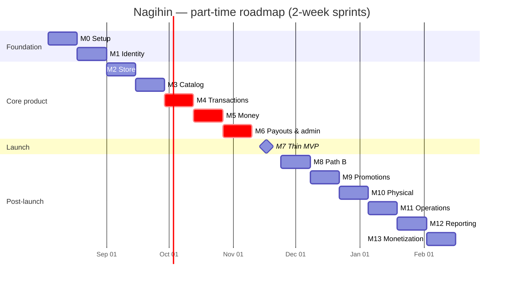

# 12 — Roadmap & Sprints

**Capacity assumption:** one part-time engineer, ~20–25 hours per two-week sprint (~10–12h/week).
Every estimate below is against that capacity. Adjust proportionally for a different pace.

---

## 1. Milestones

| M | Milestone | Sprints | Complexity | Outcome |
|---|---|---|---|---|
| **M0** | Foundation | 1 | Low | Repo, Docker, CI, config, health checks, Prisma bootstrap |
| **M1** | Identity | 2 | Medium | Google OAuth, JWT + rotation, guards, profile |
| **M2** | Store & storefront | 3 | Medium | Store CRUD, username, public `/@username`, social links |
| **M3** | Catalog | 4 | Medium | Products, images, digital files, storefront product pages |
| **M4** | Transaction core | 5 | **High** | Checkout, orders, Midtrans, webhooks, outbox, digital delivery |
| **M5** | Money | 6 | **High** | Ledger, balances, invoices, CRM capture |
| **M6** | Payouts & admin | 7 | High | Withdrawals, admin dashboard, buyer `/akun`, audit |
| **M7** | **Thin MVP launch** | 8 | Medium | Reports, polish, production hardening, first sellers |
| **M8** | Path B | 9 | Medium | Inquiries, manual orders, WA channel |
| **M9** | Promotions | 10 | Medium | Promotions, auto-apply links, redemptions |
| **M10** | Physical & disputes | 11 | High | Shipping, tracking, disputes, refunds |
| **M11** | Operations | 12 | Medium | Reconciliation, balance verification, notification log |
| **M12** | Reporting depth | 13 | Medium | Gross profit, product performance, CRM export |
| **M13** | Monetization | 14 | Medium | Subscriptions, Pro gating, recurring billing |

---

## 2. Sprint backlog

### Sprint 1 — Foundation
**Goal:** an empty but production-shaped system that deploys.

- [x] pnpm monorepo: `apps/api`, `apps/worker`, `packages/contracts`, `web`
- [x] NestJS bootstrap: config module with env schema validation at boot, Pino logging, global pipes/filters/interceptors
- [x] Prisma init, migration 001. **Amendment:** Postgres is self-hosted via Docker Compose (and later the VPS) rather than Supabase-hosted; Supabase is scoped to object storage only ([13 §3](./13-devops-testing-prod.md#3-production-checklist) amended accordingly). `DATABASE_URL`/`DIRECT_DATABASE_URL` are still kept distinct so a pooler can be dropped in later without a code change
- [x] Shared kernel: `Result`, base entity/aggregate/VO, UUIDv7, `Money`
- [x] Docker Compose: Postgres, Redis, API, worker
- [x] Swagger at `/docs`, health at `/health` and `/health/ready`
- [x] Next.js bootstrap: Tailwind, shadcn init, theme provider, dark mode
- [x] GitHub Actions: lint, typecheck, test, build (integration/e2e jobs deferred — no Postgres-backed module or staging environment to test yet)
- [ ] Deploy skeleton to Railway/Render + Vercel — **deferred.** No hosting accounts yet; the production target is a self-hosted VPS with its own domain rather than Railway/Render/Vercel. `Dockerfile.api`/`Dockerfile.worker` are already VPS-portable; the actual deploy pipeline (and Vercel or a VPS-hosted `web`) is revisited once the VPS is ready

**Deliverable:** `docker compose up` runs the whole stack; verified locally — Postgres/Redis healthy,
`/health` and `/health/ready` return green, migration 001 applies cleanly. No deployed environment yet.

---

### Sprint 2 — Identity
**Goal:** a user can sign in and stay signed in.

- [ ] Migration 002: `users` (+ `role`), `refresh_tokens`
- [ ] `User` aggregate, `Email`/`Phone`/`UserRole` VOs, `UserRepository` + mapper
- [ ] Google OAuth: authorize redirect, state in Redis, PKCE, callback, `id_token` verification
- [ ] Token issuance: RS256 access (15m), opaque refresh (30d, hashed)
- [ ] Rotation with family reuse detection
- [ ] `JwtAuthGuard` global + `@Public()`, `RolesGuard`, `@CurrentUser()`
- [ ] `/auth/*` and `/users/me` endpoints
- [ ] Frontend: `/masuk`, `/callback`, `/lengkapi-profil`, token store, silent refresh, single-flight
- [ ] Middleware protecting `/dashboard/*` and `/akun/*`
- [ ] Tests: OAuth flow, rotation, reuse detection, guards

**Deliverable:** sign in with Google, refresh across a reload, sign out.

---

### Sprint 3 — Store & public storefront
**Goal:** a seller has a shareable link.

- [ ] Migration 003: `stores` (+ `invoice_counter`), `social_links`
- [ ] `Store` aggregate, `Username` VO + reserved blocklist, `SettlementPolicy` VO
- [ ] Store creation, profile update, username availability + change
- [ ] Settlement mode setting with floor enforcement
- [ ] Social links CRUD + reorder
- [ ] Storefront read context + Redis cache with event invalidation
- [ ] Supabase Storage: avatar and banner upload
- [ ] Frontend: dashboard shell + sidebar, `/dashboard/toko`, `/dashboard/pengaturan`
- [ ] Frontend: public `/@username` (SSR), `StorefrontHeader`, social links
- [ ] Seed: reserved usernames, plans, bank codes

**Deliverable:** create a store, claim `@username`, view the live public page.

---

### Sprint 4 — Catalog
**Goal:** there is something to sell.

- [ ] Migration 004: `products`, `digital_files`
- [ ] `Product` aggregate, `ProductType`/`ProductStatus`/`Slug`/`StockLevel` VOs, `ProductRiskTierResolver`
- [ ] Product CRUD, publish/archive, slug uniqueness per store
- [ ] Image upload (public bucket), reorder, delete
- [ ] Digital file upload (private bucket), validation that digital products have files before publishing
- [ ] Public product endpoints + cache
- [ ] Frontend: `/dashboard/produk` list, create/edit form, `ImageUploader`, `FileUploader`, `MoneyInput`
- [ ] Frontend: public product page with Beli + Tanya buttons (Tanya inert until Sprint 9)
- [ ] Tests: product rules, slug collisions, storage integration

**Deliverable:** publish a digital product and see it on the public storefront.

---

### Sprint 5 — Transaction core ⚠️ highest risk
**Goal:** a buyer can pay, and the system knows.

- [ ] Migrations 005, 006, 011: orders, items, status history, webhook events, outbox, idempotency
- [ ] `Order` aggregate with the full state machine and transition policy
- [ ] `OrderFactory.fromCheckout`, `OrderPricingService`, `HoldingPeriodCalculator`
- [ ] Checkout quote + create with `Idempotency-Key`
- [ ] Midtrans Snap client, token creation, sandbox wiring
- [ ] Webhook controller: signature verification, raw persist, fast `200`, enqueue
- [ ] Webhook processor: dedup, status mapping, `MarkOrderPaid`
- [ ] Outbox table, service, and relay in the worker
- [ ] BullMQ setup, queues, `expire-orders` job
- [ ] Digital delivery provisioning + signed URL issuance + download counting
- [ ] Frontend: checkout page, Snap integration, status page with polling
- [ ] Tests: full state machine matrix, webhook idempotency, outbox durability

**Deliverable:** end-to-end sandbox purchase of a digital product, with the file downloadable.

> **This sprint carries the most risk in the project.** If anything slips, it is this one. Everything
> downstream depends on the order model being right, so under-delivering here is far cheaper than
> rushing it.

---

### Sprint 6 — Money
**Goal:** money is tracked correctly and a record exists.

- [ ] Migrations 007–010: ledger, bank accounts, withdrawals, invoices, deliveries, `store_buyers`
- [ ] `StoreBalance` aggregate with `FOR UPDATE` locking
- [ ] `balance_transactions` append-only writes with balance snapshots
- [ ] `credit-holding-balance` and `release-to-available` jobs
- [ ] `release-holding-balance` scheduler with floor re-check and dispute skip
- [ ] Invoice number generator (per-store counter), HTML template, PDF worker, storage upload
- [ ] Email channel + `NotificationChannel` port + `notification_deliveries` groundwork
- [ ] `store_buyers` upsert on `OrderPaid`, recompute-not-increment
- [ ] Frontend: `/dashboard/keuangan` (balance + holding countdown), `/dashboard/pembeli`, `/dashboard/invoice`
- [ ] Tests: ledger invariants, balance concurrency, invoice idempotency, CRM replay safety

**Deliverable:** a paid order credits holding, releases on schedule, generates an emailed invoice, and
creates a buyer record.

---

### Sprint 7 — Payouts & admin
**Goal:** money can leave, safely.

- [ ] Migration 012: `audit_logs`
- [ ] Bank account CRUD with a single default
- [ ] Withdrawal request: locked balance check, pending-reservation logic, snapshot
- [ ] Admin: approve / reject / mark-paid, with the ledger debit on mark-paid
- [ ] `AuditLogPort` + writes from every mutating context
- [ ] Admin auth, role assignment, admin route tree
- [ ] Buyer `/akun`: order history, order detail, downloads
- [ ] Frontend: `/dashboard/keuangan/penarikan`, `/rekening`, `/admin`, `/admin/penarikan`
- [ ] Tests: withdrawal concurrency, admin RBAC, cross-tenant isolation suite

**Deliverable:** a seller requests a withdrawal, an admin approves and marks it paid, and the ledger
balances.

---

### Sprint 8 — Thin MVP launch
**Goal:** a real seller, a real transaction, real money.

- [ ] Dashboard summary cards + revenue report
- [ ] Every empty, loading, and error state across the app
- [ ] Mobile responsiveness pass on the whole dashboard
- [ ] Production Midtrans account, live keys, production webhook URL
- [ ] Production checklist ([13 §3](./13-devops-testing-prod.md#3-production-checklist))
- [ ] Sentry, uptime monitoring, alert routing
- [ ] Terms of service + privacy policy pages
- [ ] Backup verification: restore drill from PITR
- [ ] Seller onboarding guide
- [ ] Load-test the storefront path
- [ ] **Pilot with 1–3 friendly sellers**

**Deliverable:** live product, first real transaction, first real withdrawal.

---

### Sprint 9 — Path B
- [ ] Migration 013: `inquiries` + `orders.inquiry_id`
- [ ] `Inquiry` aggregate, creation from the storefront, WA deep link with pre-filled message
- [ ] Manual order creation with price override and buyer-by-email
- [ ] Manual payment confirmation
- [ ] Inquiry → order conversion, mark lost
- [ ] WhatsApp channel implementation (Fonnte/Wablas) behind the port
- [ ] Frontend: `/dashboard/pesanan/manual`, `/dashboard/pesanan/pertanyaan`, live Tanya button

**Deliverable:** the chat-first flow works end to end and lands buyers in the database.

### Sprint 10 — Promotions
- [ ] Migration 014: promotions, scope, redemptions
- [ ] `Promotion` aggregate, validator, discount calculator with subtotal clamp
- [ ] Usage limits (total + per buyer), redemption on paid, release on refund
- [ ] Auto-apply `?promo=` links + share-link generator
- [ ] Below-HPP margin warning (advisory)
- [ ] Frontend: `/dashboard/promosi`, storefront promo preview

### Sprint 11 — Physical & disputes
- [ ] Migrations 015, 016: shipping fields, `refunds`
- [ ] Shipping input, `recompute-holding-until` from `shipped_at`
- [ ] Stock decrement on paid, restore on cancel/expire
- [ ] Dispute raise (buyer + seller), funds freeze, release-job skip
- [ ] Refund flow across all three fund positions, incl. `requires_manual_recovery`
- [ ] Admin dispute queue and resolution
- [ ] Frontend: shipping form, dispute dialog, `/admin/sengketa`

### Sprint 12 — Operations
- [ ] Migrations 017, 018: notification deliveries, settlement reports, reconciliation runs
- [ ] Daily settlement fetch + three-way reconciliation + mismatch alerts
- [ ] Weekly balance verification + drift alerts
- [ ] Notification delivery log + retry job
- [ ] Admin: reconciliation dashboard, webhook inspection + reprocess, audit viewer
- [ ] Dead-letter queue monitoring and alerting

### Sprint 13 — Reporting depth
- [ ] Gross profit from HPP snapshots (with the "never join products" test)
- [ ] Per-product performance, charts, date ranges
- [ ] CRM: buyer detail, tags, notes, CSV export
- [ ] Inquiry follow-up analytics
- [ ] Frontend: `/dashboard/laporan`, `/dashboard/pembeli/[id]`

### Sprint 14 — Monetization
- [ ] Migration 019: subscriptions, subscription invoices
- [ ] `Subscription` aggregate, plan resolution, `PlanFeatureResolver`
- [ ] Server-side feature gating on every Pro feature
- [ ] Subscribe flow via Midtrans, recurring charge job, dunning
- [ ] Fee rate differentiation (5% free / 2.5% pro)
- [ ] Frontend: `/harga`, `/dashboard/pengaturan/langganan`

---

## 3. Developer task list

### Backend

**Foundation**
- [x] pnpm workspace, `apps/api`, `apps/worker`, `packages/contracts`
- [x] Typed config module with boot-time env validation
- [x] Pino logger with request correlation IDs
- [x] Global `ValidationPipe`, `DomainExceptionFilter`, `PrismaExceptionFilter`
- [x] `Result<T,E>`, base entity/aggregate/VO/domain-event classes
- [x] `Money` value object. `Email`/`Phone`/`Username`/`Slug` deferred to the modules that need them (Sprint 2+)
- [x] `TransactionManager` with AsyncLocalStorage (wired, unused until the first repository lands)
- [x] `PrismaService` with pooler/direct connection split (api uses `DATABASE_URL`, worker uses `DIRECT_DATABASE_URL`)
- [x] Redis module — typed cache wrapper deferred until a consumer needs it
- [ ] BullMQ registration, queue names, typed payloads — Sprint 5
- [ ] Outbox service, table, and relay — Sprint 5
- [ ] Idempotency store + interceptor — Sprint 5
- [ ] Supabase Storage service (upload, signed URL) — Sprint 3
- [x] Health indicators: Postgres, Redis. Storage indicator deferred until the storage service exists

**Identity**
- [ ] `User` aggregate + `RefreshToken` entity + mapper
- [ ] Google OAuth service with PKCE and state
- [ ] JWT service (RS256, key rotation via `kid`)
- [ ] Rotation service with family reuse detection
- [ ] `JwtAuthGuard`, `RolesGuard`, `@CurrentUser`, `@Public`, `@Roles`
- [ ] Auth + user controllers

**Store / Catalog**
- [ ] `Store` aggregate, `SettlementPolicy` VO, username service with blocklist
- [ ] `Product` aggregate, `ProductRiskTierResolver`
- [ ] Storefront read repository + cache invalidation on events

**Ordering**
- [ ] `Order` aggregate with all guarded transitions
- [ ] `OrderTransitionPolicy` as a data table
- [ ] `HoldingPeriodCalculator` (max risk tier + Midtrans floor)
- [ ] `OrderPricingService`
- [ ] `OrderFactory` (checkout + manual)
- [ ] `Inquiry` aggregate
- [ ] Command handlers for all 14 transitions
- [ ] `OrderReadRepository` with raw SQL

**Payments**
- [ ] Midtrans Snap + Core API client
- [ ] `SignatureVerifier` (constant-time compare)
- [ ] Webhook controller + ingestion service
- [ ] `PaymentStatusMapper` incl. `capture`+`challenge`
- [ ] Webhook processor with dedup
- [ ] Refund service
- [ ] Reconciliation service (three-way match)

**Ledger**
- [ ] `StoreBalance` aggregate with row locking
- [ ] Ledger service; private balance mutation
- [ ] Withdrawal service with pending-reservation logic
- [ ] Bank account service
- [ ] `BalanceReconciler`
- [ ] Platform revenue + seller liability calculators

**Supporting**
- [ ] Invoice number generator, renderer, delivery service
- [ ] Digital delivery service, signed URL issuer, download policy
- [ ] `StoreBuyer` service with recompute-on-event
- [ ] `Promotion` aggregate, validator, calculator
- [ ] `NotificationChannel` port, email adapter, WhatsApp adapter, dispatcher
- [ ] `AuditLogPort` + service
- [ ] Reporting read repositories
- [ ] Admin services

### Frontend

- [x] Next.js App Router with route groups (placeholder pages; real content lands sprint-by-sprint)
- [x] Tailwind + shadcn init, theme tokens, dark mode without flash
- [ ] Typed API client with auth interceptor and single-flight refresh
- [ ] TanStack Query provider, per-feature query keys
- [ ] Auth store (Zustand, memory only), middleware guard
- [ ] Layout shells: marketing, storefront, dashboard, admin, buyer
- [ ] `DataTable` with responsive card fallback
- [ ] `EmptyState` / `ErrorState` / skeleton set
- [ ] `MoneyDisplay`, `MoneyInput` (bigint-safe)
- [ ] `OrderStatusBadge`, `Timeline`, `HoldingCountdown`, `BalanceCard`
- [ ] `ImageUploader`, `FileUploader`, `UsernameInput`, `PhoneInput`
- [ ] Storefront pages (SSR), product page, `BuyWhatsAppButtons`
- [ ] Checkout + Snap integration + status polling
- [ ] Every dashboard page from [11 §2](./11-frontend.md#2-page-inventory)
- [ ] Buyer `/akun` pages
- [ ] Admin pages
- [ ] `InvoicePreview` shared with the PDF renderer
- [ ] Charts (dynamically imported)
- [ ] Mobile pass on every screen

### DevOps

- [x] `Dockerfile.api`, `Dockerfile.worker` (multi-stage, non-root, Node 22)
- [x] `docker-compose.yml` for local development
- [x] `.env.example` with every Sprint 1 variable documented (remaining variables land with the modules that need them)
- [x] GitHub Actions: lint, typecheck, unit, build. Integration job deferred — Sprint 2 (first Postgres-backed module)
- [ ] Deploy pipeline: self-hosted VPS for API + worker, Vercel or VPS for web — deferred until the VPS is provisioned
- [ ] Staging environment with a separate Supabase project — not applicable as scoped; Postgres is self-hosted, revisit if staging needs its own DB instance
- [ ] Sentry (API, worker, web)
- [ ] Uptime monitoring on `/health/ready`
- [ ] Log aggregation
- [ ] Secrets in the platform's secret store, never in the repo
- [ ] Nightly `pg_dump` to object storage + restore drill
- [ ] Alert routing for critical queues and reconciliation

### Database

- [ ] Migrations 001–019 in order (001 done — extensions only, no tables yet)
- [ ] All check constraints from [06 §4](./06-database-roadmap.md#4-constraints)
- [ ] All indexes from [06 §3](./06-database-roadmap.md#3-indexes)
- [x] `seed/base.ts` (idempotent, production-safe) — no-op stub until Sprint 3 needs reserved usernames
- [ ] `seed/dev.ts` generating data through domain commands
- [ ] `seed/test.ts` minimal fixtures

### Testing

- [ ] Unit: every value object
- [ ] Unit: `Order` state machine — all 14 legal + all illegal transitions
- [ ] Unit: `HoldingPeriodCalculator` incl. mixed baskets and the Midtrans floor
- [ ] Unit: `OrderPricingService`, `DiscountCalculator` clamping
- [ ] Unit: ledger invariants
- [ ] Integration: repositories against a real Postgres container
- [ ] Integration: webhook idempotency (duplicate delivery)
- [ ] Integration: balance concurrency (parallel withdrawals)
- [ ] Integration: outbox durability (publish failure → retry)
- [ ] Integration: **cross-tenant isolation for every seller endpoint**
- [ ] Integration: gross profit never joins `products`
- [ ] E2E: signup → store → product → checkout → invoice → download
- [ ] E2E: withdrawal request → admin approve → mark paid
- [ ] Architecture test: no framework imports in `domain/`

---

## 4. The Thin MVP cut line

`summary.md` assumes 1–2 months for the MVP. **At ~10–12 hours per week, Sprint 8 lands roughly 16 weeks
out.** That is the honest number, and planning against 8 weeks would mean either shipping money-handling
code that has not been tested properly, or discovering the slip in month three.

Two ways to compress, both legitimate:

### Option A — more hours

Full-time (≈40h/week) compresses the same scope to roughly 5 sprints / 10 weeks. Nothing is cut; the
sequencing is unchanged.

### Option B — cut scope to Sprint 6

Ship after **Sprint 6** at ~12 weeks, with a deliberately narrow product:

**In:** Google auth · store + storefront · digital products only · Path A checkout · Midtrans ·
order state machine · ledger · invoice by email · buyer database · digital delivery

**Out, and handled manually:** withdrawals (calculate and transfer by hand for the first sellers, then
build Sprint 7) · admin dashboard (query the database directly) · reports (the dashboard cards suffice)

This works only because the first weeks have single-digit sellers. Manually transferring to three sellers
weekly is perhaps 30 minutes; building the withdrawal UI is a sprint. **The ledger is not optional
in this cut** — manual payouts still need a correct record of what is owed, and retrofitting a ledger onto
live money data is one of the worst migrations in software.

### What must never be cut

| Never cut | Why |
|---|---|
| The ledger | Retrofitting onto live money data is near-impossible to do safely |
| Webhook idempotency | Duplicate credits are the most expensive bug available |
| `store_buyers` capture | Missed data is permanently missed; it is the entire moat |
| Order state machine | Adding states to a live orders table with money attached is brutal |
| Order snapshots | Historical reports become wrong the first time a price changes |
| Audit trail | Dispute investigation is impossible without it |

Everything else is negotiable. These six are the load-bearing walls.

---

## 5. Risk register

| Risk | P | Impact | Mitigation |
|---|---|---|---|
| Sprint 5 overruns | High | Everything slips | Timebox to sandbox-only; move digital delivery to Sprint 6 if needed |
| Midtrans production approval is slow | Medium | Blocks launch | Start the merchant application during Sprint 3 |
| MDR makes 5% unprofitable | Medium | Business model | Get real rates before Sprint 8; fee logic is already per-order and channel-aware |
| WA provider terminated | Medium | Feature loss | Port abstraction; email is the guaranteed channel |
| Part-time capacity drops | High | Slip | Option B cut line is pre-agreed, not an emergency decision |
| Supabase Postgres 18 unavailable | Low | None | UUIDv7 generated in application code |
| Scope creep from seller feedback | High | Slip | P0/P1/P2 tiers are the answer; feedback lands in P1+, not in the current sprint |
| Solo bus factor | High | Project halts | These documents; conventional technology; no clever code |

---

Next: [13 — DevOps, Testing & Production](./13-devops-testing-prod.md)
