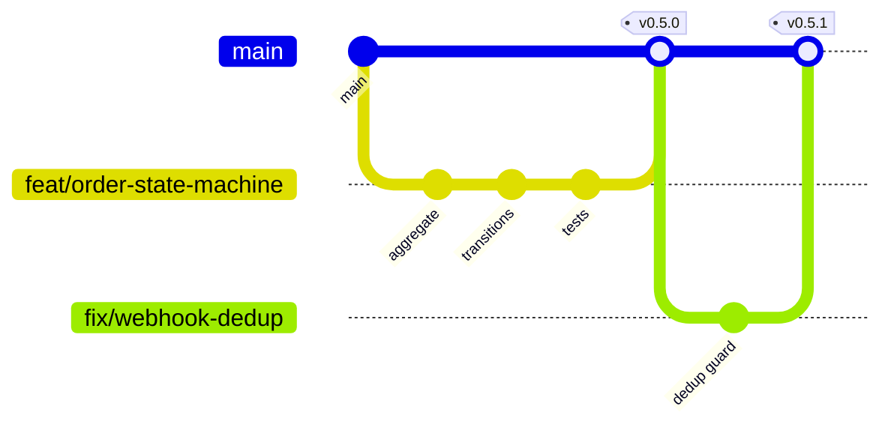

# 13 — DevOps, Testing & Production

---

## 1. Git strategy

### Branching: trunk-based with short-lived branches

`main` is always deployable. Work happens on short-lived branches merged within a day or two.

**Not Git Flow.** Git Flow's `develop`, `release/*` and `hotfix/*` branches exist to coordinate multiple
teams shipping on a release train. With one part-time engineer, those branches are ceremony that produces
merge conflicts and stale integration branches while solving a coordination problem that does not exist
([AD-12](./README.md#decision-log)).



When a second engineer joins, add a `staging` branch that auto-deploys to the staging environment.
Nothing else changes.

### Branch naming

```
<type>/<short-description>

feat/order-state-machine
fix/webhook-duplicate-credit
refactor/ledger-repository
chore/upgrade-prisma
docs/payment-architecture
test/withdrawal-concurrency
```

### Commits: Conventional Commits

```
<type>(<scope>): <subject>

feat(ordering): add holding period calculator
fix(payments): dedupe webhooks by transaction id and status
refactor(ledger): move balance mutation behind the aggregate
test(withdrawal): cover concurrent request serialization
chore(deps): bump prisma to 6.2
```

Types: `feat`, `fix`, `refactor`, `test`, `docs`, `chore`, `perf`, `build`, `ci`.
Scopes match module names.

The payoff is not tidiness — it is `changesets`/`semantic-release` generating changelogs automatically,
and `git log --grep` actually working when investigating an incident six months later.

### Pull requests

Even solo. A PR is a diff you read with fresh eyes, and CI runs before merge rather than after.

**Required before merge:**
- [ ] CI green: lint, typecheck, unit, integration, build
- [ ] Migrations reviewed separately from code
- [ ] Domain layer imports no framework
- [ ] New endpoints have cross-tenant tests
- [ ] Money-touching code has concurrency tests
- [ ] `.env.example` updated if config changed

**PR template:**

```markdown
## What
## Why
## How
## Migrations
- [ ] None / listed below, with rollback noted
## Testing
- [ ] Unit  - [ ] Integration  - [ ] Manual
## Risk
- [ ] Touches money  - [ ] Touches auth  - [ ] Breaking API change
```

Squash merge — one commit per PR on `main`, so `main`'s history reads as a list of changes rather than a
list of keystrokes.

### Releases

Semantic versioning, tagged on `main`. `main` auto-deploys to staging; production deploys are triggered
by tagging, so shipping to production is always a deliberate act.

| Bump | When |
|---|---|
| Major | Breaking API change |
| Minor | New feature, backward compatible |
| Patch | Fix |

**Hotfix:** branch from the production tag, fix, tag a patch, deploy, then merge back to `main`. No
separate long-lived hotfix branch.

---

## 2. Testing strategy

### Shape

```
        /\        E2E (10) — critical journeys, Playwright
       /  \
      /----\      Integration (~120) — repositories, endpoints, jobs, real Postgres + Redis
     /      \
    /--------\    Unit (~300) — domain logic, VOs, calculators, state machine
```

Deliberately integration-heavy for a solo project. Most of the risk here lives in the seams — a webhook
arriving twice, two withdrawals racing, an outbox row never relayed — and those are invisible to unit
tests. A mocked Prisma client proves the code calls the mock, not that money is correct.

### Coverage targets

| Area | Target | Enforcement |
|---|---|---|
| `domain/` in Tier 1 modules (ordering, payments, ledger) | **95%** | CI fails below |
| `domain/` in Tier 2 modules | 80% | CI fails below |
| `application/` | 70% | Warning |
| `infrastructure/` | 50% | Not enforced — covered by integration |
| `presentation/` | Covered by integration | — |
| Overall | 75% | CI fails below |

Coverage is a smoke detector, not a goal. 95% on the order aggregate is meaningful because the tests are
the transition matrix. 95% on a Prisma mapper would be theatre.

### Unit tests

Pure domain logic, no I/O, no framework.

```
describe('Order.release', () => {
  it('rejects release before the platform floor even in manual mode');
  it('moves holding to available when the period has elapsed');
  it('refuses to release a disputed order');
  it('records exactly one status history entry');
  it('emits OrderReleased once');
});

describe('HoldingPeriodCalculator', () => {
  it('uses T+0 for digital, floored by the Midtrans settlement estimate');
  it('takes the maximum risk tier in a mixed basket');
  it('recomputes from shipped_at when tracking exists');
});

describe('Money', () => {
  it('never produces fractional rupiah');
  it('rounds percentages half-up');
  it('refuses implicit number coercion');
});
```

### Integration tests

Real Postgres and Redis in Testcontainers (or Compose services in CI). Each test runs in a transaction
rolled back afterwards, so tests are order-independent.

| Suite | Covers |
|---|---|
| Repository | Mapping fidelity, constraints, cascade behavior |
| Endpoint | Auth, validation, status codes, response shape |
| **Cross-tenant** | Every seller endpoint, authenticated as the wrong store → `403`/`404` |
| Webhook | Duplicate delivery credits once; bad signature rejected; malformed payload still persisted |
| Concurrency | Parallel withdrawals do not double-spend; parallel webhooks transition once |
| Outbox | Publish failure leaves the row pending; retry publishes exactly once |
| Job | Each job is idempotent under re-run |
| Reporting | Gross profit never joins `products` |

The cross-tenant suite is generated from the route table rather than hand-written per endpoint, so a new
endpoint is covered the moment it is registered. Hand-written isolation tests are exactly the thing
someone forgets on the endpoint that matters.

### E2E tests

Playwright, ten scenarios, against staging with Midtrans sandbox:

1. Sign in with Google (mocked provider)
2. Create store, claim username, view public page
3. Create and publish a digital product
4. Buyer checkout → pay → invoice received → file downloaded
5. Buyer checkout → expire unpaid → order expired
6. Seller views the order, releases after the holding period
7. Withdrawal request → admin approve → mark paid
8. Manual order (Path B): inquiry → manual order → confirm payment
9. Promo link auto-applies the discount at checkout
10. Refund during holding returns the balance correctly

### Mocking policy

| Dependency | Unit | Integration | E2E |
|---|---|---|---|
| Postgres | n/a (no I/O) | Real container | Real staging |
| Redis | n/a | Real container | Real staging |
| Midtrans | Stub client | Recorded fixtures | Sandbox |
| Supabase Storage | Stub | Local MinIO or a test bucket | Real staging bucket |
| Email / WhatsApp | Stub | In-memory channel capturing sends | Test inbox |
| Google OAuth | Stub | Stub verifier | Mocked provider |

**Never mock the database in integration tests.** The bugs worth catching are constraint violations,
cascade behavior, and lock contention — a mock has none of those.

### Architecture tests

Enforced in CI, because these degrade silently:

- No file under `modules/*/domain/` imports `@nestjs/*`, `@prisma/client`, `bullmq`, or `axios`
- No module imports another module's `infrastructure/` or `domain/`
- No `float`/`number` type on a money field
- Every `POST` handler that writes money declares idempotency

### CI pipeline

```yaml
on: [pull_request, push to main]
jobs:
  quality:    lint · typecheck · format check
  test-unit:  jest unit + coverage gate
  test-integration:
    services: postgres:16 · redis:7
    steps: prisma migrate deploy · seed test · jest integration
  arch:       dependency-cruiser rules
  build:      docker build api + worker · next build
  e2e:        (main only) deploy staging · playwright
```

Target: under 10 minutes for the PR path. A slow pipeline gets bypassed, and a bypassed pipeline is worse
than none because it creates false confidence.

---

## 3. Production checklist

### Environment variables

| Variable | Purpose | Secret |
|---|---|---|
| `NODE_ENV` | | |
| `PORT` | | |
| `DATABASE_URL` | Supabase pooler (API) | ✅ |
| `DIRECT_DATABASE_URL` | Direct (migrations, worker) | ✅ |
| `REDIS_URL` | | ✅ |
| `JWT_PRIVATE_KEY` / `JWT_PUBLIC_KEY` | RS256 keypair | ✅ |
| `JWT_ACCESS_TTL` / `JWT_REFRESH_TTL` | | |
| `GOOGLE_CLIENT_ID` / `GOOGLE_CLIENT_SECRET` / `GOOGLE_REDIRECT_URI` | | ✅ (secret) |
| `MIDTRANS_SERVER_KEY` / `MIDTRANS_CLIENT_KEY` / `MIDTRANS_IS_PRODUCTION` | | ✅ |
| `SUPABASE_URL` / `SUPABASE_SERVICE_ROLE_KEY` | Storage | ✅ |
| `SUPABASE_BUCKET_PUBLIC` / `_PRIVATE` | | |
| `EMAIL_PROVIDER_API_KEY` / `EMAIL_FROM` | | ✅ |
| `WHATSAPP_PROVIDER` / `WHATSAPP_API_KEY` | | ✅ |
| `PLATFORM_FEE_RATE_FREE` / `_PRO` | | |
| `MIN_WITHDRAWAL_AMOUNT` | | |
| `ORDER_EXPIRY_HOURS` | | |
| `HOLDING_DAYS_PHYSICAL` / `_SERVICE` / `MIDTRANS_SETTLEMENT_DAYS` | | |
| `AUTO_FORCE_RELEASE_DAYS` | | |
| `FRONTEND_URL` / `CORS_ORIGINS` | | |
| `SENTRY_DSN` | | |
| `SWAGGER_USER` / `SWAGGER_PASSWORD` | Docs basic auth | ✅ |

**Validated at boot with a Zod/class-validator schema.** A missing `MIDTRANS_SERVER_KEY` must crash on
startup, not surface as a failed payment three hours later.

Business parameters (fee rates, holding days, minimum withdrawal) are configuration, not constants —
they will change, and changing them should not require a deploy of business logic.

### Security

- [ ] HTTPS everywhere; HSTS enabled
- [ ] Helmet headers (CSP, X-Frame-Options, nosniff)
- [ ] CORS restricted to known origins
- [ ] Rate limits per [05 §17](./05-api-roadmap.md#17-conventions)
- [ ] Global `ValidationPipe` with `whitelist` + `forbidNonWhitelisted`
- [ ] Webhook signature verification with constant-time comparison
- [ ] SQL injection: Prisma parameterization; `$queryRaw` only via tagged templates
- [ ] Secrets in the platform secret store, never committed
- [ ] `.env` in `.gitignore`; secret scanning enabled on the repo
- [ ] Dependency audit in CI; Dependabot on
- [ ] No tokens, passwords, or card data in logs
- [ ] Private storage bucket for digital files and invoices; signed URLs only
- [ ] Admin role assigned manually
- [ ] Full auth checklist from [07 §7](./07-auth.md#7-security-checklist)

### Observability

| Layer | Tool | Purpose |
|---|---|---|
| Errors | Sentry (API, worker, web) | Exceptions with correlation IDs |
| Logs | Pino JSON → platform aggregator | Structured, request-correlated |
| Uptime | UptimeRobot / BetterStack on `/health/ready` | External liveness |
| Metrics | `/metrics` Prometheus | Queue depth, job rates, request latency |
| Alerts | Email + WhatsApp to the operator | Per [10 §5](./10-background-jobs.md#5-operational-rules) |

**Business metrics on the admin dashboard, not just system metrics:** daily GMV, orders by status,
pending withdrawals, reconciliation status, **total seller liability**. A green system serving wrong
numbers is the failure mode that actually threatens the business.

### Logging rules

- Structured JSON, never string concatenation
- Correlation ID propagated from HTTP request into jobs
- Levels: `error` (needs action), `warn` (anomaly), `info` (business events), `debug` (dev only)
- **Always log:** order transitions, ledger writes, withdrawal actions, webhook receipt and outcome,
  auth failures, admin actions
- **Never log:** tokens, `Authorization` headers, full payment payloads with card data, buyer phone
  numbers in plain text at `info`

### Deployment

| Component | Platform | Notes |
|---|---|---|
| Web | Vercel | Preview deploys per PR |
| API | Railway / Render / VPS | Health-checked, auto-restart |
| Worker | Same platform, separate service | Sized for PDF memory |
| Postgres | Supabase | PITR on |
| Redis | Platform-managed or Upstash | Persistence enabled — queues must survive a restart |
| Storage | Supabase Storage | Public + private buckets |

**Deploy sequence:** migrate → deploy worker → deploy API → deploy web. Migrations first because both
API and worker assume the new schema; worker before API so jobs enqueued by new API code have a consumer.

Rollback: revert the tag and redeploy. **Migrations are forward-only in practice** — write them to be
backward-compatible with the previous release (add columns nullable, remove them a release later) so a
code rollback never requires a schema rollback.

### Pre-launch checklist

- [ ] Every environment variable set in production
- [ ] Migrations applied and verified
- [ ] `seed/base.ts` run (reserved usernames **before** the first signup)
- [ ] Midtrans production account approved, webhook URL registered, live keys set
- [ ] A real end-to-end transaction with real money, then refunded
- [ ] Google OAuth consent screen verified for production
- [ ] Email provider domain verified (SPF, DKIM)
- [ ] Storage buckets created with correct public/private policies
- [ ] HTTPS + custom domain live
- [ ] Health checks green; uptime monitoring firing correctly (test by taking it down)
- [ ] Sentry receiving events from all three services
- [ ] Alerts routed and tested
- [ ] Swagger behind basic auth
- [ ] PITR confirmed; nightly `pg_dump` running
- [ ] **Restore drill completed** — a backup that has never been restored is a hypothesis
- [ ] Terms and Privacy published
- [ ] Seller-facing explanation of holding periods and T+3 settlement (expectation setting)
- [ ] Bank account for seller funds **separate from operating funds** (`user-behavior.md` §13)
- [ ] Operator runbook written
- [ ] Reconciliation job verified against a real settlement report

### Backups and restore drill

**PITR itself is a Supabase/VPS-side setting the operator enables** — nothing in this repo turns it on.
What lives here is the other half: proof that a dump can actually be restored, since PITR that has never
been exercised is the same hypothesis as any other untested backup.

`scripts/backup/pg-backup.sh` (`pnpm backup:dump`) runs `pg_dump -Fc` against `DIRECT_DATABASE_URL` into
`backups/nagihin-<timestamp>.dump`, then sweeps old dumps down to the newest `BACKUP_KEEP` (default 14).
It uses a local `pg_dump` if one is on `PATH`, otherwise falls through to `docker compose exec postgres
pg_dump` — the same script runs unchanged on a Windows dev box or the Linux VPS.

`scripts/backup/restore-drill.sh` (`pnpm backup:drill`) restores a dump (the newest one by default) into a
throwaway `nagihin_drill_<timestamp>` database and asserts, via `scripts/backup/assertions.sql`:

- every migration in `_prisma_migrations` applied cleanly, none rolled back or half-finished
- every core table exists and is queryable, with row counts logged for a human to sanity-check
- the ledger reconciles — `SUM(holding_delta)`/`SUM(available_delta)` per store from
  `balance_transactions` matches `stores.holding_balance`/`available_balance`, the same invariant
  `BalanceReconciler` and `ledger.int-spec.ts` assert. This is what makes the drill prove the restored
  data is coherent, not just that `pg_restore` exited `0`

The drill database is dropped on success and left in place on failure, for inspection. Both scripts read
`DIRECT_DATABASE_URL` from `.env` and require Git Bash (or WSL) on Windows.

`backups/` is gitignored — these are local artifacts, not something to commit. Run `pnpm backup:dump` on a
schedule (cron on the VPS) and `pnpm backup:drill` periodically against whatever the latest dump is; a
green drill is what turns "PITR confirmed" into a checked box below, not the other way around.

### Operator runbook

Daily:
- Check reconciliation results
- Process the withdrawal queue
- Review dead-letter queues
- Confirm seller liability ≤ bank balance

Weekly:
- Review balance drift report
- Review failed notifications
- Check dispute queue

Incident response:

| Symptom | First check |
|---|---|
| Seller reports a missing order | `webhook_events` for that transaction ID |
| Balance looks wrong | `balance_transactions` for that store, in order |
| Invoice not received | `notification_deliveries`, then the invoice job DLQ |
| Payment taken, order unpaid | Reconciliation `missing_internal`; replay the webhook |
| Site down | `/health/ready`, then Postgres and Redis independently |

---

## 4. Nice-to-have improvements

Beyond the source documents. Roughly ordered by value per unit of effort.

### Already in this plan (worth noting explicitly)

| Improvement | Where |
|---|---|
| Transactional outbox | [09 §6](./09-payments-ledger.md#6-outbox--event-flow) |
| Idempotency keys | [09 §3](./09-payments-ledger.md#3-idempotency) |
| Append-only ledger with balance snapshots | [09 §4](./09-payments-ledger.md#4-ledger-design) |
| Cross-tenant test generation | [§2](#2-testing-strategy) |
| Architecture tests | [§2](#2-testing-strategy) |
| Notification channel port | [10 §3](./10-background-jobs.md#3-notifications) |

### High value, low effort — do these early

| # | Improvement | Why |
|---|---|---|
| 1 | **Correlation IDs end to end** | Request → job → outbox → job. Debugging a payment issue without this means reading three log streams and guessing |
| 2 | **Business metrics dashboard** | Seller liability vs bank balance on one screen. The single most important operational number |
| 3 | **Feature flags via config** | Kill a broken feature without a deploy; roll out risky changes to one store first |
| 4 | **Storefront caching with event invalidation** | Already planned; matters more than it looks when a bio link goes viral |
| 5 | **Structured audit metadata** | `audit_logs.metadata` with before/after diffs, not just an action name |
| 6 | **Seller onboarding checklist in-app** | Store → product → first sale, with progress. Activation is where funnels leak |
| 7 | **Order timeline in the buyer UI** | Buyers who can see status stop asking sellers; sellers notice that |

### Medium value

| # | Improvement | Notes |
|---|---|---|
| 8 | **Event bus → message broker** | When extraction begins, the outbox relay targets a broker instead of BullMQ. Design already permits it |
| 9 | **Read replicas for reporting** | When report queries start competing with checkout |
| 10 | **Full-text search on products/buyers** | Postgres `tsvector` first; a search engine only if that stops scaling |
| 11 | **Materialized daily balance snapshots** | Makes weekly verification O(days) instead of O(all history) |
| 12 | **Webhook replay tooling** | Beyond single-event reprocessing: replay a date range after a bug fix |
| 13 | **Soft-delete + restore for products** | Sellers archive things by accident |
| 14 | **Rate limiting per store, not just per IP** | One abusive seller should not degrade everyone |
| 15 | **Idempotency on all mutating endpoints** | Currently only checkout and withdrawal |
| 16 | **Seller data export (full)** | Portability builds trust and is a likely future obligation |

### Longer term

| # | Improvement | Trigger |
|---|---|---|
| 17 | **Outbox → CDC (Debezium)** | Multiple consumers needing the same stream |
| 18 | **Multi-currency** | Only if expanding beyond Indonesia — currently a non-goal |
| 19 | **Multi-language UI** | Same |
| 20 | **Sub-account model (Model 2)** | The GMV/regulatory triggers in `user-behavior.md` §15 |
| 21 | **Midtrans Payouts (Iris)** | ~20–30 active sellers |
| 22 | **Reserve balance** | Real dispute-rate data |
| 23 | **Analytics pipeline** | When product decisions need cohort data |
| 24 | **A/B testing on the storefront** | When conversion optimization beats feature work |
| 25 | **Public API + webhooks for sellers** | When sellers ask to integrate |

### Explicitly rejected

| Idea | Why not |
|---|---|
| Microservices | One engineer. Extraction path already preserved |
| Event sourcing everywhere | Append-only ledger gives most of the value at a fraction of the cost |
| GraphQL | REST + typed contracts is simpler for one client |
| Kubernetes | Railway/Render is sufficient for years at this scale |
| Double-entry accounting | Explicitly rejected in `summary.md` §5 — a different product competing with Accurate/Jurnal |
| Marketplace discovery | Contradicts the positioning: sellers bring their own traffic |
| Custom auth | Google OAuth exists and is better than anything we would write |
| Row Level Security | A second, invisible authorization system that will eventually disagree with the first |

---

## 5. Definition of done

A feature is done when:

- [ ] Domain logic has unit tests, including failure paths
- [ ] Endpoints have integration tests including auth and cross-tenant isolation
- [ ] Money-touching code has concurrency tests
- [ ] Migrations are written, reviewed, and reversible in principle
- [ ] Swagger documents every new endpoint
- [ ] Frontend has loading, empty and error states
- [ ] Mobile layout verified
- [ ] Errors surface to the user in Indonesian, actionably
- [ ] Audit logging added for mutating actions
- [ ] `.env.example` updated
- [ ] CI green
- [ ] Verified manually on staging

---

← Back to the [documentation index](./README.md)
