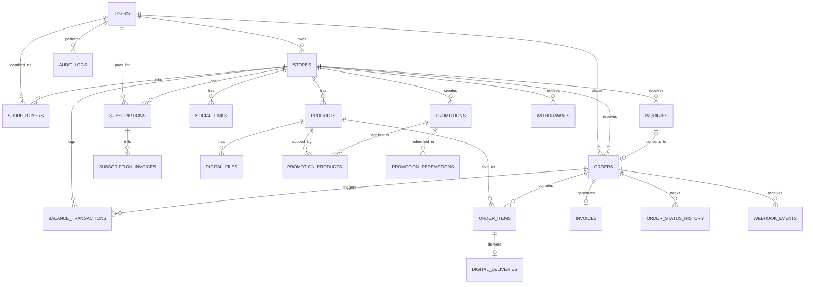

# Skema Database — Nagihin

Dirancang berdasarkan keputusan di [`user-behavior.md`](./user-behavior.md): state machine order (bagian 4), holding period per tipe produk (bagian 5-9), produk digital (bagian 10), riwayat buyer lintas-seller (bagian 11), diskon (bagian 12), dan model payment Model 1 — Midtrans Snap + Payouts/Iris (bagian 13-15). Asumsi stack: Postgres (Supabase), mengikuti keputusan storage sebelumnya.

## Prinsip desain

- **Identitas buyer global, data CRM per-toko privat.** Satu `users` row dipakai lintas seller (network effect), tapi riwayat/tag/catatan buyer disimpan di tabel terpisah per-store (`store_buyers`) — seller A tidak bisa lihat buyer itu juga belanja di toko B.
- **Snapshot, bukan referensi hidup.** `order_items` menyimpan salinan nama/harga/HPP produk saat transaksi terjadi — supaya kalau seller edit harga produk nanti, laporan HPP/profit order lama tetap akurat.
- **`paid` ≠ `released`.** Field `holding_until` dan `released_at` terpisah dari `paid_at` — inti dari desain proteksi chargeback/refund yang sudah dibahas.
- **Saldo didenormalisasi + dicatat di log transaksi.** `stores.holding_balance`/`available_balance` adalah angka berjalan yang cepat dibaca, tapi setiap perubahan wajib tercatat di `balance_transactions` (append-only) — supaya bisa direkonsiliasi dan tidak ada yang "salah kira duit sendiri" (poin dari bagian 13).
- **Semua primary key `id` bertipe `uuid`, format UUID v7 (time-ordered)** — bagian awal UUID mengandung timestamp, jadi insert baru selalu "nempel" di ujung index B-tree (bukan acak sebar seperti v4), lebih ramah performa untuk tabel dengan volume insert tinggi (`orders`, `balance_transactions`, `webhook_events`), sekaligus tetap unik & aman dipakai di URL publik. Cara generate: pakai fungsi native `uuidv7()` kalau project Supabase sudah jalan di Postgres 18+ (fitur ini baru resmi ada sejak Postgres 18, rilis September 2025 — cek versi Postgres project kamu dulu, karena Supabase disebut baru mulai migrasi ke Postgres 18 sekitar awal 2026 dan belum tentu semua project sudah kebagian). Kalau project masih di Postgres 17 ke bawah, dua fallback yang setara: extension `pg_uuidv7`, atau generate UUIDv7 di kode aplikasi (mis. library `uuid` versi terbaru punya helper v7) sebelum insert — keduanya menghasilkan format yang sama, jadi tidak masalah dicampur sumbernya.
- **Setiap perubahan penting punya jejak log terpisah dari tabel data intinya** — `order_status_history` buat transisi status order, `audit_logs` buat aksi seller/admin di dashboard, `webhook_events` buat payload mentah dari Midtrans (dan provider lain nanti) — supaya ada bukti audit lengkap, bukan cuma "state saat ini".

## ERD

## Tabel

### `users`
Identitas global — dipakai buat buyer maupun seller (satu orang bisa dua-duanya).

| Kolom | Tipe | Catatan |
|---|---|---|
| id | uuid, pk | |
| google_id | text, unique | Login by Google, keputusan terbaru (bukan OTP WA) |
| email | text, unique | |
| name | text | |
| avatar_url | text | |
| phone | text, nullable | Nomor WA, diisi belakangan (buat invoice/notifikasi), bukan syarat login |
| created_at | timestamptz | |

### `stores`
Satu seller = satu toko.

| Kolom | Tipe | Catatan |
|---|---|---|
| id | uuid, pk | |
| owner_id | uuid, fk → users.id | |
| username | text, unique | Jadi URL `/@username` — bio link |
| display_name | text | |
| bio | text | |
| avatar_url / banner_url | text | |
| theme | jsonb, nullable | Kustomisasi storefront, fase lanjut |
| custom_domain | text, nullable | Fitur Pro |
| plan | enum('free','pro') | Default 'free', dari bagian 14 — cache cepat-baca, sumber kebenarannya `subscriptions.status` |
| settlement_mode | enum('auto','manual') | Default 'auto', dari bagian 9 — manual hanya boleh memperpanjang hold, bukan mempersingkat di bawah floor platform |
| holding_balance | numeric | Denormalized, update via `balance_transactions` |
| available_balance | numeric | Denormalized, siap di-withdraw |
| created_at | timestamptz | |

### `social_links`
Fungsi link-aggregator klasik di halaman `/@username`.

| Kolom | Tipe | Catatan |
|---|---|---|
| id | uuid, pk | |
| store_id | fk | |
| platform | text | instagram / tiktok / whatsapp / youtube / other |
| url | text | |
| position | int | Urutan tampil |

### `products`

| Kolom | Tipe | Catatan |
|---|---|---|
| id | uuid, pk | |
| store_id | fk | |
| name / slug | text | slug unik per store (`unique(store_id, slug)`) |
| description | text | |
| price | numeric | |
| hpp | numeric, nullable | Modal per unit — dasar mini accounting (bagian 10, IA sebelumnya) |
| product_type | enum('digital','physical','service') | 'service' = jalur Path B/custom nego |
| stock | int, nullable | Null = unlimited (digital/service) |
| images | jsonb | Array URL |
| status | enum('active','draft','archived') | |
| created_at | timestamptz | |

### `digital_files`
Khusus `product_type = 'digital'` (bagian 10).

| Kolom | Tipe | Catatan |
|---|---|---|
| id | uuid, pk | |
| product_id | fk | |
| file_path | text | Path privat di Supabase Storage |
| max_downloads | int | Default 3 |
| created_at | timestamptz | |

### `inquiries`
Jejak tombol "Tanya dulu via WA" — Path B (bagian 3).

| Kolom | Tipe | Catatan |
|---|---|---|
| id | uuid, pk | |
| store_id | fk | |
| product_id | fk, nullable | |
| buyer_id | fk → users.id, nullable | Null kalau buyer belum login saat klik chat |
| status | enum('open','converted','lost') | |
| converted_order_id | fk → orders.id, nullable | Diisi saat seller buat Order Manual dari inquiry ini |
| created_at | timestamptz | |

Catatan: record ini yang bikin seller bisa lihat "siapa saja yang nanya tapi belum beli" — calon buyer yang hilang, berguna buat follow-up.

### `orders`
Inti state machine (bagian 4).

| Kolom | Tipe | Catatan |
|---|---|---|
| id | uuid, pk | |
| order_number | text, unique | Human-readable, dipakai di invoice |
| store_id | fk | |
| buyer_id | fk → users.id | |
| source | enum('self_checkout','manual') | Path A vs Path B |
| inquiry_id | fk, nullable | Kalau berasal dari Path B |
| status | enum('pending_payment','paid','holding','released','disputed','refunded','cancelled','expired') | |
| subtotal | numeric | |
| discount_code | text, nullable | |
| discount_amount | numeric | Default 0 |
| total | numeric | |
| platform_fee_rate | numeric | Snapshot dari `stores.plan` saat order dibuat (5% free / 2-3% pro) |
| platform_fee_amount | numeric | |
| payment_method | text, nullable | |
| midtrans_transaction_id | text, nullable | |
| shipping_address | jsonb, nullable | Untuk produk fisik |
| paid_at | timestamptz, nullable | |
| holding_until | timestamptz, nullable | Dihitung dari tipe produk (bagian 5) + T+3 settlement Midtrans (bagian 13) |
| released_at | timestamptz, nullable | Dana pindah ke `available_balance` di titik ini |
| created_at | timestamptz | |

### `order_items`
Snapshot produk saat transaksi — support multi-item per order dari awal (biar tidak migrasi menyakitkan kalau nanti butuh cart multi-produk).

| Kolom | Tipe | Catatan |
|---|---|---|
| id | uuid, pk | |
| order_id | fk | |
| product_id | fk | |
| product_name_snapshot | text | |
| product_type_snapshot | text | |
| price_snapshot | numeric | |
| hpp_snapshot | numeric, nullable | Dipakai buat laporan gross profit, tidak berubah walau HPP produk asli berubah belakangan |
| qty | int | Default 1 |

### `digital_deliveries`

| Kolom | Tipe | Catatan |
|---|---|---|
| id | uuid, pk | |
| order_item_id | fk | |
| file_path | text | |
| download_count | int | Default 0 |
| max_downloads | int | |
| expires_at | timestamptz | 24-48 jam, sesuai keputusan awal |

Signed URL **tidak disimpan** di kolom — di-generate on-demand tiap buyer buka halaman `/akun` atau invoice, supaya link tidak basi/predictable.

### `invoices`

| Kolom | Tipe | Catatan |
|---|---|---|
| id | uuid, pk | |
| order_id | fk, unique | |
| invoice_number | text, unique | |
| pdf_url | text | |
| sent_via | enum('wa','email','both') | |
| sent_at | timestamptz | |
| created_at | timestamptz | |

### `store_buyers`
Mini-CRM — inti diferensiasi vs Lynk.id (bagian 6-8 di summary.md).

| Kolom | Tipe | Catatan |
|---|---|---|
| id | uuid, pk | |
| store_id | fk | |
| buyer_id | fk → users.id | `unique(store_id, buyer_id)` |
| first_purchase_at / last_purchase_at | timestamptz | |
| total_orders | int | Default 0 |
| total_spent | numeric | Default 0 |
| tags | text[], nullable | Fase lanjut (mis. "repeat buyer") |
| notes | text, nullable | |

Update via trigger/job setiap order pindah status `paid`.

### `promotions`, `promotion_products`, `promotion_redemptions`
Diskon (bagian 12).

| Tabel | Kolom kunci |
|---|---|
| `promotions` | store_id, code (`unique(store_id, code)`), type('percent'/'fixed'), value, scope('all'/'specific'), min_purchase, usage_limit_total, usage_limit_per_buyer, valid_from, valid_until |
| `promotion_products` | promotion_id, product_id — dipakai kalau scope='specific' |
| `promotion_redemptions` | promotion_id, order_id, buyer_id, discount_amount, redeemed_at — buat enforce usage limit |

### `subscriptions`
Billing tier Pro (bagian 14) — disiapkan sekarang sesuai permintaan, walau otomatisasi charge-nya baru diaktifkan saat tier Pro benar-benar di-launch.

| Kolom | Tipe | Catatan |
|---|---|---|
| id | uuid, pk | |
| user_id | fk → users.id | Pembayar (pemilik metode bayar) |
| store_id | fk → stores.id | Toko yang dapat fitur Pro — dipisah dari `user_id` supaya siap kalau satu user punya banyak toko nanti |
| plan | enum('free','pro') | |
| status | enum('active','trialing','past_due','cancelled') | |
| billing_cycle | enum('monthly') | Sesuai harga Rp49-99k/bulan di bagian 14 |
| price | numeric | Snapshot harga saat subscribe — kalau harga tier berubah nanti, subscriber lama tidak ikut berubah otomatis |
| current_period_start / current_period_end | timestamptz | |
| midtrans_reference | text, nullable | ID transaksi/langganan di sisi Midtrans |
| cancelled_at | timestamptz, nullable | |
| created_at | timestamptz | |

### `subscription_invoices`
Riwayat tagihan bulanan — bagian dari "semua log" yang diminta, sekaligus dasar rekonsiliasi billing.

| Kolom | Tipe | Catatan |
|---|---|---|
| id | uuid, pk | |
| subscription_id | fk | |
| amount | numeric | |
| status | enum('pending','paid','failed') | |
| period_start / period_end | timestamptz | |
| midtrans_transaction_id | text, nullable | |
| paid_at | timestamptz, nullable | |
| created_at | timestamptz | |

### `withdrawals`
Manual di MVP (keputusan sebelumnya), siap upgrade ke Payouts/Iris API nanti tanpa ubah skema.

| Kolom | Tipe | Catatan |
|---|---|---|
| id | uuid, pk | |
| store_id | fk | |
| amount | numeric | |
| status | enum('requested','paid','rejected') | |
| bank_account_snapshot | jsonb | |
| requested_at / paid_at | timestamptz | |
| admin_note | text, nullable | |

### `balance_transactions`
Log append-only — jawaban konkret buat "jangan sampai salah kira duit sendiri" (bagian 13).

| Kolom | Tipe | Catatan |
|---|---|---|
| id | uuid, pk | |
| store_id | fk | |
| order_id | fk, nullable | |
| withdrawal_id | fk, nullable | |
| type | enum('order_paid_holding','order_released','withdrawal_paid','refund_debit','promo_adjustment') | |
| amount | numeric | Bisa negatif |
| holding_balance_after | numeric | |
| available_balance_after | numeric | |
| note | text, nullable | |
| created_at | timestamptz | |

**Platform revenue** (fee Nagihin) sengaja **tidak** punya tabel ledger terpisah di MVP — cukup diturunkan dari query `SUM(orders.platform_fee_amount) WHERE released_at IS NOT NULL AND status != 'refunded'`, karena timing "recognized"-nya identik dengan `released_at` order (bagian 14). Kalau nanti butuh audit trail terpisah dari pergerakan saldo seller, baru dipecah jadi tabel sendiri.

### `order_status_history`
Log setiap transisi status order — melengkapi `balance_transactions` (yang fokus ke uang) dengan jejak *state* order itu sendiri, penting buat investigasi dispute ("kapan order ini pindah ke `holding`, siapa yang ubah ke `disputed`").

| Kolom | Tipe | Catatan |
|---|---|---|
| id | uuid, pk | |
| order_id | fk | |
| from_status | text, nullable | Null untuk transisi pertama (saat order dibuat) |
| to_status | text | |
| changed_by_type | enum('system','seller','buyer','admin') | |
| changed_by_id | uuid, nullable | fk → users.id kalau bukan 'system' |
| reason | text, nullable | Mis. alasan dispute/refund |
| created_at | timestamptz | |

### `audit_logs`
Log generik buat aksi seller/admin di dashboard yang tidak otomatis tercakup tabel lain — mis. ubah `settlement_mode`, approve/reject withdrawal, edit produk, hapus promo.

| Kolom | Tipe | Catatan |
|---|---|---|
| id | uuid, pk | |
| actor_type | enum('user','admin','system') | |
| actor_id | uuid, nullable | fk → users.id |
| action | text | Mis. `'product.updated'`, `'store.settlement_mode_changed'`, `'withdrawal.approved'` |
| entity_type | text | Nama tabel/entitas yang kena aksi |
| entity_id | uuid | |
| metadata | jsonb, nullable | Snapshot before/after, buat konteks tambahan |
| created_at | timestamptz | |

### `webhook_events`
Log mentah semua webhook masuk (Midtrans sekarang, provider lain nanti) — dasar konkret buat rekonsiliasi harian yang sudah diwajibkan di bagian 13.

| Kolom | Tipe | Catatan |
|---|---|---|
| id | uuid, pk | |
| source | text | `'midtrans'`, dst |
| event_type | text, nullable | |
| payload | jsonb | Payload mentah apa adanya, sebelum diproses |
| order_id | fk, nullable | Diisi kalau berhasil dikenali dari payload |
| status | enum('received','processed','failed','ignored') | |
| error_message | text, nullable | |
| received_at | timestamptz | |
| processed_at | timestamptz, nullable | |

## Index & constraint penting

- `stores.username` — unique (dipakai sebagai bio link, harus tidak bisa duplikat)
- `products(store_id, slug)` — unique
- `orders.order_number` — unique
- `promotions(store_id, code)` — unique
- `store_buyers(store_id, buyer_id)` — unique
- `subscriptions(store_id)` — partial unique `WHERE status IN ('active','trialing')`, supaya satu toko tidak bisa punya dua langganan aktif sekaligus
- `webhook_events(source, payload->>'transaction_id')` — index buat pencarian cepat saat rekonsiliasi, bukan unique (Midtrans bisa kirim event sama dua kali karena retry, sengaja tidak diblokir di level DB, cukup ditandai `status='ignored'` saat diproses)

## Sengaja disederhanakan (bukan skenario yang belum kepikiran)

- **Belum ada field untuk Model 2 (split payment/sub-akun)** — sesuai keputusan bagian 15, itu migrasi masa depan, tidak perlu kolom "siap pakai" yang nganggur di skema sekarang.
- **Belum ada tabel `platform_revenue_transactions` terpisah** — cukup diturunkan dari `orders` (lihat catatan di bagian `balance_transactions`).
- **`subscriptions`/`subscription_invoices` sudah disiapkan skemanya**, tapi integrasi recurring charge otomatis ke Midtrans tetap baru dikerjakan saat tier Pro mau di-launch — skema siap duluan supaya tidak ada migrasi menyakitkan nanti.

---

Skema ini siap dipakai sebagai acuan bikin migration pertama. Mau lanjut ke penulisan migration SQL-nya, atau ada bagian skema ini yang perlu didiskusikan/diubah dulu?
